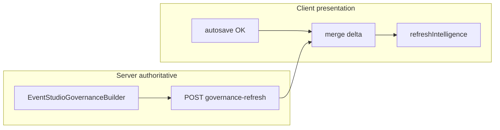

# Event Studio incremental governance refresh (adoption slice)

This slice moves **orchestration authority** for readiness, CTAs, suppression signals, continuity lines, and intelligence **ordering hints** to the server between full page loads, while keeping Event Studio **autosave**, **preview sync**, and **field UX** on the client.

## 1. Incremental refresh architecture map

- **Form load**: `EventStudioGovernanceBuilder::buildForEvent()` (unchanged composition order: workflow → state → policy → experience → intelligence → observability) feeds Twig + `drupalSettings.melEventStudioGovernance`.
- **After draft persist**: Browser POST `melEventStudio.urls.governanceRefresh` → `EventStudioGovernanceRefreshController::refresh()` → `buildDeltaPayload()` → JSON `{ ok, governance_enabled, unchanged, delta }`.
- **Browser**: Merges `delta` into a per-form runtime overlay (`WeakMap`), then runs existing `refreshIntelligence()` for **presentation** (text, sidebar lists, checklist DOM).



## 2. Governance delta payload map

| Key | Role |
| --- | --- |
| `primaryCta`, `nextBestText`, `publishReadinessLead` | Server CTA + readiness narrative |
| `stateSummaryLines`, `continuityLines`, `policyLines` | Sidebar regions (safe strings only) |
| `suppressionActiveIds` | Active operational suppression **keys** (no internal maps) |
| `intelligenceVisibleIds` | Post-policy visible intelligence ids (ordering signal) |
| `checklist` | Governance checklist rows for the field-tips list |
| `experience.*`, `policy.*`, `observabilityTier` | Continuity summary + policy surface + staff diagnostics tier |

`buildDeltaPayload()` returns only keys whose JSON differs from the client `baseline` snapshot (full payload when baseline absent).

## 3. Refresh trigger strategy

- **Primary**: successful `/vendor/events/autosave` for an existing node — refresh then `refreshIntelligence()`.
- **No** per-keystroke governance polling (avoids spam and reflects **saved** entity truth).
- CSRF: `X-CSRF-Token` + JSON body `{ baseline }`, mirroring other Event Studio POST JSON endpoints.

## 4. CTA refresh consolidation

- When `melEventStudioGovernance.enabled`: primary CTA label/href and next-best text come **only** from merged governance settings (including post-save delta). Client `buildStructuredInsights()` is **not** used for CTA/next-best priority.

## 5. Readiness consolidation

- When governance enabled: publish readiness **narrative** uses `publishReadinessLead` from server; client appends draft/live **label** and optional **local form blocking** hints only (field UX, not governance orchestration).

## 6. Suppression consolidation

- `suppressionActiveIds` is derived from `MelIntelligenceManager` operational policy suppression flags already composed server-side. JS does not infer suppression ordering.

## 7. Continuity consolidation

- `continuityLines` and `experience.*` come from `MelExperienceManager` / workflow signals on the request (vendor `/vendor/...` route). Client updates continuity/policy/status lists in the sidebar from the merged payload.

## 8. Security / privacy validation

- Route: `_entity_access: node.update`, `_custom_access: vendor_console`, workspace parity + update checks mirror autosave for non-admin users; CSRF header required.
- Response: `Cache-Control: private, no-store`.
- No observability traces in JSON unless staff diagnostics path already allows tier (same as initial page).
- Event Studio remains vendor-scoped; endpoint is not public.

## 9. Accessibility

- Existing `aria-live` regions retained; sidebar updates replace list markup without duplicate live regions.
- Empty-state paragraphs toggled with `hidden` + `aria-hidden` when lists gain items after refresh.

## 10. File-by-file implementation summary

| File | Change |
| --- | --- |
| `web/modules/custom/myeventlane_event_studio/src/Service/EventStudioGovernanceBuilder.php` | `buildGovernancePayload`, `buildIncrementalPayload`, `buildDeltaPayload`, `computeJsDelta`, JS schema v2 + sidebar-safe arrays |
| `web/modules/custom/myeventlane_event_studio/src/Controller/EventStudioGovernanceRefreshController.php` | New POST controller |
| `web/modules/custom/myeventlane_event_studio/myeventlane_event_studio.routing.yml` | `myeventlane_event_studio.governance_refresh` |
| `web/modules/custom/myeventlane_event_studio/myeventlane_event_studio.services.yml` | Controller service |
| `web/modules/custom/myeventlane_event_studio/src/Form/EventStudioForm.php` | `melEventStudio.urls.governanceRefresh` |
| `web/modules/custom/myeventlane_event_studio/templates/mel-event-studio.html.twig` | Stable IDs for incremental sidebar DOM updates |
| `web/modules/custom/myeventlane_event_studio/js/mel-event-studio.js` | Runtime merge, fetch-after-save, governance-only insights/readiness/CTA |
| `web/modules/custom/myeventlane_vendor/src/EventSubscriber/EventStudioVendorOnboardingGateSubscriber.php` | Include governance refresh in vendor studio gate |
| `web/modules/custom/myeventlane_event_studio/tests/src/Unit/EventStudioGovernanceBuilderDeltaTest.php` | Delta helper tests |

**PHPUnit (delta helper)**:

```bash
./vendor/bin/phpunit --bootstrap web/core/tests/bootstrap.php \
  web/modules/custom/myeventlane_event_studio/tests/src/Unit/EventStudioGovernanceBuilderDeltaTest.php
```

---

**Assumption**: Governance refresh reflects **persisted** node/workspace state (same as initial GET). Unsaved field edits are reflected only after autosave succeeds.

**Residual risk**: Full intelligence Twig panel HTML is not re-rendered client-side; incremental updates target summary lists + builder checklist + CTAs. Staff diagnostics markup still requires full page load if traces change materially.
