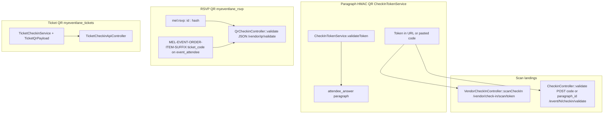
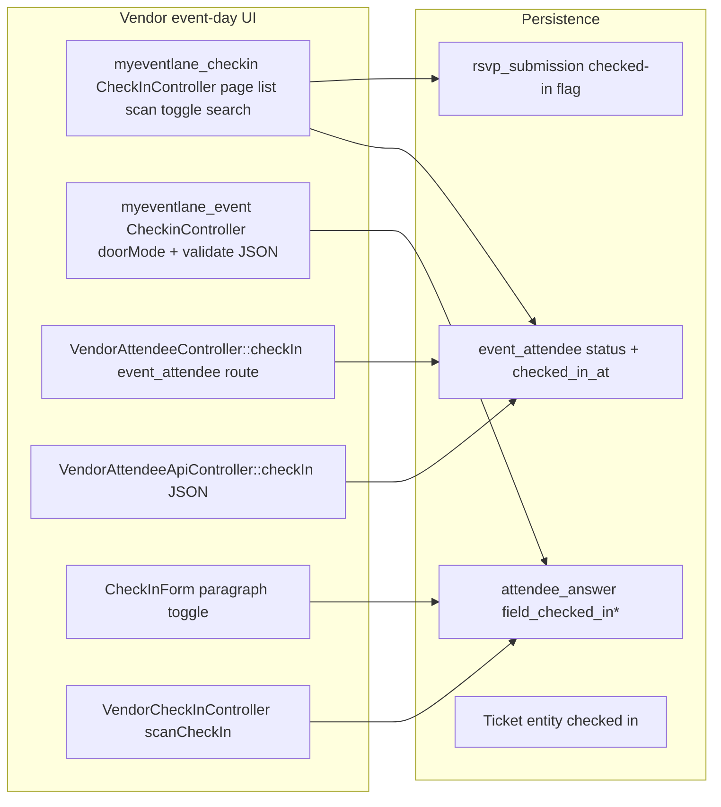

# MEL Live Venue Operations — Step 1 Audit

Read-only inventory of **existing** QR, check-in, door-mode, RSVP scan,
ticket scan, vendor surfaces, metrics, and governance touchpoints. This
document extends
[`mel-attendee-operations-audit.md`](mel-attendee-operations-audit.md)
with a **live venue / event-day operations** lens. **No code was removed.**

**Scope assumption:** Audit reflects the repository as inspected on
2026-05-09. Runtime verification (`ddev drush`, live routes) was not part
of this step.

---

## 1. Operational ownership map

Canonical layers (from product brief + code):

| Layer | Owner module / class | Responsibility |
| --- | --- | --- |
| **Operational truth** | `myeventlane_event_attendees` — `event_attendee` | `status`, `checked_in_at`, `ticket_code`, `order_item`, `source`, `extra_data`, … |
| **Checkout snapshot** | `myeventlane_checkout_paragraph` — `attendee_answer` | `field_checked_in`, `field_checked_in_timestamp`, `field_checked_in_by` on paragraphs under `commerce_order_item.field_ticket_holder` |
| **Attendance mutation (entity)** | `AttendanceManager` / `AttendanceManagerInterface` | `checkIn(EventAttendee)` — sets entity status + save |
| **Unified check-in intent (designed)** | `MelAttendeeCheckinManager` | Wraps `AttendanceManager`, `MelAttendeeOperationsAccess`, paragraph mirror, structured audit log fields in return shape |
| **Operational state vocabulary** | `MelAttendeeAttendanceState` (enum) | Maps `event_attendee` + optional `OrderItem` to `registered` / `checked_in` / `refunded` / …; `readinessId()` for MELStateSystem |
| **Presentation / KPIs** | `MelAttendeeOperationsPresenter` | Counts and row-level presentation data for **vendor attendees dashboard** (`VendorAttendeesController`) |
| **HMAC QR token (paragraph-scoped)** | `CheckInTokenService` | `generateToken` / `validateToken` — 24h expiry, HMAC over `paragraph_id:timestamp` |
| **Workspace parity** | `EventVendorAccessChecker` | `accountHasWorkspaceParityForEvent()` — used by `myeventlane_checkin`, exports, analytics, RSVP access, etc. |
| **Store ownership (legacy path)** | `VendorOwnershipResolver` (checkout_flow) | `VendorCheckInController::checkAccess`, `CheckinController` door access (store + `vendorOwnsEvent`) |
| **RSVP legacy entity** | `rsvp_submission` | `QrCheckinController` legacy branch; `RsvpSubmission::checkIn()` |
| **Separate ticket product** | `myeventlane_tickets` — `Ticket`, `TicketCheckinService` | Signed ticket QR / PWA / API — **not** the same as `event_attendee` Commerce path |
| **Reporting / capacity** | `myeventlane_reporting` — `MetricsAggregator` (via services) | `getCheckedInCount`, `getCapacityTotal`, insights tabs |

**Important finding:** `MelAttendeeCheckinManager` and
`MelAttendeeOperationsAccess` are **registered in
`myeventlane_checkout_flow.services.yml`** and covered by **unit tests**,
but **no production controller or form** in the scanned tree **injects or
calls** `myeventlane_checkout_flow.attendee_checkin_manager`. Operational
check-in in the wild still goes through **older paths** (see §4).

---

## 2. QR flow map



| Entry | Route / path | Token / code | Resolver | Post-scan behaviour |
| --- | --- | --- | --- | --- |
| Vendor paragraph scan (redirect) | `myeventlane_checkout_flow.vendor_checkin_scan` — `/vendor/check-in/scan/{token}` | Base64 HMAC token | `CheckInTokenService` | **Paragraph fields only**; redirect to `myeventlane_checkin.page` |
| Door mode (JSON) | `myeventlane_event.checkin_validate` — `/event/{event}/checkin/validate` | Token **or** `paragraph_id` **or** name search | `CheckInTokenService` if “looks like” base64; else DB search on paragraphs | **Paragraph fields only**; JSON includes `paragraph_id` on success |
| RSVP QR | `myeventlane_rsvp.checkin_validate` — `/vendor/qr/validate` | `mel:rsvp:` or `MEL-…` ticket code | Custom hash / `event_attendee` load | **RSVP entity** or **`AttendanceManager::checkIn`** on `event_attendee` |
| Ticket product | `myeventlane_tickets.ticket_checkin_*` | Ticket QR payload | `TicketQrPayload` | **Ticket** entity lifecycle + `TicketCheckinLogger` (hashed codes) |

**Token exposure:** `myeventlane-vendor-checkin.html.twig` (module + theme
copies) embeds **per-row `qr_token`** and **`paragraph_id` links** for
operators. Tokens are **opaque URLs**, not raw PII, but they are
**capability-bearing** (any holder within TTL can check in if access
allows).

---

## 3. Check-in flow map



| Surface | HTTP | Authority | Updates `event_attendee`? | Updates paragraph mirror? |
| --- | --- | --- | --- | --- |
| `CheckInController::toggle` | POST JSON `/vendor/events/{node}/check-in/toggle/{id}` | `CheckInStorage` → repository `checkIn` / `undoCheckIn` | **Yes** (ticket path) / **RSVP path** via adapter | Not unified here |
| `VendorAttendeeController::checkIn` | Route `vendor_checkin` on entity | `AttendanceManager::checkIn` | **Yes** | **No** (bypasses `MelAttendeeCheckinManager` mirror) |
| `VendorAttendeeApiController::checkIn` | PATCH-style body `checked_in` bool | Direct `$attendee->checkIn()` / status | **Yes** | **No** |
| `CheckinController::jsonCheckInParagraph` | POST JSON | Paragraph `update` access + SQL proof of completed order | **No** | **Yes** |
| `VendorCheckInController::scanCheckIn` | GET scan URL | Store ownership + paragraph access | **No** | **Yes** |
| `CheckInForm::submitForm` | Form POST | Paragraph `update` access | **No** | **Yes** |
| `QrCheckinController` Commerce RSVP branch | POST `/vendor/qr/validate` | `AttendanceManager` or `$attendee->checkIn()` | **Yes** | **No** |
| `TicketCheckinService` | Forms + API | Ticket validation pipeline | **Ticket entity** | N/A |

**Consequence:** `event_attendee` and `attendee_answer` can **diverge**
whenever a path writes **only** one side. `MelAttendeeCheckinManager` was
written to **prevent** that for ticket-linked attendees but is **not yet
wired** into scan / form / API controllers.

---

## 4. Duplicate check-in logic

| Concern | Implementations | Notes |
| --- | --- | --- |
| **Idempotent “already checked in”** | `AttendanceManager::checkIn`, `MelAttendeeCheckinManager`, `VendorCheckInController`, `CheckinController`, `QrCheckinController`, `TicketCheckinService` | Each re-implements eligibility / duplicate messaging differently |
| **Paragraph field mutation** | `VendorCheckInController`, `CheckinController`, `CheckInForm` | Near-copy of set `field_checked_in` + timestamp + by |
| **Access: vendor vs event** | `EventVendorAccessChecker` (`myeventlane_checkin`), `VendorOwnershipResolver` + paragraph access (`VendorCheckInController`), store-only door mode (`CheckinController`) | **Not identical** — door mode does **not** use `EventVendorAccessChecker` |
| **Audit trail** | `MelAttendeeCheckinManager` (logger + `audit_id` in array), `CheckinController` (watchdog notice), `TicketCheckinLogger` (DB table w/ hashes), RSVP controller (implicit) | No **single** operational audit stream |
| **Rate limiting** | `QrCheckinController` (flood), `VendorAttendeeApiController` (rate limiter service), door mode (none beyond CSRF on POST) | Uneven |

---

## 5. Venue operational surfaces

| Surface | Route(s) | Module | Primary template / library |
| --- | --- | --- | --- |
| **Event check-in hub** | `/vendor/events/{node}/check-in` (+ list, scan, search, toggle) | `myeventlane_checkin` | `checkin-page.html.twig`, `checkin-list.html.twig`, `checkin-scan.html.twig`, `js/checkin.js` |
| **Door mode (mobile JSON)** | `/event/{event}/checkin`, `/event/{event}/checkin/validate` | `myeventlane_event` | `mel_checkin_page` theme + `js/mel-door-checkin.js`, `css/mel-door-checkin.css` |
| **Per-event attendees + AJAX check-in** | `/vendor/events/{node}/attendees`, `/vendor/attendee/{event_attendee}/checkin` | `myeventlane_event_attendees` | Vendor theme + module templates |
| **Vendor attendees & sales dashboard** | `/vendor/attendees` | `myeventlane_checkout_flow` | `MelAttendeeOperationsPresenter` — mel cards / KPIs |
| **Paragraph check-in form** | `/vendor/check-in/paragraph/{paragraph}` | `myeventlane_checkout_flow` | `CheckInForm` |
| **QR scan redirect** | `/vendor/check-in/scan/{token}` | `myeventlane_checkout_flow` | Redirects to `myeventlane_checkin.page` |
| **RSVP check-in list / PDF / scan page** | `/vendor/event/{event}/rsvps/checkin`, `/vendor/event/{event}/rsvps/checkin/pdf`, RSVP scan route | `myeventlane_rsvp` | RSVP Twig + `myeventlane_rsvp/qrscan` library |
| **Insights — check-ins tab** | `/vendor/events/{event}/insights/checkins` | `myeventlane_reporting` | Chart JSON + KPIs from metrics service |
| **Ticket check-in (staff permission)** | `/event/{event}/tickets/checkin` (+ validate, API, analytics, PWA) | `myeventlane_tickets` | Separate permission model (`check in tickets`) |
| **Vendor HTTP API** | `/api/v1/vendor/events/{node}/attendees/{attendee_id}/checkin` | `myeventlane_api` | JSON; exposes numeric `attendee_id` in API contract |

**Registered but unused theme:** `hook_theme` defines
`myeventlane_vendor_checkin` in `myeventlane_checkout_flow.module`, but
**no controller** in the scanned tree returns `#theme =>
'myeventlane_vendor_checkin'`. Module + theme still ship
`myeventlane-vendor-checkin.html.twig` (likely **legacy / dead path**
after consolidation onto `myeventlane_checkin`).

**There is no** `/vendor/events/{event}/operations` route **today** —
that remains a **Step 2+ target**.

---

## 6. Attendee state flow

**Storage (canonical entity):** `event_attendee.status` allowed values
include `confirmed`, `waitlist`, `cancelled`, `checked_in`, `no_show`
(see `EventAttendee::baseFieldDefinitions()`).

**Operational projection:** `MelAttendeeAttendanceState::fromEventAttendee()`
merges **order state** (refund / pending / canceled) with attendee
status → `registered` | `checked_in` | `cancelled` | `refunded` |
`pending` | `invalid`.

**Gaps vs planned live ops vocabulary (Steps 5+):** There is **no**
first-class `late`, `denied`, `duplicate_scan`, `manual_override`, or
`refunded_after_checkin` **enum** today — those would extend **this**
enum + transitions, not a parallel store.

**Paragraph mirror:** For ticket-linked attendees, paragraph
`field_checked_in*` should follow **`MelAttendeeCheckinManager::mirrorToParagraph`** —
currently **only** if/when that manager is invoked after an
`event_attendee` transition.

---

## 7. Event-day workflow map

```mermaid
sequenceDiagram
  participant Staff as Staff device
  participant Door as Door JSON CheckinController
  participant Vendor as myeventlane_checkin UI
  participant EA as event_attendee
  participant PAR as attendee_answer

  Staff->>Door: POST validate token or paragraph_id
  Door->>PAR: save checked_in fields
  Note over Door,EA: No event_attendee update in this path

  Staff->>Vendor: POST toggle ticket/rsvp id
  Vendor->>EA: repository checkIn

  Staff->>Vendor: Open scan URL VendorCheckInController
  Vendor->>PAR: save checked_in fields
  Vendor->>Vendor: Redirect to check-in page
```

**RSVP day-of:** `RsvpCheckinController` PDF/list + `QrCheckinController`
for codes; waitlist sections in RSVP check-in Twig.

**Commerce ticket day-of:** Order completed → paragraphs exist → door
mode / scan paths target paragraphs; **parallel** path uses
`VendorAttendeeController` / API on **`event_attendee`**.

**Reporting:** Event insights pull `checkin_count` via metrics service;
chart endpoint aggregates **`event_attendee`** (`ChartDataController`).

---

## 8. Operational security review

| Topic | Finding | Severity |
| --- | --- | --- |
| **CSRF** | Door mode POST requires `X-CSRF-Token` | Good |
| **CSRF** | `myeventlane_checkin` toggle POST has **no** CSRF token in `checkin.js` | **Gap** — relies on session cookie only for POST |
| **Authorization consistency** | `myeventlane_checkin` uses `EventVendorAccessChecker` + admin | Aligned with workspace parity |
| **Authorization consistency** | `VendorCheckInController` uses **store ownership** only (no `EventVendorAccessChecker`) | **Team member edge cases** may diverge |
| **Authorization consistency** | `CheckinController` door mode duplicates store resolution | Same divergence risk |
| **Identifier exposure** | Door JSON success returns `paragraph_id` | Useful for UI; **avoid public** unauthenticated surfaces |
| **API** | `VendorAttendeeApiController` exposes `id`, `ticket_code` in JSON | Acceptable for **authenticated vendor API**; still **not** public QR payload |
| **Flood** | RSVP QR validate uses flood; door validate does not | Uneven |
| **Token TTL** | `CheckInTokenService` — 24h window | Document for venue replay policy |
| **Ticket path** | `TicketCheckinLogger` stores **hashed** codes + masked label | Strong pattern to **reuse** for venue ops audit |

---

## 9. Mobile UX review

| Asset | Behaviour | Gaps |
| --- | --- | --- |
| `mel-door-checkin.js` | Debounced GET search; POST with CSRF; candidate picker | Returns `paragraph_id` to client for second POST — server still authoritative |
| `checkin.js` | Toggle + incomplete search results (`@todo` in JS) | Full page reload; search UI not finished |
| `checkin-scan.html.twig` | Scan page shell | Depends on `myeventlane_checkin/scan` library — verify camera UX in library (not re-audited file-by-file here) |
| Vendor attendees dashboard | `MelAttendeeOperationsPresenter` mel cards | **Not** the same route as door/check-in pages — operators may jump between UIs |

**WCAG / reduced motion:** Door CSS/JS exist; a **unified** venue ops pass
(Step 12) should align with `MELInteractionSystem` / theme tokens.

---

## 10. Observability review

| Mechanism | What is traced | Venue / check-in coverage |
| --- | --- | --- |
| **`myeventlane_checkout_flow_mel_observability_page_payload_alter`** | Staff-only traces for **attendee list / export** routes | **Does not** list `myeventlane_checkin.*`, door routes, or scan routes today |
| **`MelAttendeeAttendanceState::readinessId()`** | Stable readiness strings | Ready for `MELStateSystem` / diagnostics **if** surfaces emit them |
| **Watchdog** | Door mode logs duplicate + success | Good local signal; **not** a unified operational audit |
| **`TicketCheckinLogger`** | Append-only DB log for ticket scans | Pattern to mirror for **Commerce attendee** QR (hashed identifiers) |

**Governance registries** (`MelObservabilityRegistry`, `MelStateRegistry`,
`MelOperationalPolicyRegistry`, `MelInteractionManager`, …) describe
**platform contracts**. Live venue work should **register** new
operational traces there instead of inventing ad hoc analytics.

---

## 11. Recommended convergence targets

Aligned with the product brief (“no duplicate logic / PHP authoritative /
reuse `MelAttendeeCheckinManager` + `CheckInTokenService` + governance”).

1. **Wire `MelAttendeeCheckinManager` into every mutation path** that
   today writes **`event_attendee` and/or paragraph** ad hoc:
   `VendorAttendeeController::checkIn`, `VendorAttendeeApiController`,
   `CheckinController::jsonCheckInParagraph`, `VendorCheckInController`,
   `CheckInForm`, and RSVP Commerce branch where appropriate. **Deprecate**
   direct paragraph toggles once a single manager owns transitions.

2. **Unify access** on `EventVendorAccessChecker` (plus existing entity
   access) for **all** vendor event-day routes; retire duplicated
   `VendorOwnershipResolver` / private `vendorOwnsEvent` copies **or**
   document a single delegated primitive.

3. **Single venue operations home** at `/vendor/events/{event}/operations`
   (Step 2) that **links** into door mode, list, scan, insights — **no**
   second dashboard system; compose `mel_card`, `mel_empty_state`,
   `MelAttendeeOperationsPresenter` / readiness helpers.

4. **`MelVenueQrOperationsManager` (Step 3)** should call
   `CheckInTokenService`, resolve to **`event_attendee`** (not public IDs in
   JSON), delegate transitions to **`MelAttendeeCheckinManager`**, and
   return **opaque** operation tokens / messages.

5. **Extend `MelAttendeeAttendanceState`** for new operational states
   (Step 5) **in this enum only**; map from existing fields + order state
   where possible before adding storage.

6. **`MelVenueOperationsMetricsBuilder` (Step 6)** should wrap
   `MelAttendeeOperationsPresenter` / `MelAttendeeCheckinManager::readinessForEvent`
   / reporting metrics — **one cache-tagged builder** per event, no Twig
   DB.

7. **Observability (Step 9):** extend
   `myeventlane_checkout_flow_mel_observability_page_payload_alter` (or a
   dedicated venue ops alter) to cover **check-in routes**, **scan
   outcomes**, and **degraded mode** — still **PII-free**.

8. **Retire or repurpose** orphan `myeventlane_vendor_checkin` theme / Twig
   if confirmed unused, to avoid operators following **stale** UX paths.

9. **Ticket module (`myeventlane_tickets`)** remains a **sibling** product
   for ticket QR — venue ops should **not** merge codebases, but **should**
   align **audit hashing**, **rate limits**, and **staff vs vendor**
   boundaries conceptually.

---

## Cross-reference

- Prior attendee-layer audit:
  [`docs/adoption/mel-attendee-operations-audit.md`](mel-attendee-operations-audit.md)
- Phase 9 historical notes (partially superseded by routing changes):
  [`docs/phase-9-check-in.md`](../phase-9-check-in.md)

---

## Files created / changed (Step 1)

| Path | Change |
| --- | --- |
| `docs/adoption/mel-live-venue-operations-audit.md` | **Created** — this audit |

## Commands run

| Command | Result |
| --- | --- |
| _(none required for doc-only Step 1)_ | N/A |

## Residual risk

- **`MelAttendeeCheckinManager` not wired:** Canonical design exists but
  **production** check-in **does not** uniformly flow through it — highest
  technical debt for live ops.
- **Split brain:** Paragraph-only and `event_attendee`-only paths can
  disagree until convergence.
- **Access drift:** Store-based vs `EventVendorAccessChecker` paths may
  disagree for **vendor team** members.
- **This audit is static:** Hardening claims must be re-verified after
  implementation (Steps 2–13).
