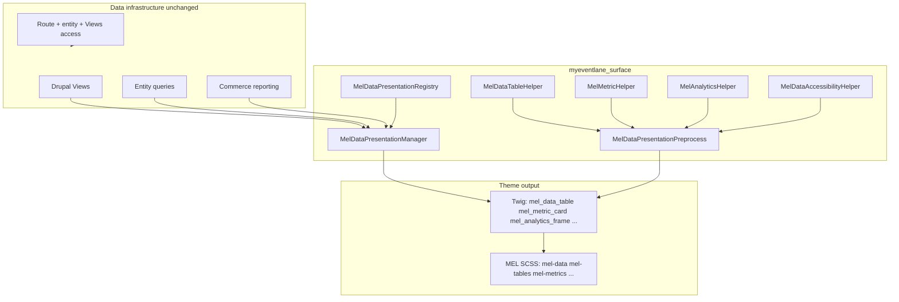

# MELDataPresentationSystem

Canonical **presentation** governance for operational tables, metrics, analytics shells, activity feeds, and export UI. **Drupal Views, entities, Commerce, and access checks remain the sole data and security layers.**

## 1. Architecture map

## 2. Table governance map

| Theme hook / shell | Role |
| --- | --- |
| `mel_data_table` | Wraps **existing** table markup (e.g. Views output) — toolbar, scroll region, empty slot, pagination, actions |
| `mel_table_toolbar` | Filter / tool clusters (presentation) |
| `mel_table_empty` | Inline empty slot (prefer composing `mel_empty_state`) |
| `mel_table_pagination` | Pagination landmark wrapper |
| `mel_table_actions` | Row / bulk actions cluster |
| `mel_table_status` | Operational status row |

Contract IDs: `MelDataPresentationRegistry::TABLE_*` (`mel.table.*`).

## 3. Metrics governance map

| Theme hook | Role |
| --- | --- |
| `mel_metric_card` | Tile: label, value, delta, trend, status, loading, empty |
| `mel_metric_grid` | Responsive grid for tiles |
| `mel_stat_panel` | Grouped stats section |
| `mel_summary_bar` | Horizontal summary (e.g. checkout/dashboard strip) |

Contract IDs: `MelDataPresentationRegistry::METRIC_*` (`mel.metric.*`). Values are **passed in** from upstream render arrays — never queried here.

## 4. Analytics governance map

| Theme hook | Role |
| --- | --- |
| `mel_analytics_frame` | Chart/graph **shell**: summary (`aria-describedby`), legend slot, loading, empty, `engine` hint class |

Contract IDs: `MelDataPresentationRegistry::ANALYTICS_*` (`mel.analytics.*`). Does **not** embed Chart.js/Recharts logic — only layout and a11y associations.

## 5. Export governance map

| Theme hook | Role |
| --- | --- |
| `mel_export_panel` | Export actions / summaries chrome |
| `mel_export_notice` | Privacy / CSV guidance (`role="status"`, `aria-live="polite"`) |

Contract IDs: `MelDataPresentationRegistry::EXPORT_*` (`mel.export.*`). Permissions and isolation stay in Drupal access layer.

## 6. Activity feed governance map

| Theme hook | Role |
| --- | --- |
| `mel_activity_feed` | Landmark region (`aria-label` via `feed_label`) |
| `mel_activity_item` | Single row (`article`) |
| `mel_timeline` | Timeline column |
| `mel_event_log` | Monospace log styling hook |

Contract IDs: `MelDataPresentationRegistry::FEED_*` (`mel.feed.*`).

## 7. Empty dataset governance map

- Use **`mel_empty_state`** (what / why / next / CTA) and **`mel_next_step_panel`** with **MELWorkflowSystem** for onboarding linkage.
- **`mel_table_empty`** is a thin slot; rich empty UX should compose `mel_empty_state` inside content passed to the table shell.

## 8. Duplication cleanup report

| Location | Finding | Action |
| --- | --- | --- |
| `web/modules/custom/myeventlane_vendor/templates/myeventlane-vendor-analytics.html.twig` | Custom `vendor-kpi-card` grid | **No change** in this slice — canonical path for **new** work is `mel_metric_card` / `mel_metric_grid`; migrate incrementally when touching that template |
| `web/modules/custom/myeventlane_admin_dashboard/templates/platform-control-centre--pro-kpis.html.twig` | Staff KPI tiles (`pcc-kpis`) | **No change** — staff surface uses utilitarian styling; `mel_metric_card` supports `mel-metric-card--plain` |
| Vendor theme `kpi-cards`, `vendor-kpi-strip` | Parallel KPI styling | **Coexist** until vendor screens adopt MEL theme hooks; SCSS tokens reused by new partials |

No orphan duplicates were removed to avoid breaking production vendor/admin UIs in one pass.

## 9. Accessibility report

- **Tables**: Optional scroll region labelled via `caption_id` + `scroll_region_label` (`aria-labelledby`, keyboard-focusable region).
- **Metrics**: Live region (`role="status"`, `aria-live="polite"`, `aria-atomic="true"`); loading uses `aria-busy="true"`.
- **Charts**: Summary element ID + `aria-describedby` on frame; visually hidden placeholder when ID required without visible copy.
- **Exports**: Notice uses non-assertive live region.
- **Activity**: Region landmark — **not** `role="feed"` (avoids implying infinite dynamic feed semantics).

Target: **WCAG 2.1 AA** for these patterns when consuming templates supply correct labels and visible captions.

## 10. File-by-file implementation summary

| File | Purpose |
| --- | --- |
| `src/DataPresentationDefinition.php` | Value object for contract metadata |
| `src/MelDataPresentationRegistry.php` | Contract IDs + definitions registry |
| `src/MelDataPresentationManager.php` | Page context, `buildDataTableShell()`, cache merge |
| `src/MelDataTableHelper.php` | Table density / responsive modifier classes |
| `src/MelMetricHelper.php` | Metric normalisation + card modifier |
| `src/MelAnalyticsHelper.php` | Analytics frame classes + engine token |
| `src/MelDataAccessibilityHelper.php` | ARIA/table/chart/export semantics |
| `src/MelDataPresentationPreprocess.php` | Theme preprocess normalisation |
| `src/SurfaceNegotiator.php` | Attaches `mel_data_presentation_context`, `data-mel-layout-profile` on `<html>` |
| `myeventlane_surface.services.yml` | Service wiring |
| `myeventlane_surface.module` | `hook_theme()`, `hook_theme_registry_alter()`, universal preprocess |
| `templates/data/*.html.twig` | Governed Twig shells |
| `src/MelComponentRegistry.php` | Registers data hooks under category `data` |
| `web/themes/custom/myeventlane_theme/src/scss/components/_mel-*.scss` | Canonical presentation styles |
| `web/themes/custom/myeventlane_theme/src/scss/main.scss` | Imports |

## Views integration (manual)

1. Keep the View as **data** infrastructure (query, access, pager).
2. In a wrapper render array or Twig override, pass the rendered View output as `content` to `#theme => 'mel_data_table'` or `MelDataPresentationManager::buildDataTableShell()`.
3. Attach toolbar/pagination from existing View attachments **without** duplicating queries.

## Page variables

- `mel_data_presentation_context` — from `MelDataPresentationManager::getPageContext()` (surface, `layout_profile`, `density`, modifier hints).
- HTML root: `data-mel-layout-profile` (`customer_simplified`, `vendor_operational`, `staff_utilitarian`, `public_minimal`, `auth_compact`).
