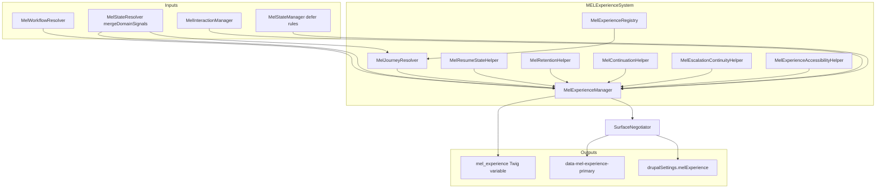

# MELExperienceSystem

Canonical orchestration layer for **experience continuity only**: cross-surface coherence, journey continuation, resume-state hints, retention tiering, escalation-safe flags, and CTA sequencing — without replacing Drupal workflows, Commerce checkout, onboarding source systems, entity state, moderation, or access.

## 1. Architecture map

## 2. Experience registry map

| Category | Experience IDs |
|----------|----------------|
| Auth continuity | `login_resume`, `onboarding_resume`, `interrupted_checkout_resume`, `password_recovery_return` |
| Customer journeys | `rsvp_completion_calendar_prompt`, `ticket_purchase_wallet_calendar_share`, `saved_event_return_discovery`, `support_resolution_followup` |
| Vendor journeys | `vendor_onboarding_continuation`, `vendor_stripe_continuation`, `vendor_event_draft_continuation`, `vendor_publish_continuation`, `vendor_attendee_management_continuation`, `vendor_analytics_continuation` |
| Checkout continuity | `abandoned_checkout_recovery`, `attendee_info_continuation`, `payment_completion_continuity`, `order_confirmation_continuity` |
| Escalation continuity | `moderation_interruption`, `support_escalation`, `payout_review`, `trust_recovery_flows`, `dispute_refund_continuity` |

Each `ExperienceDefinition` carries: surface ownership, linked `MelWorkflowRegistry` IDs, trigger/resume signal keys (interpretation-only), continuity priority, retention tier, CTA sequencing notes, accessibility notes, privacy boundaries, and cross-surface hint labels.

## 3. Journey continuity map

- **Workflow edges**: `MelContinuationHelper` expands `linkedWorkflowIds` into `workflow_edges` using `nextStepRecommendations` from existing workflows (no new BPM).
- **Cross-surface hints**: opaque string tokens (e.g. `auth_to_customer`, `checkout_to_tickets`) for templates and analytics — not routing.

## 4. Resume-state governance map

- `MelResumeStateHelper` emits **ranked** `resume_candidates` only when `resumeGateSignalsAll` is non-empty and satisfied (and checkout-safe filtering applies).
- Vendor resume **copy** remains delegated to `MelWorkflowCTAHelper` + `OnboardingManager` (no duplicated onboarding logic).

## 5. Retention continuity map

- `MelRetentionHelper` computes a single **tier** (`none` / `low` / `medium`) from applicable definitions — coordinates respectful frequency; messaging cooldowns remain with Growth/Messaging modules.

## 6. Escalation continuity map

- `MelEscalationContinuityHelper` exposes **booleans only**: `moderation_hold_active`, `support_escalation_active`, `commerce_dispute_context_active` — no moderation internals or trust scores.

## 7. Cross-surface continuity map

| Transition hint | Typical context |
|-----------------|-----------------|
| `auth_to_customer` | Post-login shell |
| `customer_shell_to_checkout` | Cart/checkout entry |
| `checkout_to_tickets` | Order confirmation |
| `vendor_onboarding_to_shell` | Onboarding → dashboard |
| `vendor_publish_to_attendees` | Publish → operations |

## 8. Accessibility report

- **PHP**: `MelExperienceAccessibilityHelper` — continuation `role="region"`, polite `aria-live` defaults, reduced-motion data attribute (paired with existing utilities).
- **JS**: `mel-experience.js` — progressive enhancement for `[data-mel-experience-live]` (aligns with `mel-interactions.js` live-region pattern).
- **WCAG**: Target **2.1 AA**; checkout trust contexts still defer modal focus per `MelInteractionManager`.

## 9. Duplication cleanup report

**Inspected (grep / codebase):**

- Vendor dashboard / Stripe **resume URLs** in `VendorDashboardController` and onboarding Twig remain **source routes**; MEL does not duplicate those URLs.
- **Cart abandoned** messaging schedulers live in `myeventlane_messaging` — experience layer supplies **sequencing hints only**.
- **Workflow primary CTA** remains in `MelWorkflowManager` / `MelWorkflowCTAHelper`; experience adds `cta_governance` and `resume_candidates` for consolidation in Twig later.

**Removed**: No standalone resume/continuity templates were deleted in this pass (none were redundant with the new variable); future Twig should read `mel_experience` instead of hardcoding duplicate banners.

## 10. File-by-file implementation summary

| File | Role |
|------|------|
| `src/ExperienceDefinition.php` | Continuity contract shape |
| `src/MelExperienceContractCategory.php` | Registry grouping enum |
| `src/MelRetentionTier.php` | Retention tier enum |
| `src/MelExperienceRegistry.php` | Canonical contract catalogue |
| `src/MelJourneyResolver.php` | Applicable experiences from merged signals + routes |
| `src/MelResumeStateHelper.php` | Ranked resume candidates |
| `src/MelRetentionHelper.php` | Retention tier + implication lines |
| `src/MelContinuationHelper.php` | Workflow edges + cross-surface hints |
| `src/MelEscalationContinuityHelper.php` | Privacy-safe escalation flags |
| `src/MelExperienceAccessibilityHelper.php` | ARIA / landmark hints |
| `src/MelExperienceManager.php` | Orchestration + hooks + cache metadata |
| `src/SurfaceNegotiator.php` | Exposes `mel_experience`, library, drupalSettings, HTML data attribute |
| `myeventlane_surface.services.yml` | DI wiring |
| `myeventlane_surface.libraries.yml` | `experience` library |
| `js/mel-experience.js` | Drupal behaviour |
| `myeventlane_surface.module` | Hook documentation |
| `src/scss/components/_mel-*.scss` (theme) | Token-only layout hooks |
| `src/scss/main.scss` | Imports |

### Hooks

- `hook_mel_experience_applicable_alter(&$experiences, $context, $merged_signals)`
- `hook_mel_experience_memory_alter(&$memory, $context, $merged_signals)` — opt-in via request attribute `mel_experience_memory` (array) + alter
- `hook_mel_experience_attachments_alter(&$attachments, $context, $merged_signals)`

## Validation commands

Run from project root:

- `php -l` on touched PHP files
- `composer validate`
- `npm run mel:lint` && `npm run mel:build`
- `ddev drush cr`

## Residual risk

- **Signals**: Experiences depending on `support.flags.*`, `event.lifecycle.moderation_hold`, etc. require owning modules to populate facts via existing `hook_mel_state_domain_facts_alter()` / workflow signal patterns — otherwise those contracts stay inactive (fail-safe).
- **Twig adoption**: Themes can progressively consume `mel_experience`; until then, behaviour is additive only.
