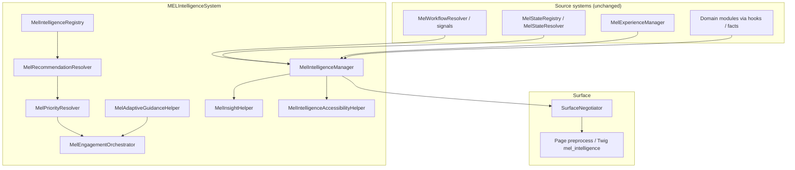

# MELIntelligenceSystem

Canonical **governance layer** for explainable orchestration of recommendations, prioritisation, adaptive guidance, engagement sequencing, and operational insights. Drupal, Commerce, onboarding, analytics, and messaging **own data and actions**; this system **does not** replace them.

## 1. Architecture map

## 2. Intelligence registry map

| Category | IDs (canonical) |
|----------|-----------------|
| Customer guidance | `recommended_events`, `continue_saved_event`, `complete_profile_prompt`, `add_to_calendar_prompt`, `revisit_recent_event`, `support_followup_prompt` |
| Vendor guidance | `complete_vendor_setup`, `connect_payouts`, `publish_event_prompt`, `boost_event_prompt`, `low_ticket_sales_prompt`, `attendee_engagement_prompt`, `analytics_review_prompt` |
| Checkout guidance | `complete_attendee_details`, `retry_checkout`, `add_wallet_prompt`, `share_event_prompt`, `order_followup_prompt` |
| Lifecycle guidance | `draft_completion_prompt`, `sold_out_momentum_prompt`, `cancelled_event_followup`, `moderation_recovery_prompt` |
| Engagement guidance | `re_engagement_prompt`, `incomplete_onboarding_prompt` (vendor), `incomplete_customer_onboarding_prompt` (customer), `return_to_platform_prompt`, `trust_building_prompt`, `public_discovery_events_hint` |
| Staff diagnostic | `staff_trust_escalation_diagnostic`, `staff_moderation_hold_diagnostic` |

Each `IntelligenceDefinition` carries: surfaces, presentation lane, signal triggers, optional state expectations (including explainable OR-groups), priority tier/weight, recommendation source key, CTA/retention implications, explainability, accessibility, privacy notes, and engagement orchestration kind.

## 3. Prioritisation governance map

Deterministic ordering: **`priority_tier` DESC → `priority_weight` DESC → `id` ASC** (lexical). `MelPriorityResolver::explainOrder()` emits a trace row per candidate with the rule string.

Examples encoded via tiers/weights on definitions:

| Principle | How it is expressed |
|-----------|---------------------|
| Incomplete onboarding / payouts over analytics | Vendor onboarding and payout items use **tier 100**; `analytics_review_prompt` uses **tier 35**. |
| Checkout recovery over discovery | Checkout `retry_checkout` **tier 98** vs customer discovery-style items **tier ≤ 55**. |
| Moderation recovery over engagement | `moderation_recovery_prompt` **tier 100** vs `re_engagement_prompt` **tier 58**. |

No opaque scores: only declared integers on definitions plus the explicit sort key.

## 4. Adaptive guidance map

`MelAdaptiveGuidanceHelper::resolveProfiles()` returns machine keys only:

| Key | Values |
|-----|--------|
| `vendor` | `vendor_beginner` / `vendor_experienced` (from `vendor.onboarding.completed` signal) |
| `customer` | `customer_first_time_attendee` / `customer_repeat_attendee` (from `customer.flags.has_orders`) |
| `primary_experience_id` | From `MelExperienceManager` payload when set |

## 5. Engagement orchestration map

`MelEngagementOrchestrator`:

- Enforces **per-shell visible caps** (checkout: 1, public: 2, customer/vendor: 4, staff: 6, auth: 1).
- Emits **`messaging_hints`** as non-binding rows (orchestration only; **no** message send).
- **Dedupes** multiple `OnboardingContinuation` items to the single highest-priority row after ranking.

## 6. Insight governance map

`MelInsightHelper` emits **short, deterministic** headlines from **state evaluation strings only** (no merged signal values in copy). Surfaces:

- **Vendor**: payout connection/readiness, sold out, draft/incomplete lifecycle.
- **Customer**: incomplete profile.
- **Staff**: moderation hold and escalation **diagnostic** lines only.

Customer/vendor shells **filter out** insight rows whose `id` starts with `staff_`.

## 7. Explainability report

Every intelligence **item** includes:

- `why_shown` (registry explainability string).
- `trigger_signal_keys` (key names only).
- `state_snapshot` for states tied to the definition.
- `recommended_action` and dismissibility hint in Twig.
- `explainability.framework` on the page payload.

No hidden ranking: full order trace in `prioritisation_trace`.

## 8. Accessibility report

- Region metadata from `MelIntelligenceAccessibilityHelper` (`role="region"`, `aria-labelledby`).
- Polite **`aria-live`** hook via `data-mel-intelligence-live` + `mel-intelligence.js` behaviour (mirrors experience pattern).
- Reduced-motion data attribute hook for CSS.
- Twig template uses semantic headings and `
` for “why” disclosure.

## 9. Duplication cleanup report

| Area | Finding | Action |
|------|---------|--------|
| Vendor onboarding UI | Existing `vendor-dashboard-onboarding-panel.html.twig` and MEL workflow/experience systems | **No removal**: intelligence reuses signals/state; `MelEngagementOrchestrator` dedupes duplicate onboarding **intelligence** rows only. |
| MEL components | `mel_guided_next_step`, `mel_next_step_panel`, workflow CTAs | **Reused**, not replaced; intelligence attaches alongside `mel_workflow` / `mel_experience`. |
| Customer onboarding row | None created on incidental page views | **`OnboardingManager::loadCustomerStateByUid()`** + `customer.guidance.needs_resume` signal for intelligence only (read-only). |
| Theme SCSS | `_vendor-nudges.scss`, onboarding partials | **Left intact**; new partials are additive hooks for `mel-intelligence-panel` layout. |

Further consolidation (e.g. routing all vendor nudges through `mel_intelligence` render arrays) is a **follow-up product decision** and was not done to avoid breaking existing UIs.

## 10. File-by-file implementation summary

| Path | Role |
|------|------|
| `MelIntelligenceContractCategory.php` | Contract grouping enum. |
| `MelIntelligencePresentationLane.php` | Guidance / checkout / public / staff lane enum. |
| `MelIntelligenceShellProfile.php` | Shell posture enum for density + tone hints. |
| `MelEngagementOrchestrationKind.php` | Engagement classification enum. |
| `IntelligenceDefinition.php` | Immutable definition + OR-group state expectations. |
| `MelIntelligenceRegistry.php` | **Single** canonical registry of all intelligence IDs. |
| `MelRecommendationResolver.php` | Deterministic applicability filter. |
| `MelPriorityResolver.php` | Sort + explain trace + anonymous guard. |
| `MelAdaptiveGuidanceHelper.php` | Adaptive profile keys. |
| `MelEngagementOrchestrator.php` | Caps, dedupe, messaging hints. |
| `MelInsightHelper.php` | Deterministic operational insight strings. |
| `MelIntelligenceAccessibilityHelper.php` | Region / live-region / reduced-motion hooks. |
| `MelIntelligenceManager.php` | Payload builder, translations, `hook_mel_intelligence_page_payload` alter target. |
| `SurfaceNegotiator.php` | Memoised `mel_intelligence`, optional `mel_intelligence_panel` render array, cache bubble + library. |
| `myeventlane_surface.services.yml` | Service wiring. |
| `myeventlane_surface.libraries.yml` | `intelligence` library. |
| `js/mel-intelligence.js` | Drupal behaviour for live regions. |
| `myeventlane_surface.module` | Theme registration + alter hook documentation. |
| `templates/components/mel-intelligence-panel.html.twig` | Generic renderer (no per-prompt hardcoding). |
| Theme SCSS `_mel-intelligence.scss`, `_mel-guidance.scss`, `_mel-insights.scss`, `_mel-priorities.scss`, `_mel-recommendations.scss` + `main.scss` | Canonical styling hooks using **spacing + typography tokens** only. |

## Optional domain signals (documented)

Owning modules may set (via `hook_mel_workflow_signals_alter` or `hook_mel_state_domain_facts_alter`):

- `vendor.guidance.low_ticket_sales_context`
- `vendor.guidance.attendee_engagement_opportunity`
- `checkout.state.recoverable_failure`

Until set, the corresponding intelligence rows **do not appear** (conservative default).
