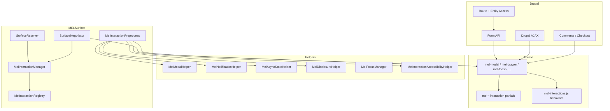

# MELInteractionSystem

**Principle:** Drupal Form API, Drupal AJAX, Commerce checkout panes, and route/entity access remain **infrastructure**. MELInteractionSystem owns **interaction orchestration**: modal/drawer shells, async presentation, notifications, progressive disclosure, focus hints, and accessibility semantics for those layers.

## Architecture map

## Modal governance map

| Contract ID (`MelInteractionRegistry`) | TWIG shell | Notes |
| --- | --- | --- |
| `modal_rsvp` | `mel_modal` + fragments | Caller supplies header/body/actions; no duplicate modal markup. |
| `modal_ticket` | same | |
| `modal_onboarding` | same | Prefer non-blocking patterns where product allows. |
| `modal_confirmation` | `mel_modal_confirmation` | Destructive confirmations — actions still Form API / links. |
| `modal_support` | `mel_modal` | Checkout-safe tag in registry. |

**Semantics:** `MelInteractionAccessibilityHelper::applyModalDialogSemantics()` sets `role="dialog"`, `aria-modal="true"`, optional `aria-labelledby` / `aria-describedby`.

**JS:** `js/mel-interactions.js` — Escape to close, optional overlay dismiss (disabled in checkout trust context), focus trap (relaxed under checkout trust).

## Notification governance map

| Contract ID | Theme hook | Role / live region |
| --- | --- | --- |
| `notification_toast` | `mel_toast` | `status` + polite (errors assertive via variant) |
| `notification_inline` | `mel_inline_notice` | Banner semantics via variant |
| `notification_warning_notice` | `mel_warning_banner` | polite `status` |
| `notification_confirmation_notice` | `mel_confirmation_banner` | polite `status` |
| `notification_workflow_notice` | composable | Same banner family |

Stacking hint: `mel_interaction_context.toast_stack_limit` from `MelInteractionManager`; container convention `[data-mel-notification-stack]` (styled in `_mel-notifications.scss`).

## Async-state governance map

| Contract ID | Theme hook | aria-busy |
| --- | --- | --- |
| `async_loading` | existing `mel_loading_state` (component) | yes (component helper) |
| `async_saving` | `mel_saving_state` | yes |
| `async_processing` | `mel_processing_state` | yes |
| `async_retry` | `mel_retry_state` | assertive retry messaging |
| `async_queued` | registry contract | map to processing/saving in product code |
| `async_success` | use `mel_alert` / workflow | avoid duplicate success chrome |

## Disclosure governance map

| Contract ID | Theme hooks |
| --- | --- |
| `disclosure_advanced_settings` | `mel_advanced_settings` |
| `disclosure_optional_ticket` | `mel_disclosure` / `mel_expandable_section` |
| `disclosure_vendor_only` | same (access enforced server-side) |
| `disclosure_analytics_drilldown` | `mel_collapsible_panel` |
| `disclosure_onboarding_detail` | `mel_expandable_section` |

**JS:** Toggle updates `aria-expanded` and `hidden` on panel; keyboard activation via native `button`.

## Focus governance map

| Concern | PHP (`MelFocusManager`) | JS |
| --- | --- | --- |
| Modal open/close | Stable modal `id`, hints only | Trap + restore on close |
| Drawer | Same pattern | Escape + overlay (checkout-trust aware) |
| Disclosure | `toggle_id` / `panel_id` wiring | Focus remains on toggle |
| Notifications | `steal_focus` hints (default false) | Product-specific if needed |

## Surface-aware interaction density

Exposed as `mel_interaction_context` on pages (from `SurfaceNegotiator`) and `data-mel-interaction-profile` on `<html>` / `<body>`:

| Profile | Intent |
| --- | --- |
| `auth_minimal` | Calm chrome (`MelSurfaceId::Auth`). |
| `customer_guided` | Touch-first spacing cues. |
| `vendor_operational` | Dense disclosure + drawer panels. |
| `staff_operational` | Staff routes — operational density. |
| `checkout_trust` | Low interruption; `data-mel-checkout-trust="true"`; overlay dismiss + scroll policies toned down. |

## Drupal AJAX integration

- No replacement of AJAX commands or `#ajax` callbacks.
- Use governed wrappers inside AJAX-replaced regions (Twig theme hooks) so states/notifications stay consistent.
- CSRF, routes, and permissions unchanged.

## Checkout safety

`MelInteractionManager::isCheckoutTrustContext()` detects `/cart`, `/checkout`, `commerce_checkout.*`, and `commerce_payment*` routes. Behaviour layer avoids aggressive overlay dismissal and heavy focus traps in that context — **Stripe Elements and checkout panes stay authoritative.**

## Accessibility report (design targets)

- Modal: `aria-modal`, labelled dialog, Escape, focus trap (checkout-aware).
- Drawer: dialog semantics on panel, labelled where `label_id` provided.
- Notifications: `role` + `aria-live` appropriate to severity.
- Async: `aria-busy` on saving/processing/empty loading; assertive retry.
- Disclosure: `aria-expanded`, `aria-controls`, `role="region"` on panel.
- Motion: spinner animation suppressed under `prefers-reduced-motion` in `_mel-loading.scss`.
- Touch targets: disclosure toggle `min-height: 44px` (WCAG 2.1 AA target).

## Duplication cleanup report

| Location | Finding | Recommendation |
| --- | --- | --- |
| `site-header` / `_mobile-drawer.scss` | Legacy mobile drawer | Migrate to `mel_drawer` + `drawer_mobile_nav` contract when touching header. |
| `_toasts.scss` | `.mel-toast` / `.mel-banner` | Keep for compatibility; new work uses `mel_toast` + `.mel-interaction-toast` overrides in `_mel-notifications.scss`. |
| `myeventlane_event_studio` | Bespoke modal/drawer | Domain-specific; align aria/dialog patterns with `mel-modal` when refactoring. |
| `mel-ai-drawer` (escalations) | Separate drawer | Same consolidation path as event studio. |
| `mel_loading_state` component | Older loading component | Prefer `mel_saving_state` / `mel_processing_state` for async specificity; keep `mel_loading_state` for generic spinner. |

No destructive removals in this change set — consolidation is incremental to avoid regressions.

## File-by-file implementation summary

**PHP (`web/modules/custom/myeventlane_surface/src/`)**

- `InteractionDefinition.php` — Value object for interaction contracts.
- `MelInteractionRegistry.php` — Canonical contract IDs (modal, drawer, async, notification, disclosure).
- `MelInteractionManager.php` — Page context, checkout trust detection, toast limits, overlay density.
- `MelModalHelper.php` — Modal overlay/dialog attributes and contract validation.
- `MelNotificationHelper.php` — Toast and banner chrome.
- `MelAsyncStateHelper.php` — Saving/processing/retry/empty-loading chrome.
- `MelDisclosureHelper.php` — Disclosure toggle/panel attributes + contract validation.
- `MelFocusManager.php` — Stable focus strategy hints for JS.
- `MelInteractionAccessibilityHelper.php` — WCAG-oriented aria roles/live/busy.
- `MelInteractionPreprocess.php` — Single preprocess entry for all interaction theme hooks.
- `SurfaceNegotiator.php` — Attaches `mel_interaction_context`, library, HTML data attributes.

**Module wiring**

- `myeventlane_surface.services.yml` — Services listed above + negotiator argument.
- `myeventlane_surface.module` — `hook_theme()`, `hook_theme_registry_alter()`, `myeventlane_surface_preprocess_mel_interaction()`.
- `myeventlane_surface.libraries.yml` — `interactions` library.

**Twig** — `templates/interactions/*.html.twig` — Modal family, drawer, toast, banners, async states, disclosures.

**JS** — `js/mel-interactions.js` — `Drupal.behaviors.melInteractions` with `once`.

**Theme SCSS** — `web/themes/custom/myeventlane_theme/src/scss/components/_mel-interactions.scss`, `_mel-overlays.scss`, `_mel-modals.scss`, `_mel-notifications.scss`, `_mel-disclosure.scss`, `_mel-loading.scss`; imported from `main.scss`.

## Validation checklist (automated)

- `php -l` on new/changed PHP — pass.
- `composer validate` — pass.
- `npm run mel:lint` — pass.
- `npm run mel:build` — pass.
- `ddev drush cr` — pass.

## Manual verification (product)

Exercise RSVP/ticket flows, vendor onboarding disclosures, checkout loading states, auth forms, and confirm: no duplicate modal stacks, AJAX still succeeds, permissions unchanged, Stripe/checkout unaffected.
