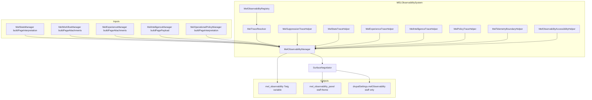

# MELObservabilitySystem

Canonical governance layer for **explainability and orchestration visibility only**. Drupal logging, monitoring, analytics, moderation, Commerce enforcement, permissions, and vendor isolation remain authoritative. This system **reuses** payloads from MELStateSystem, MELWorkflowSystem, MELExperienceSystem, MELIntelligenceSystem, and MELOperationalPolicySystem without recomputing business rules.

## 1. Architecture map

## 2. Observability registry map

| Category | Canonical observability IDs |
|----------|----------------------------|
| State | `mel.obs.state.lifecycle_evaluation`, `mel.obs.state.readiness_evaluation`, `mel.obs.state.trust_interpretation`, `mel.obs.state.eligibility` |
| Workflow | `mel.obs.workflow.activation`, `mel.obs.workflow.cta_suppression`, `mel.obs.workflow.onboarding_progression`, `mel.obs.workflow.continuity_activation` |
| Intelligence | `mel.obs.intelligence.recommendation_ordering`, `mel.obs.intelligence.prioritisation`, `mel.obs.intelligence.suppression`, `mel.obs.intelligence.engagement_orchestration` |
| Policy | `mel.obs.policy.suppression`, `mel.obs.policy.automation_boundary`, `mel.obs.policy.trust_threshold`, `mel.obs.policy.communication` |
| Experience | `mel.obs.experience.resume_continuity`, `mel.obs.experience.escalation_continuity`, `mel.obs.experience.cross_surface_continuity` |
| Telemetry governance | `mel.obs.telemetry.drupal_log_boundary`, `mel.obs.telemetry.drupal_settings_boundary`, `mel.obs.telemetry.twig_boundary` |

Each `ObservabilityDefinition` records: source systems, minimum `MelObservabilityVisibilityLevel`, explainability boundaries, privacy boundaries, allowed `MelSurfaceId` list, accessibility notes, and deterministic `sortOrder`.

## 3. Trace governance map

| Question | Source | Governed output |
|----------|--------|-----------------|
| Why a recommendation ranked higher | `prioritisation_trace` from intelligence | `MelIntelligenceTraceHelper` — tier/weight/id rule text |
| Why a CTA was suppressed | State `cta_governance` + workflow context | `MelStateTraceHelper` / workflow traces — flags only |
| Why density dropped an item | Orchestration `suppressed_ids`, `density_policy` | `MelSuppressionTraceHelper` |
| Why policy hid intelligence | `intelligence_governance.suppress_definition_ids` | `MelSuppressionTraceHelper` + `MelPolicyTraceHelper` |
| Why continuity resumed | Experience attachments | `MelExperienceTraceHelper` — customer copy is reassuring, not id-heavy |

Traces are **sorted** by `deterministic_key` (lexical) for stable ordering. Keys are built only via `MelObservabilityDeterministicKey::format()`: `observability_id|code`, or `observability_id|code|disambiguator` when the same code can repeat; segments never contain translated copy or raw `|` characters.

## 4. Suppression visibility map

- **Checkout / sensitivity**: categorical density and policy lines (no payment internals).
- **Operational policy**: uses existing `explainability.lines` and suppression governance maps.
- **Customer shell**: suppressed recommendation list is truncated; staff retains full list in traces.

## 5. State interpretation visibility map

- **Operational+**: lifecycle primary id, readiness summary keys, eligibility (counts on customer).
- **Diagnostic + staff**: trust indicator contract ids only on staff surface (`MelStateTraceHelper`).

## 6. Experience continuity visibility map

- **Minimal**: reassuring resume copy for customer/auth; boolean escalation flags as posture only.
- **Operational+**: cross-surface hint tokens and workflow edges from `continuation` payload.

## 7. Telemetry-boundary governance map

`MelTelemetryBoundaryHelper` emits **static** staff-only rows: Drupal logger ownership, drupalSettings shape, Twig variable discipline. `boundaryReference()` returns a keyed reference map for the staff panel disclosure.

## 8. Explainability report

- Every trace row: `observability_id`, `code`, `message` (translated), `deterministic_key`.
- Payload `explainability.framework` states deterministic, categorical derivation.
- `hook_mel_observability_page_payload_alter()` allows owning modules to trim or annotate without adding surveillance.

## 9. Accessibility report

- Staff panel: `role="region"`, `aria-labelledby`, `data-mel-reduced-motion="respect"` on region; `summary` elements keyboard-focusable via `mel-observability.js` (Drupal behavior + `once`).
- Theme SCSS uses existing spacing, radii, and colour tokens only.

## 10. Duplication cleanup report

- **Prioritisation / orchestration**: single source remains `MelIntelligenceManager`; observability **reads** `prioritisation_trace` and `orchestration` only.
- **Policy explainability**: reuses `explainability.lines` from `MelOperationalPolicyManager`; no second policy engine.
- **No new** Twig hardcoding of business rules: `mel-observability-panel.html.twig` loops PHP-provided rows only.
- **Existing** `components/_diagnostics.scss` (`.mel-diagnostics`) left unchanged; new MEL observability uses `mel-observability-panel` BEM to avoid collision.

## 11. Surface visibility matrix

| Shell | Tier | Panel / traces |
|-------|------|----------------|
| CustomerShell | Minimal | `mel_observability` variable; no staff panel; truncated suppression enumeration |
| VendorShell | Operational | Traces in variable; no diagnostic theme panel |
| StaffSurface | Diagnostic | `mel_observability_panel` when traces non-empty; telemetry reference |
| PublicSurface | None | Empty / minimal traces only where contracts allow |
| AuthShell | Minimal | Same posture as customer for continuity copy |

## 12. File-by-file implementation summary

| File | Role |
|------|------|
| `MelObservabilityTraceCategory.php` | Trace grouping enum |
| `MelObservabilityVisibilityLevel.php` | Visibility tier enum |
| `ObservabilityDefinition.php` | Immutable contract row |
| `MelObservabilityRegistry.php` | Canonical registry |
| `MelTraceResolver.php` | Surface tier + contract applicability |
| `MelSuppressionTraceHelper.php` | Suppression / density / policy suppress traces |
| `MelStateTraceHelper.php` | State interpretation traces |
| `MelExperienceTraceHelper.php` | Continuity traces |
| `MelIntelligenceTraceHelper.php` | Intelligence trace wrapping |
| `MelPolicyTraceHelper.php` | Policy explainability traces |
| `MelTelemetryBoundaryHelper.php` | Telemetry boundary copy |
| `MelObservabilityAccessibilityHelper.php` | Region/list ARIA attributes |
| `MelObservabilityManager.php` | Composes payload, merges cache, invokes alter hook; permission gate + trace sanitisation |
| `MelObservabilityDiagnosticsAccess.php` | Staff surface + `access mel observability diagnostics` gate |
| `MelObservabilityTraceSanitizer.php` | Redacts payment tokens, long numerics, emails from trace copy |
| `SurfaceNegotiator.php` | Attaches `mel_observability`, panel, library, drupalSettings |
| `myeventlane_surface.permissions.yml` | `access mel observability diagnostics` (restrict access) |
| `myeventlane_surface.services.yml` | DI wiring |
| `myeventlane_surface.module` | Theme + preprocess + hook documentation |
| `templates/components/mel-observability-panel.html.twig` | Staff panel markup |
| `js/mel-observability.js` | Progressive enhancement |
| `myeventlane_surface.libraries.yml` | `observability` library |
| Theme `page.html.twig` | Renders `mel_observability_panel` region |
| `_mel-observability.scss`, `_mel-traces.scss`, `_mel-diagnostics.scss`, `_mel-explainability.scss`, `_mel-governance-panels.scss`, `main.scss` | Token-only styling |

## 13. Residual risk

- Full diagnostics require **Staff surface** plus the **`access mel observability diagnostics`** permission (PHP gate in `MelObservabilityManager` and `SurfaceNegotiator`). Roles with `is_admin: true` receive all permissions by default.
- Themes that do not extend `page.html.twig` must opt in to render `mel_observability_panel` manually (vendor console uses `layout/page.html.twig` + governance include on the dashboard route).
