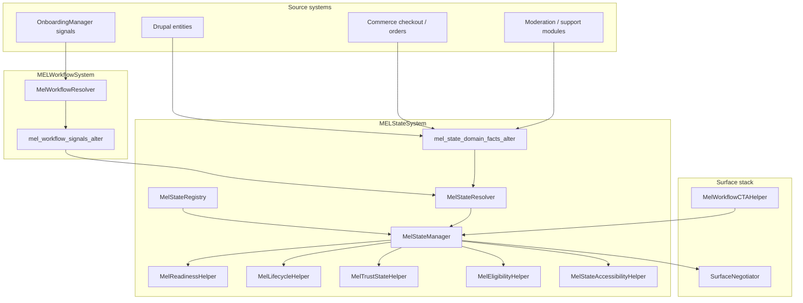

# MELStateSystem

Canonical **interpretation layer** for readiness, lifecycle, trust, checkout UX states, and feature eligibility across MEL surfaces. Drupal entities, Commerce orders, onboarding records, moderation queues, permissions, and routes remain the **sources of truth**; this system governs **how shells present** those truths without replacing access control.

## 1. Architecture map

**Page variables**

- `mel_state` — array from `MelStateManager::buildPageInterpretation()` (plus bubbled cache metadata).
- `data-mel-state-tone` on `<html>` / `<body>` — surface tone for progressive enhancement.

## 2. State registry map

| Contract ID | Category | Primary signal / fact keys |
|-------------|----------|----------------------------|
| `account_created` | Customer readiness | `surface.customer` + authenticated |
| `profile_completed` | Customer readiness | `customer.profile.complete` |
| `first_booking_completed` | Customer readiness | `customer.flags.has_orders` |
| `notification_preferences_complete` | Customer readiness | `customer.readiness.notifications_complete` |
| `vendor_profile_completed` | Vendor readiness | `vendor.flags.has_vendor` (refine via facts) |
| `stripe_connected` | Vendor readiness | `vendor.flags.stripe_connected` |
| `payout_ready` | Vendor readiness | `vendor.readiness.payout_ready` |
| `onboarding_complete` | Vendor readiness | `vendor.onboarding.completed` |
| `first_event_ready` | Vendor readiness | `vendor.flags.has_events`, `vendor.flags.has_tickets` |
| `draft` … `moderation_hold` | Event lifecycle | `event.lifecycle.*` facts |
| `cart_ready` … `refunded` | Checkout interpretation | `checkout.state.*` facts |
| `verified_vendor` … `support_attention` | Trust | `trust.*` facts (+ aliases) |
| `*_eligible` | Feature eligibility | `feature.eligibility.*` facts |

Full metadata (severity, UX/CTA implications, accessibility notes) lives on each `StateDefinition` in `MelStateRegistry`.

## 3. Lifecycle governance map

- **Primary chip**: `MelLifecycleHelper::resolvePrimaryLifecycleId()` applies precedence: moderation hold → archived → cancelled → sold out → draft → incomplete → publishable → published → boosted.
- **Publishable** contract treats moderation hold / cancelled / archived as **blocking** interpretation signals so publish CTAs stay suppressed in UX until modules assert publishability.

## 4. Trust governance map

- **Public / Auth shells**: only contracts marked `publicSafe` on trust definitions may surface (today: `verified_vendor`).
- **Vendor / Staff**: broader trust IDs may render when satisfied; copy must remain non-sensitive (no investigation internals).
- **Aliases**: `support.flags.escalation` workflow signal maps to `trust.escalation_review` for interpretation glue only.

## 5. Readiness governance map

- `MelReadinessHelper` emits **neutral summaries** from interpreted evaluations plus checkout route signals (e.g. attendee completeness on Commerce checkout).
- Does **not** replace onboarding managers, publish gates, or form validation.

## 6. Eligibility governance map

- `MelEligibilityHelper::satisfiedFeatureIds()` lists satisfied **feature eligibility** contracts.
- **Drupal permissions** still enforce export, analytics, boosts, etc.; eligibility hints only steer UX.

## 7. CTA eligibility map

| Hint (`mel_state.cta_governance`) | Rule (interpretation) |
|-----------------------------------|------------------------|
| `defer_workflow_primary` | Payment processing on Commerce checkout **or** `event.lifecycle.moderation_hold` |
| `elevate_stripe_cta` | Vendor shell + onboarding resume + Stripe contract unsatisfied |
| `hide_publish_cta` | `publishable` ≠ satisfied |
| `hide_boost_cta` | `boost_eligible` ≠ satisfied |
| `hide_export_cta` | `export_eligible` ≠ satisfied |

`MelWorkflowCTAHelper` calls `MelStateManager::shouldSuppressPrimaryWorkflowCta()` so workflow orchestration defers during sensitive interpretation moments.

## 8. Accessibility report

- `MelStateAccessibilityHelper` exposes polite/assertive `role="status"` attribute bundles for templates.
- JS behaviour `mel-state-live` mirrors `data-mel-aria-live` onto `aria-live` when absent (progressive enhancement).
- SCSS uses existing spacing/colour/radius tokens; severity variants avoid colour-only reliance by documenting icon + text pairing in registry strings.
- Reduced-motion hint: `data-mel-reduced-motion="respect"` in `mel_state.accessibility.reduced_motion_data` for pairing with CSS.

## 9. Duplication cleanup report

| Area | Finding | Follow-up |
|------|---------|-----------|
| Vendor dashboard readiness | `VendorDashboardViewModelBuilder::buildReadiness()` duplicates operational concepts | Feed dashboard cards from `mel_state` + domain facts when route/event context is available |
| Event Studio readiness | `EventStudioForm` inline warnings | Map studio checks into `hook_mel_state_domain_facts_alter()` and reuse registry contracts |
| Publish gates | `VendorPublishRequirementsGate`, `PaidPublishStripeGate` | Keep as enforcement; surface layer reads interpreted facts only |
| Public trust | `public-trust` components | Align copy with `trust.*` contracts and `publicSafe` flags |

**This iteration** introduces the registry and page-level interpretation without removing legacy UI to avoid behavioural regressions.

## 10. Commerce & moderation safety

- No Commerce order state mutation; checkout contracts require contributing modules to set `checkout.state.*` facts.
- No public exposure of moderation risk scores; staff diagnostic language stays in staff/vendor-safe contexts.

## 11. File-by-file summary

| File | Role |
|------|------|
| `MelStateContractCategory.php` | Enum grouping registry entries |
| `MelStateSeverity.php` | Interpretation severity |
| `web/modules/custom/myeventlane_core/src/MelStateEvaluation.php` | satisfied / unsatisfied / unknown |
| `StateDefinition.php` | Single contract record |
| `MelStateRegistry.php` | Canonical catalogue |
| `MelStateResolver.php` | Merge workflow signals + `hook_mel_state_domain_facts_alter` + aliases |
| `MelStateManager.php` | Page interpretation + CTA governance hints |
| `web/modules/custom/myeventlane_core/src/MelReadinessHelper.php` | Readiness copy (DI: service id `myeventlane_surface.state_readiness_helper` in `myeventlane_core.services.yml`) |
| `MelLifecycleHelper.php` | Lifecycle precedence |
| `MelTrustStateHelper.php` | Role-aware trust visibility |
| `MelEligibilityHelper.php` | Feature eligibility listing |
| `MelStateAccessibilityHelper.php` | WCAG-oriented attribute helpers |
| `SurfaceNegotiator.php` | Exposes `mel_state`, merges cache, sets `data-mel-state-tone` |
| `MelWorkflowCTAHelper.php` | Defers primary CTA when state manager suppresses |
| `myeventlane_surface.services.yml` | DI wiring |
| `myeventlane_surface.module` | Hook documentation |
| `mel-interactions.js` | `mel-state-live` behaviour |
| Theme `_*mel-*.scss` | Token-only hooks for readiness/lifecycle/trust/eligibility |

## 12. Integration checklist for feature modules

1. Implement `hook_mel_state_domain_facts_alter()` to set boolean facts (`event.lifecycle.*`, `checkout.state.*`, `trust.*`, `feature.eligibility.*`) **after** enforcing access in your controller/service.
2. Prefer reusing existing workflow signals before inventing new keys.
3. Never use `mel_state` output as an access bypass—pair with entity/route checks server-side.
