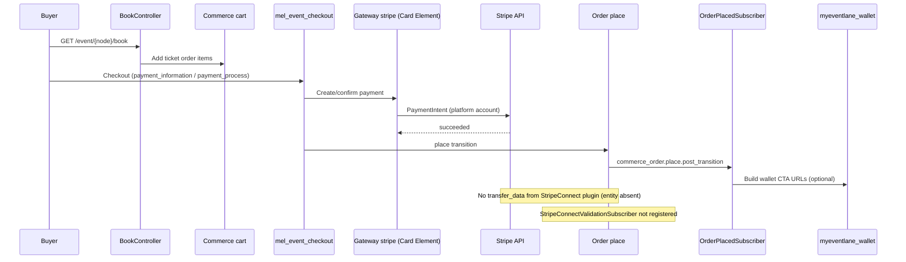
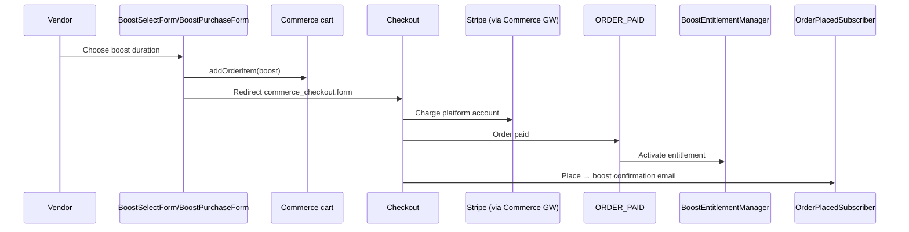
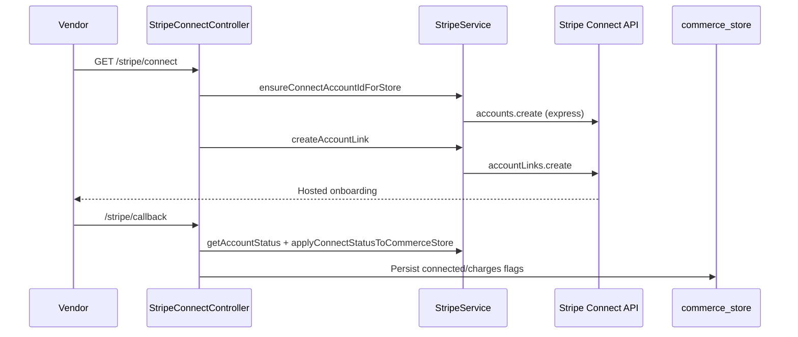
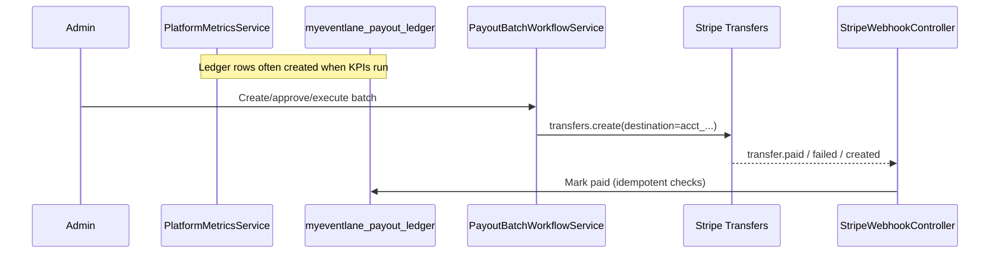
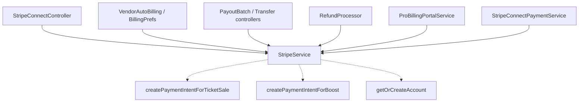

# MEL Payment Runtime Map

**Status:** READ-ONLY architecture audit  
**Date:** 20 July 2026  
**Platform:** Drupal 11 · Drupal Commerce 3 · Commerce Stripe 2.2.1 · PHP 8.x · DDEV  
**Language:** Australian English  

**Related critical report (read first):** [`payment-critical-findings.md`](./payment-critical-findings.md)

**Validation performed:**

- `ddev drush cr` — success  
- Read-only `ddev drush` entity/config/plugin inspection  
- Repository search of custom modules and `config/sync`  

**Rules used in this document:**

- Every operational claim cites source path, class/method, config ID, and/or runtime evidence.  
- Where proof is incomplete: **Not proven.**  
- Secret values are redacted. Never commit gateway secrets.

---

## Executive summary

| Concern | Proven state (DDEV, 20 Jul 2026) |
| --- | --- |
| Active Commerce Stripe gateways | `stripe` (Card Element, customers); `stripe_pe_recurring` (Pro/recurring); `mel_stripe_cc` (admin-only after remediation) |
| Custom Connect destination-charge gateway | Plugin `stripe_connect` **exists**; **0** gateway entities use it → destination charges **UNUSED** at checkout |
| Vendor fund movement | Stripe **Transfers** + `myeventlane_payout_ledger` (admin batch / transfer controllers) |
| Ledger row creation | Lazy insert inside `PlatformMetricsService::buildKpis()` — **not** on `ORDER_PAID` |
| Ticket / Boost / Pro initial checkout order type | `default` → checkout flow `mel_event_checkout` |
| Recurring renewals | Order type `recurring` (Commerce Recurring); no checkout flow on order type |
| Wallet modules | Pass generation / email CTAs after purchase — **no** Stripe charge APIs found in `myeventlane_wallet` |
| Duplicate payment paths | Parallel models exist: Commerce Stripe checkout vs unused Connect PI helpers vs Transfer payouts |

---

## Stage 1 — Payment entry points

### 1.1 Inventory

| Payment type | Active path proven? | Primary modules |
| --- | --- | --- |
| Ticket purchases | Yes | `myeventlane_commerce`, `myeventlane_checkout_flow`, `commerce_stripe` |
| Boost purchases | Yes | `myeventlane_boost`, Commerce cart/checkout |
| MEL Pro subscriptions | Yes (initial cart); renewals via Commerce Recurring | `myeventlane_pro`, `commerce_recurring` |
| Donations (RSVP / platform / organiser / MEL %) | Partially mapped | `myeventlane_donations` |
| Refunds | Yes | `myeventlane_refunds` + Commerce gateway `refundPayment()` |
| Vendor onboarding (Connect Express) | Yes | `myeventlane_vendor` + `StripeService` |
| Vendor payouts | Yes (Transfer model) | `myeventlane_admin_dashboard`, `myeventlane_stripe` |
| Off-session billing | Yes (vendor MEL contribution auto-bill) | `VendorAutoBillingService` |
| Wallet-related **payment** actions | No payment charge path found | `myeventlane_wallet` (pass/JWT only) |
| Apple / Google Wallet payment dependencies | None proven | Wallet links in confirmation email only |

---

### 1.2 Ticket purchase

| Aspect | Evidence |
| --- | --- |
| User journey | Public book → cart → Commerce checkout → Stripe → place/paid → confirmation + optional wallet CTAs |
| Route | `myeventlane_commerce.book` → `/event/{node}/book` (`myeventlane_commerce.routing.yml`) |
| Controller | `Drupal\myeventlane_commerce\Controller\BookController::book` |
| Checkout flow | Order type `default` → `checkout_flow: mel_event_checkout` (runtime + `config/sync/commerce_order.commerce_order_type.default.yml`) |
| Checkout plugin | `mel_event_checkout` — `Drupal\myeventlane_checkout_flow\Plugin\Commerce\CheckoutFlow\MelEventCheckoutFlow` |
| Key panes | `payment_information` (checkout), `stripe_review` (review), `payment_process` (payment, capture=true) — `commerce_checkout.commerce_checkout_flow.mel_event_checkout` |
| Order type | `default` |
| Payment gateway (typical) | Entity `stripe`, plugin `stripe` (Card Element). Fast-checkout path requires Payment Element (`StripePaymentElementInterface`) — see Stage 2 |
| Stripe API | Via Commerce Stripe plugin (PaymentIntent creation inside contrib), **not** MEL `StripeConnect` |
| Webhook | No MEL ticket-payment webhook proven. Contrib `commerce_stripe_webhook_event` enabled; public Stripe webhook route for Commerce payments **not** found as a named public route |
| Completion | Commerce place transition; `StripeConnectValidationSubscriber` exists but is **unwired** (not in services.yml; not a COMPLETION listener at runtime) |
| Confirmation email | `OrderPlacedSubscriber` → `OrderConfirmationQueueBuilder` on `commerce_order.place.post_transition` |
| Wallet generation | Email may include Apple/Google wallet URLs via `OrderConfirmationQueueBuilder` + `myeventlane_wallet` services — **after** payment, not during charge |
| Events | `OrderEvents::ORDER_PAID` consumers (capacity, messaging PDF recovery, etc.) |
| Queue / cron | Messaging queues for confirmation; ticket PDF merge at send time (messaging module) |



---

### 1.3 Boost purchase

| Aspect | Evidence |
| --- | --- |
| User journey | Vendor selects boost → cart line item → Commerce checkout → on paid, entitlement activated |
| Routes / UI | `BoostController` + forms `BoostSelectForm` / `BoostPurchaseForm` |
| Cart | `CartManager` / `CartProvider` add boost variation; redirect `commerce_checkout.form` |
| Order type | Cart uses default Commerce cart path (boost line item bundle `boost`) — **Not proven** every boost order is exclusively `default`, but forms use standard cart APIs without creating `recurring` orders |
| Gateway | Same Commerce gateway pool as other `default` checkouts (no Boost-specific gateway filter found) |
| Stripe Connect gate | `StripeChecker` + controller checks `field_stripe_connected` before purchase UX |
| Connect on PI | `StripeConnectPaymentService::orderRequiresConnect()` skips boost-only Connect requirement |
| Completion UX | `BoostCheckoutRedirectSubscriber` → boost success page |
| Entitlement | `BoostOrderSubscriber` on `OrderEvents::ORDER_PAID` → `BoostEntitlementManager` |
| Confirmation email | `OrderPlacedSubscriber` detects boost-only and uses dedicated boost template |
| Direct PI helper | `StripeService::createPaymentIntentForBoost()` — **no callers** → UNUSED |



---

### 1.4 MEL Pro subscription

| Aspect | Evidence |
| --- | --- |
| User journey | Pro overview → `ProSubscribeForm` → cart `default` → checkout → Commerce Recurring subscription entity |
| Form | `Drupal\myeventlane_pro\Form\ProSubscribeForm` |
| Cart | `$this->cartProvider->getCart('default', $store, $user)` — **order type `default` for initial purchase** |
| Variation type | `mel_pro_subscription_variation` (logged in form) |
| Renewals | Order type `recurring`, workflow `order_recurring` (`commerce_order.commerce_order_type.recurring`) |
| Gateway intent | Entity `stripe_pe_recurring`, plugin `stripe_payment_element`, `payment_method_usage: off_session` |
| Lifecycle | `ProSubscriptionSubscriber` on Commerce Recurring subscription insert/update |
| Billing portal | `ProBillingPortalService` uses `StripeService::getPlatformClient()` |
| Webhook | `/stripe/webhook/subscription` → `ProSubscriptionWebhookController` — **audit logging only**; does not mutate Commerce state |
| Confirmation | Messaging/Commerce receipts — Pro-specific mail path **Not fully enumerated here** |

```mermaid
sequenceDiagram
  participant Vendor
  participant Form as ProSubscribeForm
  participant Cart as Cart type default
  participant CO as Checkout
  participant PE as stripe_pe_recurring (PE)
  participant CR as commerce_recurring
  participant Stripe as Stripe
  participant Hook as ProSubscriptionWebhookController

  Vendor->>Form: Subscribe
  Form->>Cart: addEntity(Pro variation)
  Form->>CO: commerce_checkout.checkout
  Note over CO,PE: Gateway selection not forced in MEL code; PE intended for off_session
  CO->>Stripe: Initial payment / setup
  CO->>CR: Subscription entity
  Stripe-->>Hook: subscription.*/invoice.* (audit only if secret set)
```

---

### 1.5 Donations

| Subtype | Evidence |
| --- | --- |
| RSVP donation | Order type `rsvp_donation`, checkout flow `default` (runtime). `RsvpDonationService`; `RsvpDonationCheckoutRedirectSubscriber` |
| Platform donation | Order type `platform_donation`, checkout flow `default`. `VendorWizardPlatformDonationSubscriber` on `ORDER_PAID` |
| Organiser donation | Current ticket booking path: `TicketSelectionForm::applyMelDonationToOrder()` → `field_mel_donation` + adjustment `source_id: myeventlane_order_donation`. Legacy `checkout_donation` item type / `DonationPane` still exist (`DonationPane::isVisible()` always FALSE). Connect fee math in `StripeConnectPaymentService` unused at PI time (see critical findings) |
| Vendor MEL % / invoices | `VendorMelPctContributionService`, invoice services; payment method save via `VendorMelSavePaymentMethodController` + SetupIntent |
| Auto-billing | `VendorAutoBillingService::attemptAutoCharge()` → `StripeService::createPaymentIntentOffSession()`; triggered from Drush commands / admin invoice form — **not** proven on cron by default |

```mermaid
sequenceDiagram
  participant Actor
  participant Checkout as Commerce checkout
  participant Stripe as Stripe (Commerce or StripeService)
  participant Paid as ORDER_PAID subscribers

  alt Attendee/platform donation checkout
    Actor->>Checkout: Donate (order type rsvp_donation / platform_donation)
    Checkout->>Stripe: Commerce payment
    Checkout->>Paid: Mark wizard / contribution state
  else Vendor MEL auto-bill
    Actor->>Stripe: createPaymentIntentOffSession (opt-in only)
  end
```

---

### 1.6 Refunds

| Aspect | Evidence |
| --- | --- |
| Buyer request | Route `myeventlane_refunds.buyer_refund` → `/my-tickets/order/{commerce_order}/refund` |
| Vendor refund | `myeventlane_refunds.vendor_refund` → `/vendor/orders/{commerce_order}/refund` |
| Approval flow | Refund request approve/reject routes under `/vendor/events/{node}/refund-requests/...` |
| Execution | `RefundProcessor::refundPayment()` → `$plugin->refundPayment($payment, $price)` |
| Stripe verify | `RefundProcessor` also uses `StripeService::getPlatformClient()` to list/confirm refunds |
| Email / notify | Messaging + optional `RefundNotificationTriggerService` |
| Queue | Refund module uses queue factory (retry route `myeventlane_refunds.retry`) |

```mermaid
sequenceDiagram
  participant Actor as Buyer/Vendor/Admin
  participant RP as RefundProcessor
  participant GW as Payment gateway plugin
  Stripe as Stripe API

  Actor->>RP: Request / approve refund
  RP->>GW: refundPayment(payment, amount)
  GW->>Stripe: Refund API (Commerce Stripe)
  RP->>Stripe: Confirm refund id via platform client
  RP->>Actor: Status + notifications
```

---

### 1.7 Vendor onboarding (Stripe Connect Express)

| Aspect | Evidence |
| --- | --- |
| Routes | `/stripe/connect`, `/stripe/callback`, `/stripe/manage`, `/vendor/onboard/stripe`, return/refresh paths — `myeventlane_vendor.routing.yml` |
| Controller | `StripeConnectController` (`connect`, `callback`, `manage`) |
| Onboard page | `VendorOnboardStripeController::stripe` |
| Service | `myeventlane_core.stripe` → `ensureConnectAccountIdForStore`, `createAccountLink`, `getAccountStatus`, `applyConnectStatusToCommerceStore`, `createLoginLink` |
| Account type | Express (`createConnectAccount(..., 'express')`) |
| Store fields | `field_stripe_account_id`, `field_stripe_connected`, `field_stripe_status` |
| Access | `StripeConnectAccess` |
| OAuth (Commerce Stripe platform) | Separate: `commerce_stripe.connect.oauth_*` routes for gateway Connect OAuth — used by gateway entity auth, not vendor Express Account Links |



---

### 1.8 Vendor payouts

| Aspect | Evidence |
| --- | --- |
| Model | Platform holds funds; admin creates Stripe **Transfer** to connected account |
| Ledger | Table `myeventlane_payout_ledger` |
| Ledger create | `PlatformMetricsService::buildKpis()` lazy insert (see CF-006) |
| Batch workflow | `PayoutBatchWorkflowService` — draft → pending → approved → executed |
| Transfer create | `$client->transfers->create(['destination' => $connectedAccountId, ...])` |
| Controllers | `PayoutController`, `PayoutBatchController`, `PayoutTransferController`, `PayoutActionController` |
| Vendor UI | `/vendor/payouts` (`myeventlane_vendor.console.payouts`); balance via `VendorStripeBalanceService` / `VendorStripePayoutService` (payouts.list on connected account) |
| Webhook reconcile | `/stripe/webhook/payout` |



---

### 1.9 Off-session billing

| Path | Evidence | Status |
| --- | --- | --- |
| Vendor MEL contribution auto-charge | `VendorAutoBillingService` + SetupIntent collection | ACTIVE when opted in |
| Pro recurring renewals | `stripe_pe_recurring` `payment_method_usage: off_session` + Commerce Recurring | ACTIVE (module enabled); end-to-end charge in this audit run **Not proven** |
| Fast checkout | Requires Payment Element gateway | ACTIVE code path |

---

### 1.10 Wallet modules

| Claim | Evidence |
| --- | --- |
| No Stripe charge in wallet module | `myeventlane_wallet` builders/controllers deal with pass/JWT presentation |
| Post-payment dependency | Confirmation email embeds wallet URLs (`OrderConfirmationQueueBuilder`) |
| Payment gateway dependency | **None proven** |

---

## Stage 2 — Commerce payment gateway audit

### 2.1 Configured gateway entities

| Machine name | Label | Plugin ID | Conditions | Payment method types | Auth | Webhook secret (runtime DDEV) | Status |
| --- | --- | --- | --- | --- | --- | --- | --- |
| `stripe` | MEL - Stripe CC | `stripe` | `current_currency: AUD` | `credit_card` | **Remediation:** `api_keys` (empty `access_token`); sync YAML still empty secrets | empty | enabled |
| `stripe_pe_recurring` | Stripe (Payment Element) — Recurring | `stripe_payment_element` | AUD **and** `order_variation_type: mel_pro_subscription_variation` | `stripe_card` | API keys | empty | enabled |
| `mel_stripe_cc` | MEL - Manual | `manual` | `current_user_role: administrator` | `credit_card` | n/a | n/a | enabled (admin-only) |

Sources: `config/sync/commerce_payment.commerce_payment_gateway.*.yml` + runtime `ddev drush` entity load.

### 2.2 Discovered plugins (not all have entities)

| Plugin ID | Provider | Class | Entities using it |
| --- | --- | --- | --- |
| `stripe` | commerce_stripe | `Drupal\commerce_stripe\Plugin\Commerce\PaymentGateway\Stripe` | `stripe` |
| `stripe_payment_element` | commerce_stripe | `...StripePaymentElement` | `stripe_pe_recurring` |
| `stripe_connect` | myeventlane_commerce | `Drupal\myeventlane_commerce\Plugin\Commerce\PaymentGateway\StripeConnect` | **0** |
| `manual` | commerce_payment | Manual | `mel_stripe_cc` |

### 2.3 How Commerce chooses gateways

1. `PaymentGatewayStorage::loadMultipleForOrder($order)` evaluates each gateway’s **conditions** (`applies($order)`).  
2. MEL `FilterPaymentGatewaysSubscriber` enforces the launch gateway matrix (after conditions).  
3. `stripe` requires AUD; `stripe_pe_recurring` requires AUD **and** Pro variation; `mel_stripe_cc` requires administrator.  
4. UI further splits by **payment method type**: Card Element (`credit_card`) vs Payment Element (`stripe_card`).  
5. Fast checkout explicitly requires `StripePaymentElementInterface` — unavailable on ticket carts once PE is Pro-scoped (expected).

### 2.4 Cross-use questions

| Question | Answer | Evidence |
| --- | --- | --- |
| Can ticket checkout ever use the recurring gateway (`stripe_pe_recurring`)? | **Yes at condition level** (AUD only). Segregated by `stripe_card` method type and by which panes/UX are used. Fast checkout **prefers** Payment Element. Standard Card Element path uses `credit_card` → entity `stripe`. | Gateway conditions; `FastCheckoutEligibility`; method types runtime |
| Can Pro subscriptions ever use the ticket gateway (`stripe`)? | **Yes for initial subscribe** — `ProSubscribeForm` builds a **`default`** cart (same order type/checkout pool as tickets). No MEL code forces `stripe_pe_recurring` by order type. | `ProSubscribeForm` cart type `default`; no order-type gateway conditions |

### 2.5 Stores / currency

Runtime stores are overwhelmingly `AUD`. Gateway currency condition matches. Store-level gateway assignment: **Not proven** (Commerce typically uses global gateway entities + conditions, not per-store gateway entities here).

---

## Stage 3 — Stripe runtime API usage

| API surface | Caller(s) | Flow | Classification |
| --- | --- | --- | --- |
| `StripeClient` via `StripeService::getPlatformClient()` | Connect, payouts, refunds verify, Pro portal, billing prefs, auto-bill, webhooks | Platform secret | ACTIVE |
| PaymentIntent (Commerce Stripe plugins) | Contrib Card Element / Payment Element during checkout | Tickets, boost, Pro initial, donations | ACTIVE |
| PaymentIntent (`createPaymentIntentForTicketSale`) | None outside `StripeService` | — | UNUSED |
| PaymentIntent (`createPaymentIntentForBoost`) | None outside `StripeService` | — | UNUSED |
| PaymentIntent off-session | `VendorAutoBillingService` | MEL invoices | ACTIVE |
| SetupIntent | `VendorBillingPreferencesService` / save PM controller | Card on file | ACTIVE |
| Customer | `VendorBillingPreferencesService::createCustomer` | Billing prefs | ACTIVE |
| Account / AccountLink / LoginLink | `StripeConnectController` via `StripeService` | Vendor onboarding | ACTIVE |
| Transfer | `PayoutBatchWorkflowService`, payout controllers | Vendor payouts | ACTIVE |
| Application fee (PI params) | `StripeConnectPaymentService::getConnectPaymentIntentParams` | Only via unused gateway plugin | UNUSED at checkout |
| Application fee (calc helper) | `StripeConnectPaymentService`, `VendorFinanceSummaryBuilder` | Reporting / unused PI path | PARTIALLY ACTIVE (calc/reporting) |
| Refund | Commerce gateway `refundPayment` + Stripe list verify in `RefundProcessor` | Refunds | ACTIVE |
| Payout (connected account list) | `VendorStripePayoutService` | Vendor dashboard display | ACTIVE |
| Subscription / Invoice (Stripe objects) | Pro webhook **logs** types; Commerce Recurring owns state | Pro | ACTIVE (Commerce); webhook audit OPTIONAL |
| Charge (legacy Charge API) | **Not found** in custom MEL payment code | — | UNKNOWN / unused in custom code |
| Webhook constructEvent | Payout + Pro subscription controllers | Signature verify | ACTIVE (when secrets configured) |

---

## Stage 4 — Stripe Connect audit

| Component | Role | Runtime status |
| --- | --- | --- |
| Plugin `StripeConnect` | Extends Payment Element; merges Connect PI params | Plugin discoverable; **no entity** → UNUSED for checkout |
| `StripeConnectPaymentService` | Fee/transfer_data calculation; validation helpers | Service ACTIVE for validation/logging/reporting; PI merge UNUSED |
| `StripeConnectController` | Express onboarding | ACTIVE |
| `StripeConnectValidationSubscriber` | Intended Connect check on checkout complete | UNUSED (class present; not registered as event subscriber) |
| Vendor Express accounts | `field_stripe_account_id` on store | ACTIVE onboarding |
| Destination charges | Intended in plugin | **UNUSED** |
| Application fees on PI | Intended in plugin | **UNUSED** at charge time |
| Transfers | Admin payout path | ACTIVE |
| Commerce Stripe OAuth on gateway `stripe` | `authentication_method: stripe_connect` in **active** DDEV config | ACTIVE locally; **drift vs sync** |

**Is custom StripeConnect gateway active?**  
Plugin: yes (discovery). Commerce payment gateway entity: **no**.

**Destination charge implementation classification:** **UNUSED** (code present, not wired). See CF-001.

---

## Stage 5 — `StripeService` audit

**Service ID:** `myeventlane_core.stripe`  
**Class:** `Drupal\myeventlane_core\Service\StripeService`  
**Definition:** `web/modules/custom/myeventlane_core/myeventlane_core.services.yml`

| Public method | Callers (proven) | Classification |
| --- | --- | --- |
| `getPlatformClient()` | Payouts, refunds, Pro portal, billing, webhooks, internal | ACTIVE |
| `getOrCreateAccount()` | **No external callers** | UNUSED |
| `getPlatformPublishableKey()` | `VendorMelSavePaymentMethodController` | ACTIVE |
| `ensureConnectAccountIdForStore()` | `StripeConnectController` | ACTIVE |
| `applyConnectStatusToCommerceStore()` | `StripeConnectController` | ACTIVE |
| `createConnectAccount()` | Internal from ensure/getOrCreate | ACTIVE (via ensure) |
| `createAccountLink()` | `StripeConnectController` | ACTIVE |
| `createLoginLink()` | `StripeConnectController` | ACTIVE |
| `validateAccountDashboardEligibility()` | Dashboard + internal | ACTIVE |
| `resolveStripeManageDestination()` | `StripeConnectController` | ACTIVE |
| `resolveManageDestinationFromEligibility()` | Unit tests + internal | ACTIVE |
| `createLoginLinkIfEligible()` | Internal path | ACTIVE / low external use |
| `getAccountStatus()` | Connect controllers | ACTIVE |
| `createPaymentIntentForTicketSale()` | None | UNUSED |
| `createPaymentIntentForBoost()` | None | UNUSED |
| `calculateApplicationFee()` | `StripeConnectPaymentService` | ACTIVE (helper) |
| `createCustomer()` | `VendorBillingPreferencesService` | ACTIVE |
| `createSetupIntent()` | Billing prefs | ACTIVE |
| `createPaymentIntentOffSession()` | `VendorAutoBillingService` | ACTIVE |
| `getPaymentMethodLast4()` | Billing prefs | ACTIVE |
| `maskAccountId()` | Logging callers | ACTIVE |



---

## Stage 6 — Runtime call graphs

### 6.1 Ticket purchase

`BookController` → Cart APIs → `MelEventCheckoutFlow` panes → Commerce Payment (`stripe` / optionally PE) → Commerce Stripe PaymentIntent → Order place → `OrderPlacedSubscriber` / `OrderConfirmationQueueBuilder` → optional wallet URL builders → `ORDER_PAID` subscribers (tickets, capacity, PDF recovery, MEL % accrual, etc.).

**Not in path:** `StripeConnectValidationSubscriber` (unwired).

**Not in path:** `StripeConnect::createPaymentIntent`, `createPaymentIntentForTicketSale`.

### 6.2 Boost purchase

`BoostController` / `BoostSelectForm` / `BoostPurchaseForm` → Cart → Checkout → Commerce Stripe → `ORDER_PAID` → `BoostOrderSubscriber` → `BoostEntitlementManager` → `OrderPlacedSubscriber` (boost mail) → `BoostCheckoutRedirectSubscriber`.

### 6.3 Subscription purchase

`ProSubscribeForm` → Cart `default` → Checkout → (intended) Payment Element gateway → Commerce Recurring subscription → `ProSubscriptionSubscriber` → entitlement reconciler services. Renewals: Commerce Recurring + off_session PE gateway.

### 6.4 Donation

Checkout order types `rsvp_donation` / `platform_donation` / line items on default → Commerce payment → `ORDER_PAID` donation subscribers. Organiser donation Connect fee math exists in `StripeConnectPaymentService` but PI merge unused.

### 6.5 Refund

Routes → forms/controllers → `RefundProcessor` → gateway `refundPayment` → Stripe → verify via `getPlatformClient` → messaging/notifications/queue retry.

### 6.6 Vendor billing (MEL contribution)

Save PM: `VendorMelSavePaymentMethodController` → SetupIntent.  
Charge: admin/Drush → `VendorAutoBillingService::attemptAutoCharge` → off-session PI → invoice apply.

---

## Stage 7 — Environment configuration matrix

### 7.1 Credential sources

| Source | What it sets | Used by |
| --- | --- | --- |
| Active Commerce gateway entity config | `secret_key`, `publishable_key`, optional `access_token` | Commerce Stripe plugins; also first hit in `StripeService::getPlatformSecretKey()` lookup list |
| `settings.mel_shared_session.php` | Overlays `MEL_STRIPE_*` env onto `stripe`, `stripe_myeventlane_v2`, `stripe_pe_recurring` | All consumers of those config keys when env set |
| `settings.php` | Optional `STRIPE_PK` / `STRIPE_SK` overlays (documented in `environment-configuration.md`) | Gateway config override |
| `myeventlane_core.stripe_settings` | `platform_secret_key` fallback | `StripeService` if gateways empty |
| `MEL_STRIPE_SECRET_KEY` / `MEL_STRIPE_PUBLISHABLE_KEY` / `MEL_STRIPE_WEBHOOK_SECRET` | Env fallbacks | `StripeService::melGetEnv`; settings overlay |
| `myeventlane_admin_dashboard.settings` `stripe_webhook_secret` | Payout webhook | `StripeWebhookController` |
| `myeventlane_pro.settings` `subscription_webhook_secret` | Pro audit webhook | `ProSubscriptionWebhookController` |

### 7.2 DDEV runtime (20 Jul 2026)

| Item | Result |
| --- | --- |
| `MEL_STRIPE_*` env | unset |
| Gateway `stripe` keys | present in active config (lengths non-zero); sync YAML empty |
| Gateway `stripe` auth | `authentication_method=stripe_connect` (active only) |
| `stripe_pe_recurring` keys | present active; sync empty |
| Payout webhook secret | empty |
| Pro subscription webhook secret | empty |
| `myeventlane_core.stripe_settings` platform key | empty |

### 7.3 Matrix: which credentials feed which subsystem

| Subsystem | Primary credential source |
| --- | --- |
| Commerce Stripe Card Element (`stripe`) | Gateway entity config (± env overlay) |
| Commerce Stripe Payment Element (`stripe_pe_recurring`) | Gateway entity config (± env overlay) |
| `StripeService` platform client | Gateway secret lookup order then config then env |
| Vendor Express onboarding | Same platform secret via `StripeService` |
| Subscriptions (Commerce) | Gateway used at checkout / recurring — typically PE keys |
| Payout Transfers | `StripeService::getPlatformClient()` |
| Payout webhook verify | `myeventlane_admin_dashboard.settings:stripe_webhook_secret` |
| Pro audit webhook | `myeventlane_pro.settings:subscription_webhook_secret` |

**Configuration drift:** sync vs active for `stripe` OAuth fields — see CF-005.

---

## Stage 8 — Webhook audit

| Endpoint | Route name | Controller | Events | Signature | Idempotency | Notes |
| --- | --- | --- | --- | --- | --- | --- |
| `/stripe/webhook/payout` | `myeventlane_admin_dashboard.stripe_payout_webhook` | `StripeWebhookController` (+ `StripeWebhookControllerDecorator`) | `transfer.paid`, `transfer.failed`, `transfer.created` | `Webhook::constructEvent` + admin setting secret | Decorator keyvalue `myeventlane_webhook_events` + ledger status checks | Rejects if secret empty |
| `/stripe/webhook/subscription` | `myeventlane_pro.subscription_webhook` | `ProSubscriptionWebhookController` | Any verified event; audit log if enabled | Pro settings secret | None beyond Stripe retries | **No Commerce state changes** |
| Commerce Stripe payment webhooks | Named public route **not found** | Contrib webhook event admin UI exists | Not proven for MEL checkout | Gateway `webhook_signing_secret` empty in DDEV | — | Payment completion appears synchronous in checkout |
| Postmark | `/webhooks/postmark/*` | Messaging | Delivery/bounce | Shared header secret | — | Not Stripe |

### Duplicate processing

| Webhook | Duplicate possible? | Mitigation |
| --- | --- | --- |
| Payout | Reduced | Decorator skips processed event IDs; ledger paid+same transfer idempotent; mismatch logged critical |
| Pro subscription | Yes (log spam) | Audit-only; low financial risk |
| Commerce payment | Not proven | — |

---

## Stage 9 — Dead code / component classification

| Component | Classification | Proof notes |
| --- | --- | --- |
| Gateway entity `stripe` | ACTIVE | Runtime enabled |
| Gateway entity `stripe_pe_recurring` | ACTIVE | Runtime enabled |
| Gateway entity `mel_stripe_cc` | ACTIVE (test/manual) | Runtime enabled; dangerous if shown in prod checkout |
| Plugin `stripe_connect` | FUTURE / UNUSED wiring | Discoverable; 0 entities |
| `StripeConnectPaymentService` | PARTIAL | Validation/reporting ACTIVE; PI merge UNUSED |
| `StripeConnectValidationSubscriber` | UNUSED | Class exists; not tagged/registered; runtime COMPLETION listeners exclude it |
| `StripeService::createPaymentIntentForTicketSale` | UNUSED | No callers |
| `StripeService::createPaymentIntentForBoost` | UNUSED | No callers |
| `StripeService::getOrCreateAccount` | UNUSED | No external callers (`ensureConnectAccountIdForStore` used instead) |
| Transfer payout stack | ACTIVE | Controllers + batch service |
| Ledger KPI side-effect insert | ACTIVE but fragile | Only insert site found |
| Pro subscription webhook | ACTIVE optional | Secrets empty locally |
| Wallet payment charge code | UNUSED / N/A | No Stripe charge API |

**Deletion rule:** Do not delete UNUSED items without proving: no callers, no service refs, no routes, no plugin manager use, no reflection, no queues, no subscribers. This audit lists candidates only.

---

## Stage 10 — Technical debt

| Component | Problem | Impact | Risk | Recommendation | Priority | Evidence |
| --- | --- | --- | --- | --- | --- | --- |
| `stripe_connect` plugin unwired | Destination charges never applied | Vendor funds not split at PaymentIntent | Critical financial architecture | Choose Option A or B in ADR; wire or formally retire | P0 | CF-001 |
| Ledger via KPI side effect | Orders may lack ledger rows | Vendors unpaid until metrics run | Critical ops | Insert ledger on `ORDER_PAID` with idempotency | P0 | CF-006 |
| Connect validation unwired | No Connect check on checkout complete | Operational / support debt | High | Register subscriber or earlier hard gate if required | P1 | CF-003 |
| Dual Stripe gateway entities same currency | Ambiguous checkout selection | Wrong UX / method type confusion | High | Add order-type or product conditions | P1 | Stage 2 |
| Manual gateway enabled | Test gateway may appear | Accidental unpaid “success” | High | Disable outside local | P1 | Runtime entity |
| Config sync vs active secrets/OAuth | Drift / restore risk | Broken payments after cim | High | Document deploy secret injection; never export secrets | P1 | CF-005 |
| Unused PI helper methods | Parallel mental model | Wrong fixes applied to dead code | Medium | Mark deprecated; keep until ADR | P2 | Stage 5 |
| Pro webhook audit-only | False sense of reconcile | Ops confusion | Medium | Document Commerce Recurring as SoT | P2 | Controller docblock |
| Payout webhook secret empty (DDEV) | No local webhook verify | Local reconcile untestable | Medium | Set via env/settings for staging | P2 | Runtime config |
| Application fee calc vs Transfer commission | Two fee models | Wrong economics | High | Align fee source of truth with chosen architecture | P1 | Connect service vs `commission_rate` in metrics |

---

## Stage 11 — Architecture Decision Record

### ADR: MEL marketplace payment architecture

**Date:** 20 July 2026  
**Status:** Proposed (audit recommendation)  
**Context:** Code contains a destination-charge Connect gateway **and** a Transfer/ledger payout system, but only the latter is wired to runtime Commerce gateway entities. Ticket checkout charges the platform account via Commerce Stripe Card Element.

### Option A — Official Commerce Stripe only (platform collect)

**Customer checkout:** Commerce Payment Element (and/or Card Element) on platform account.  
**Custom code retains:** Vendor Express onboarding, Stripe Connect account status, off-session vendor billing, Transfer/ledger finance, reporting.

| Dimension | Assessment |
| --- | --- |
| Complexity | Lower for checkout; finance complexity stays in ledger/Transfers |
| Maintainability | Aligns with Commerce Stripe upgrades |
| Risk | Ledger creation must be hardened (CF-006); manual ops for payouts |
| Commerce compatibility | Highest |
| Launch readiness | Closest to **current wiring** if ledger guaranteed |

### Option B — Marketplace destination charges

**Customer checkout:** Custom `stripe_connect` gateway entity (Payment Element + `transfer_data` / `application_fee_amount`).  
**Custom code:** Onboarding + fee math already largely in `StripeConnectPaymentService`.

| Dimension | Assessment |
| --- | --- |
| Complexity | Higher checkout correctness (mixed carts, boost-only, donations) |
| Maintainability | Custom plugin must track Commerce Stripe base class changes |
| Risk | Misconfigured fees/transfers; refund complexity with Connect |
| Commerce compatibility | Medium (extends contrib PE) |
| Launch readiness | **Not ready** — entity missing; validation non-blocking |

### Comparison

| | Option A | Option B |
| --- | --- | --- |
| Matches current entities | Yes | No |
| Uses existing Transfer tooling | Yes | Partially redundant |
| Uses existing Connect PI merge | No (retire/ignore) | Yes (wire entity) |
| Launch risk if chosen “as-is” | Ledger gaps | Charges without vendor split |

### Recommendation

**Recommend Option A for launch**, with mandatory hardening:

1. Treat `plugin: stripe_connect` as **future/unused** until explicitly productised.  
2. Guarantee ledger creation on paid ticket (and other vendor-revenue) orders.  
3. Keep Express onboarding + Transfer payouts as the vendor money path.  
4. Narrow gateway conditions so Pro/recurring uses PE off_session and ticket checkout uses a single intentional gateway.  
5. Disable `mel_stripe_cc` outside local/testing.  
6. Revisit Option B only after fee/refund/mixed-cart acceptance tests and a gateway entity in config.

**Evidence basis:** CF-001–CF-006; runtime `entities_with_plugin_stripe_connect=0`; Transfer execution in `PayoutBatchWorkflowService`; ticket checkout on `mel_event_checkout` + gateway `stripe`.

---

## Duplicate paths and launch risks (checklist)

| Risk | Proven? |
| --- | --- |
| Duplicate destination charge + Transfer for same order | Destination path unwired → double Connect split **not** currently possible via that plugin |
| Duplicate gateway choice (Card vs PE) | Possible at AUD condition level |
| Config drift secrets/OAuth | Proven on DDEV active vs sync |
| Ledger missing for paid orders | Proven single lazy writer |
| Wallet charges money | Not found |
| Webhooks required for ticket capture | Not proven; checkout appears synchronous |

---

## Appendix A — Key file index

| Path | Role |
| --- | --- |
| `web/modules/custom/myeventlane_commerce/src/Plugin/Commerce/PaymentGateway/StripeConnect.php` | Unused Connect PE gateway plugin |
| `web/modules/custom/myeventlane_commerce/src/Service/StripeConnectPaymentService.php` | Fee/transfer_data builder |
| `web/modules/custom/myeventlane_core/src/Service/StripeService.php` | Platform Stripe facade |
| `web/modules/custom/myeventlane_vendor/src/Controller/StripeConnectController.php` | Express onboarding |
| `web/modules/custom/myeventlane_admin_dashboard/src/Service/PayoutBatchWorkflowService.php` | Transfer batches |
| `web/modules/custom/myeventlane_admin_dashboard/src/Controller/StripeWebhookController.php` | Transfer webhooks |
| `web/modules/custom/myeventlane_admin_dashboard/src/Service/PlatformMetricsService.php` | Ledger insert |
| `web/modules/custom/myeventlane_refunds/src/Service/RefundProcessor.php` | Refunds |
| `web/modules/custom/myeventlane_pro/src/Form/ProSubscribeForm.php` | Pro cart bootstrap |
| `web/modules/custom/myeventlane_pro/src/Controller/ProSubscriptionWebhookController.php` | Audit webhook |
| `web/modules/custom/myeventlane_donations/src/Service/VendorAutoBillingService.php` | Off-session charges |
| `web/sites/default/settings.mel_shared_session.php` | Env → gateway key overlay |
| `config/sync/commerce_payment.commerce_payment_gateway.*.yml` | Exported gateway skeletons |

---

## Appendix B — Runtime commands used (read-only)

```bash
ddev drush cr
ddev drush pm:list --status=enabled --filter=stripe
ddev drush config:get commerce_payment.commerce_payment_gateway.stripe
ddev drush config:get commerce_payment.commerce_payment_gateway.stripe_pe_recurring
ddev drush php:eval '# gateway/plugin/order-type/route probes (redacted secrets)'
```

No configuration export/import, module install/uninstall, or code changes were performed for this audit beyond writing documentation under `docs/architecture/`.
