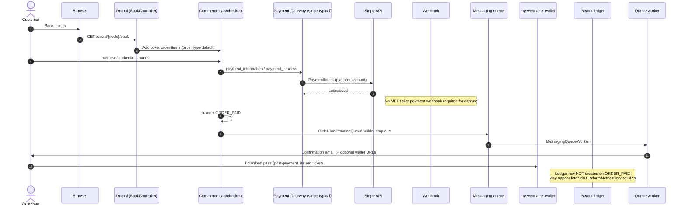
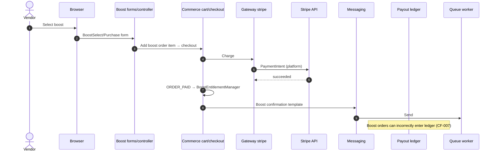
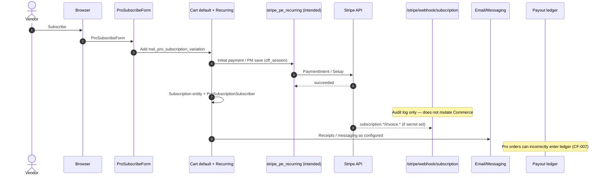
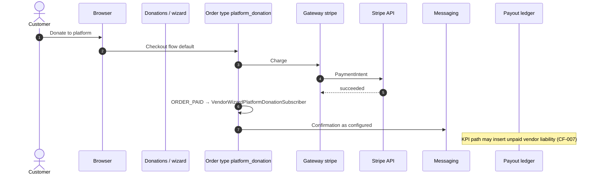
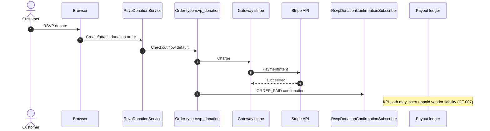
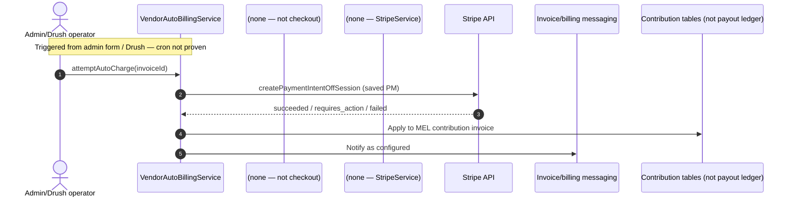
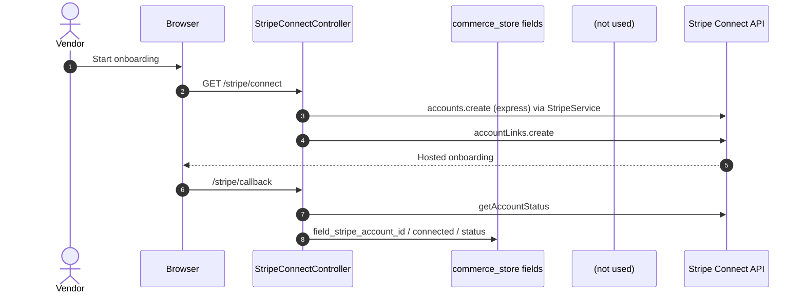
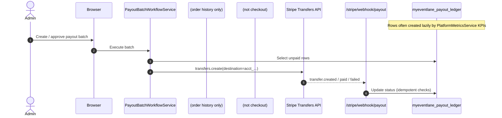
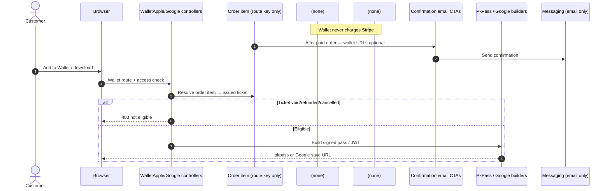

# MEL Payment Sequence Diagrams

**Status:** READ-ONLY Phase 2  
**Date:** 20 July 2026  
**Basis:** Phase 1 runtime map + Phase 2 DDEV verification  
**Note:** Diagrams show the **wired** runtime, not the unused `stripe_connect` destination-charge path.

---

## 1. Ticket purchase



---

## 2. Boost purchase



---

## 3. MEL Pro



---

## 4. Platform donation



---

## 5. RSVP donation



---

## 6. Refund

```mermaid
sequenceDiagram
  autonumber
  actor Actor as Buyer/Vendor/Admin
  participant Browser
  participant Drupal as Refund routes/forms
  participant Commerce as commerce_payment
  participant Gateway as Original payment gateway plugin
  participant Stripe as Stripe API
  participant Email as Notifications/Messaging
  participant Wallet as WalletDownloadAccessChecker
  participant Queue as Refund retry queue

  Actor->>Browser: Request / approve refund
  Browser->>Drupal: RefundProcessor
  Drupal->>Gateway: refundPayment(payment, amount)
  Gateway->>Stripe: Refund API
  Drupal->>Stripe: Verify via StripeService platform client
  Stripe-->>Drupal: Refund id / status
  Drupal->>Commerce: Update payment/order state
  Drupal->>Email: Notify parties
  Note over Wallet: Ticket status refunded/void/cancelled → wallet download denied
  Drupal->>Queue: Retry path if needed
```

---

## 7. Vendor auto billing



---

## 8. Vendor onboarding (Connect Express)



---

## 9. Vendor payout



---

## 10. Wallet generation



---

## Participant coverage checklist

| Participant | Appears in |
| --- | --- |
| Customer / Vendor / Admin | All relevant flows |
| Browser | All |
| Drupal | All |
| Commerce | Ticket, Boost, Pro, Donations, Refund, Wallet (route only) |
| Payment Gateway | Ticket, Boost, Pro, Donations, Refund |
| Stripe | All money / Connect / Transfer flows |
| Webhook | Pro (audit), Payout; not ticket capture |
| Email | Ticket, Boost, Pro, Donations, Refund, Wallet CTA |
| Wallet | Ticket confirmation + Wallet generation |
| Ledger | Ticket note, Boost/Pro/Donation risk notes, Payout |
| Queue | Ticket, Boost, Refund retry, Wallet email |
