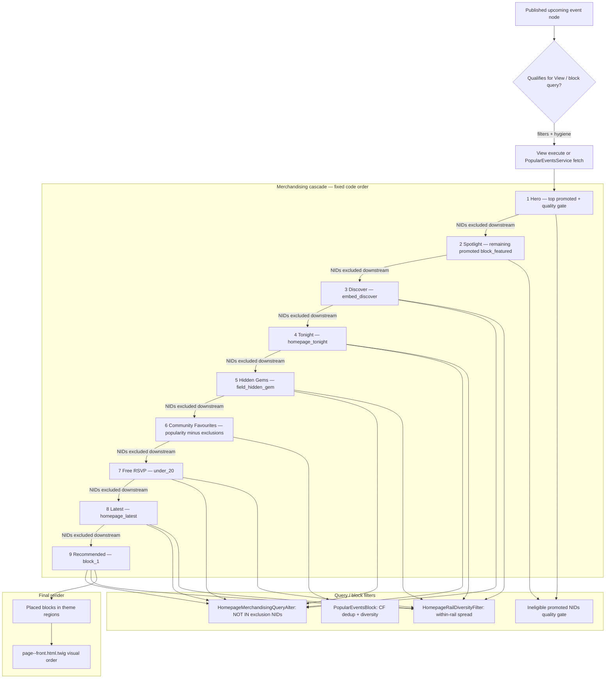

# Homepage Merchandising Alignment Audit (Phase 3B)

**Date:** 2026-06-17  
**Scope:** Audit only — no code, template, config, or rail order changes.  
**Goal:** Determine whether homepage merchandising priority matches homepage visual priority.

---

## Safety check

```bash
git status --short
```

**Result:** Working tree not strictly clean.

| Path | Status |
|---|---|
| `docs/audits/brand-rollout/homepage-rail-architecture-audit.md` | Untracked (prior audit) |

No modified tracked runtime files were present. This audit adds only the deliverable below.

---

## 1. Ownership map

### Core merchandising owners

| File | Responsibility |
|---|---|
| `web/modules/custom/myeventlane_front/src/Service/HomepageMerchandising.php` | **Primary owner.** Resolves hero, spotlight, and per-rail NID sets; defines cross-rail dedup cascade via `getExclusionNids()` and `getCommunityFavouritesExclusionNids()`. Executes upstream Views to materialise rail rosters for downstream exclusion. Applies quality gate for promoted surfaces. |
| `web/modules/custom/myeventlane_front/src/Service/HomepageMerchandisingQueryAlter.php` | Applies `NOT IN` exclusions and ineligible-promoted filter to whitelisted View displays on the front page. Restricts Community Favourites browse (`page_popular`) to `PopularEventsService` ranking. |
| `web/modules/custom/myeventlane_front/myeventlane_front.module` | Wires `hook_views_query_alter()` → `HomepageMerchandisingQueryAlter`; `hook_views_pre_render()` → `HomepageRailDiversityFilter` (+ CF browse reorder). |
| `web/modules/custom/myeventlane_front/myeventlane_front.services.yml` | Service definitions: `homepage_merchandising`, `homepage_merchandising_query_alter`, `homepage_rail_diversity`, `homepage_section_visibility`. |
| `web/modules/custom/myeventlane_front/src/Service/HomepageRailDiversityFilter.php` | Post-query organiser/category/venue diversity within a rail (not cross-rail dedup). Backfills to preserve rail item count. |
| `web/modules/custom/myeventlane_front/src/Service/HomepageSectionVisibility.php` | Sets whether section shells should render (`mel_home_show_*` inputs). CF uses post-dedup pool via `getCommunityFavouritesEventIds()`. |
| `web/modules/custom/myeventlane_front/src/Plugin/Block/PopularEventsBlock.php` | Community Favourites rail builder. Applies homepage dedup + diversity on popularity rows (not via Views query alter). |
| `web/modules/custom/myeventlane_front/src/Service/FeaturedEventsRenderBuilder.php` | Featured/hero View execution and render for Community Spotlight and hero rotator. |
| `web/modules/custom/myeventlane_event/src/Service/PublicEventDiscoveryQueryAlter.php` | Public discovery hygiene (ended state, internal titles, visibility, free/RSVP rules). Whitelists homepage displays except `mel_home_events:embed_discover`. |
| `web/modules/custom/myeventlane_views/myeventlane_views.module` | `homepage_tonight` calendar-day window override; promoted-first pre_render sort for `upcoming_events` and `mel_home_events`. |
| `web/themes/custom/myeventlane_theme/myeventlane_theme.theme` (~L1935–1982) | Front-page preprocess: computes `mel_home_show_*` from `HomepageSectionVisibility` + region children. |
| `web/themes/custom/myeventlane_theme/templates/page--front.html.twig` | **Visual order owner.** Renders discovery section shells in template sequence (independent of merchandising cascade). |
| `web/modules/custom/myeventlane_front/src/Service/HomepageVisibilityReportService.php` | Read-only reporting of which homepage surfaces an event occupies (uses merchandising getters). |

### Not found

| Expected | Status |
|---|---|
| `HomepageMerchandisingInterface` | **Does not exist** in the repository. Merchandising is a concrete final class with no interface. |

### Homepage rail presenters (View display → region)

| Label (template) | View display | Block / region |
|---|---|---|
| Hero | `front_featured_events:block_hero` | `homepage_hero` |
| Discover events | `mel_home_events:embed_discover` | `home_discover` |
| Community spotlight | `front_featured_events:block_featured` | `homepage_featured` |
| Worth exploring next | `front_recommended_events:block_1` | `home_recommended` |
| New this week | `upcoming_events:homepage_latest` | `homepage_latest` |
| Happening tonight | `upcoming_events:homepage_tonight` | `homepage_tonight` |
| Hidden Gems Near You | `upcoming_events:homepage_hidden_gems` | `homepage_hidden_gems` |
| Community Favourites | Plugin `myeventlane_popular_events_block` | `homepage_community_favourites` |
| Easy ways to join in | `mel_home_events:under_20` | `homepage_free` |
| Nearby events | (region only; no block in sync) | `homepage_nearby` |
| Online events | (region only; no block in sync) | `homepage_online` |
| Guides (blog) | `mel_blog:homepage_preview` | `homepage_blog` |

---

## 2. Merchandising flow

An event reaches the homepage through selection, rail assignment, deduplication, and render. Template order does **not** participate in dedup priority.



### Lifecycle steps

1. **Event selected** — Each rail’s View display (or `PopularEventsService` for CF) queries published upcoming events with display-specific filters (promoted, hidden gem flag, free/RSVP, calendar day, etc.) plus shared hygiene from `PublicEventDiscoveryQueryAlter` where whitelisted.
2. **Rail assigned** — First matching rail in the **merchandising cascade** retains the event. Cascade order is hard-coded in `HomepageMerchandising::getExclusionNids()` (lines 148–190) and `getCommunityFavouritesExclusionNids()` (lines 383–394).
3. **Duplicate detection** — When a downstream display executes, `HomepageMerchandisingQueryAlter` adds `nid NOT IN (...)` for all higher-priority rail NIDs already resolved. CF uses the same exclusion set inside `PopularEventsBlock::applyHomepageMerchandising()`.
4. **Rail conflict resolution** — Higher cascade rank wins. There is no “visual position” factor. Lazy getters (`getTonightEventIds()`, etc.) execute upstream Views **with** exclusions already applied, so lower rails never see events claimed above.
5. **Final render** — Blocks render in theme regions; `page--front.html.twig` outputs section shells in a **separate visual sequence** gated by `mel_home_show_*` (and `page.homepage_latest` region truthiness).

---

## 3. Deduplication order

### Priority order (merchandising — authoritative)

Processing order when resolving exclusions (highest priority first):

| Rank | Surface | Resolution method | Evidence |
|---|---|---|---|
| 0 | Hero | `getHeroEventIds()` — single top promoted, marketplace-ready | `HomepageMerchandising.php` L236–244, L454–467 |
| 1 | Spotlight / Community spotlight source | `getSpotlightEventIds()` — promoted minus hero | L251–262 |
| 2 | Discover | `getDiscoverEventIds()` — `mel_home_events:embed_discover` | L268–275; exclusion L150 |
| 3 | Tonight | `getTonightEventIds()` — `upcoming_events:homepage_tonight` | L280–287; exclusion L151–155 |
| 4 | Hidden Gems | `getHiddenGemEventIds()` — `upcoming_events:homepage_hidden_gems` | L294–301; exclusion L156–161 |
| 5 | Community Favourites | `getCommunityFavouritesEventIds()` — popularity pool minus L383–394 exclusions | L406–433; block dedup L346–361 |
| 6 | Free RSVP | `getFreeRsvpEventIds()` — `mel_home_events:under_20` | L306–313; exclusion L162–169 |
| 7 | New this week (Latest) | `getLatestEventIds()` — `upcoming_events:homepage_latest` | L318–325; exclusion L170–178 |
| 8 | Recommended | `getRecommendedEventIds()` — `front_recommended_events:block_1` | L440–447; exclusion L179–188 |

**Additional global exclusion:** Ineligible promoted events (fail `BoostedEventQualityGate`) are excluded from all merchandised displays and hero/featured quality-gate surfaces (`HomepageMerchandisingQueryAlter.php` L59–64).

### Which displays are processed first?

`HomepageMerchandising` uses lazy memoised getters. The **first call** to any getter triggers upstream View execution. Effective order follows cascade dependencies:

- Hero/spotlight load from entity query (not Views).
- `getDiscoverEventIds()` runs first among View-backed rails when any downstream exclusion is needed.
- Each subsequent getter executes its View with exclusions from all higher ranks already computed.

`MERCHANDISED_DISPLAYS` constant (L30–47) defines which displays receive query alters; Community Favourites is **intentionally absent** — dedup happens in the block plugin instead.

### Conflict behaviour (multi-rail eligibility)

**Rule:** Highest merchandising rank wins; event is `NOT IN` downstream queries.

| If event qualifies for… | Wins (appears in) | Loses (excluded from) | Why |
|---|---|---|---|
| Hidden Gems + Community Favourites | Hidden Gems | Community Favourites | CF exclusions include `getHiddenGemEventIds()` (`L393`) |
| Hidden Gems + Recommended | Hidden Gems | Recommended | Recommended exclusions include hidden gem NIDs (`L184–185`) |
| Community Favourites + Recommended | Community Favourites | Recommended | Recommended exclusions do not include CF NIDs in query alter, but CF events are popular; if same event is in CF display it was not in higher rails. If event is only in CF pool and Recommended query, Recommended runs after Latest and excludes CF indirectly only if CF NIDs were captured in Latest/Free — **CF NIDs are included in Latest/Free/Recommended exclusion lists indirectly via `getCommunityFavouritesEventIds()` only for Latest/Free/Recommended at L176–177, L186–187** |
| Tonight + Hidden Gems | Tonight | Hidden Gems | Hidden Gems exclusions include tonight NIDs (`L160`) |
| Tonight + Recommended | Tonight | Recommended | Recommended exclusions include tonight (`L183`) |
| Discover + Tonight | Discover | Tonight | Tonight exclusions include discover (`L154`) |
| Promoted + any rail | Hero or Spotlight (featured) | Lower rails | Hero/spotlight feed exclusion lists for discover onward (`L150+`) |
| New This Week + Recommended | Latest (if not excluded higher) | Recommended | Latest rank 7, Recommended rank 8 (`L170–188`) |

**Community Favourites nuance:** CF is rank 5 in the cascade but **visual position 7**. An event can appear in CF while still being eligible for Latest/Recommended queries unless it was already consumed by CF's popularity selection — Latest/Recommended exclude CF NIDs via `getCommunityFavouritesEventIds()` at L176–177 and L185–186.

**Recommended nuance:** Lowest merchandising priority. Visually `#3` in template but last in dedup cascade. Promoted events sort first in its View (`front_recommended_events` default sorts L53–80) yet still lose to six higher rails plus Latest.

---

## 4. Rail impact matrix

| Rail | Can lose events due to dedup? | Protected from dedup? | Receives leftovers? | Merchandising priority | Evidence |
|---|---|---|---|---|---|
| **Hero** | No (apex) | Yes | No — direct promoted query | **High** | `getHeroEventIds()` L236–244; only quality gate removes candidates |
| **Community spotlight** | Only to hero | Partial — only hero excluded from `block_featured` query | No — promoted roster | **High** | `getExclusionNids` case `block_featured` → hero only L149; spotlight NIDs excluded downstream L150+ |
| **Discover events** | Yes — hero, spotlight | No | No — own query, promoted-first sort | **High** | Exclusion L150; `myeventlane_views` pre_render promoted sort L119–135 |
| **Happening tonight** | Yes — hero, spotlight, discover | No | No — calendar-day query | **High–Medium** | Exclusion L151–155; tonight window `myeventlane_views.module` L37–62 |
| **Hidden Gems Near You** | Yes — hero, spotlight, discover, tonight | No | No — editorial `field_hidden_gem` flag | **Medium** | Filter `field_hidden_gem_value = 1` in view L1083–1095; exclusion L156–161 |
| **Community Favourites** | Yes — all above | No | **Yes** — popularity pool after exclusions, over-fetch 24 | **Medium** | `getPopularEventIds(7, 24)` L416; `applyHomepageMerchandising` L346–361 |
| **Easy ways to join in (Free RSVP)** | Yes — through CF | No | Partial — free events not already shown | **Medium–Low** | Exclusion L162–169; `field_product_target` empty filter in view |
| **New this week** | Yes — through CF + free | No | Partial | **Low** | Exclusion L170–178; inherits default promoted/start sort, not created |
| **Worth exploring next** | Yes — all prior rails + latest | No | Partial — promoted sort after heavy exclusion | **Low** | Exclusion L179–188; auth-only block visibility |
| **Nearby events** | N/A (unplaced) | N/A | N/A | N/A | Region in template L154–166; no block config in sync |
| **Online events** | N/A (unplaced) | N/A | N/A | N/A | Region in template L168–180; no block config |
| **Guides (blog)** | No event dedup | Yes (separate content type) | N/A | N/A | `hasPublicBlogPosts()` — not part of merchandising cascade |
| **Host CTA / Newsletter** | N/A | N/A | N/A | N/A | Non-event content |

---

## 5. Copy accuracy audit

| Label | Accurate | Misleading | Needs rename | What data actually drives the rail |
|---|---|---|---|---|
| **Worth exploring next** | | ✓ | ✓ | **Promoted content**, not personalised recommendations. View `front_recommended_events:block_1` sorts `field_promoted DESC`, then `field_event_start ASC` (`views.view.front_recommended_events.yml` L53–80). Does not call `EventRecommendationService`. Subtitle “Events popular with the community right now” overlaps Community Favourites semantics. Block is **authenticated-only** (`block.block.myeventlane_theme_views_block__front_recommended_events_block_1.yml` L32–38). |
| **New this week** | | ✓ | ✓ | **Not “recently added”.** `homepage_latest` has no `created`/`changed` filter or sort (`views.view.upcoming_events.yml` — no `created` keys in file). Inherits default sorts: promoted first, then event start. Subtitle “Recently added experiences” is inaccurate. |
| **Hidden Gems Near You** | Partial (hidden gem flag) | ✓ | ✓ | **Editorial flag only.** Filter `field_hidden_gem = 1` (L1083–1095). No location, geo, or “near you” filter in view config; no location alter in merchandising. “Near You” implies geo-personalisation not present in repository. |
| **Community Favourites** | ✓ | | | `PopularEventsService` 7-day engagement ranking; subtitle matches (“real tickets and RSVPs this week”). |
| **Happening tonight** | ✓ | | | Calendar-day window via `myeventlane_views_views_query_alter` + end-time filters in view. |
| **Community spotlight** | ✓ | | | Promoted upcoming events (`front_featured_events:block_featured`, `field_promoted`). |
| **Discover events** | ✓ | | | General upcoming discovery chips (`embed_discover`); promoted-first within rail. |
| **Easy ways to join in** | ✓ | | | Free/RSVP — no ticket product (`under_20`, `field_product_target` empty). |

### Worth exploring next — classification

| Category | Applies? |
|---|---|
| Recommendation driven | **No** — no recommendation service wired to this display |
| Promoted content | **Yes** — primary sort is `field_promoted` |
| Curated content | Partial — promotion is editorial/vendor boost, not staff curation field |
| Personalised content | **No** — no user context in query; auth gate only limits visibility |

---

## 6. Discovery alignment audit

### Visual order (actual — template)

From `page--front.html.twig`:

| # | Rail |
|---|---|
| 0 | Hero |
| 1 | Discover events |
| 2 | Community spotlight |
| 3 | Worth exploring next |
| 4 | New this week |
| 5 | Happening tonight |
| 6 | Hidden Gems Near You |
| 7 | Community Favourites |
| 8 | Easy ways to join in |

### Merchandising priority (actual — dedup cascade)

| # | Rail |
|---|---|
| 0 | Hero |
| 1 | Community spotlight (spotlight) |
| 2 | Discover events |
| 3 | Happening tonight |
| 4 | Hidden Gems |
| 5 | Community Favourites |
| 6 | Free RSVP |
| 7 | New this week |
| 8 | Recommended |

### Desired discovery priority (candidate — Phase 3B brief)

| # | Rail |
|---|---|
| 1 | Tonight |
| 2 | Hidden Gems |
| 3 | Discover |
| 4 | Community Spotlight |
| 5 | Community Favourites |
| 6 | New This Week |
| 7 | Free RSVP |
| 8 | Recommended |

### Alignment summary

| Dimension | Aligned? | Notes |
|---|---|---|
| Visual vs merchandising | **No** | Template and cascade disagree on 6 of 8 discovery rails |
| Visual vs desired discovery | **No** | Tonight #5 vs desired #1; Hidden Gems #6 vs #2; Recommended #3 vs #8 |
| Merchandising vs desired discovery | **Partial** | Tonight/Hidden Gems/Discover relative order differs; CF vs Latest ordering inverted between merchandising and desired |

### Conflicts

| Conflict | Visual | Merchandising | Desired | Impact |
|---|---|---|---|---|
| **Recommended high visual, low merchandising** | #3 | #8 (last) | #8 | Authenticated users see a rail early that loses almost all cross-rail conflicts; subtitle implies popularity already shown in CF |
| **Tonight late visually, mid merchandising** | #5 | #3 | #1 | Tonight events claim slots before Hidden Gems/Latest in dedup but appear late on page |
| **Discover first visually, second in dedup** | #1 | #2 | #3 | Discover strips events from Tonight/HG/CF though user sees Discover first |
| **Latest before Tonight visually, near-last in dedup** | #4 | #7 | #6 | “New this week” shell can appear with events already removed by 5 higher ranks |
| **CF after HG visually, before Free in dedup** | #7 | #5 | #5 | CF pool depleted by HG though HG appears above CF visually — acceptable; dedup rank matches desired relative to CF/HG but not visual HG position |

### Risks of misalignment

- **Duplicate cards** will not appear (dedup is enforced server-side) — alignment issue is **starvation and priority**, not duplicate UI.
- **Template-only reorder** (Phase 4) does **not** change which rail wins conflicts (`homepage-rail-architecture-audit.md` §9 notes same).
- **Recommended** at visual #3 creates expectation of primary personalised signal; data is leftover promoted events.
- **Hidden Gems** editorial pool may render below rails that already consumed those events in dedup (Tonight, Discover).

---

## 7. Risk assessment

### What breaks if visual order changes without merchandising changes?

| Risk | Severity | Mechanism |
|---|---|---|
| **Perceived wrong priority** | High | Users see rails in new order but events still assigned by old cascade — e.g. moving Tonight up does not make tonight win over Discover in dedup |
| **Content starvation / empty rails** | Medium–High | Lower merchandising ranks (Recommended, Latest, CF) already receive heavily filtered pools; visual promotion of those rails increases empty-state visibility |
| **Hidden gem visibility** | Medium | HG is dedup rank 4 but visual #6; moving HG up without cascade change does not increase HG event retention |
| **Promoted event visibility** | Medium | Spotlight/hero retain top dedup; Recommended (promoted sort) is last — moving Recommended up visually without cascade change does not surface more promoted events there |
| **Duplicate suppression** | Low (if merchandising unchanged) | Dedup remains correct — no duplicate cards |
| **Copy trust erosion** | Medium | Misaligned labels (Recommended, New this week, Near You) become more noticeable if rails move |
| **Auth-only Recommended gap** | Medium | Anonymous users never see visual slot #3 content; reorder alone does not fix |
| **New this week empty shell** | Low–Medium | No `mel_home_show_latest` gate — section can show heading with thin content (`page--front.html.twig` L79 — region truthiness only) |

### What breaks if merchandising cascade changes without visual/copy changes?

| Risk | Severity |
|---|---|
| Unexpected event distribution across rails | High |
| Vendor visibility reports diverge from user expectation | Medium (`HomepageVisibilityReportService`) |
| CF browse/page_popular rank drift if exclusion order changes | Medium |
| Cache invalidation / perf (extra View executions) | Low |

---

## 8. Recommendations

**Audit-only — for review before any implementation.**

1. **Treat merchandising cascade and template order as coupled changes.** Any Phase 4 visual reorder should include a matching update to `HomepageMerchandising::getExclusionNids()` and `getCommunityFavouritesExclusionNids()` so dedup priority follows desired discovery order.

2. **Align Recommended rail with data or rename.** Either wire a true recommendation source or rename/resubtitle to reflect promoted/leftover content; demote visually to match merchandising rank (#8) unless cascade changes.

3. **Fix New this week query or copy.** Add `created`/`changed` window filter and sort, **or** rename to reflect “upcoming highlights” (promoted + start date).

4. **Fix Hidden Gems “Near You” copy or add geo.** Repository shows `field_hidden_gem` only — drop “Near You” or implement location-aware query consistent with brand `homepage-system.md`.

5. **Add `mel_home_show_latest` gate** mirroring other rails to avoid empty section shells.

6. **Whitelist `embed_discover` in `PublicEventDiscoveryQueryAlter`** if hygiene parity with other homepage rails is intended (currently absent from `PUBLIC_DISCOVERY_DISPLAYS` L40–45).

7. **Run cross-rail integration test** after any cascade change: script `web/scripts/audit-homepage-gate.drush.php` plus manual check that `HomepageVisibilityReportService` surfaces match rendered cards.

8. **Do not reorder rails or modify `HomepageMerchandising` until this audit is approved** (per Phase 3B stop point).

---

## Validation

After adding this document:

```bash
git diff --stat
```

Expected: only `docs/audits/brand-rollout/homepage-merchandising-alignment-audit.md` (plus pre-existing untracked `homepage-rail-architecture-audit.md` in status).

No runtime code, Twig, PHP, config, or SCSS changes were made.

---

## References

- `web/modules/custom/myeventlane_front/src/Service/HomepageMerchandising.php`
- `web/modules/custom/myeventlane_front/src/Service/HomepageMerchandisingQueryAlter.php`
- `web/themes/custom/myeventlane_theme/templates/page--front.html.twig`
- `config/sync/views.view.front_recommended_events.yml`
- `config/sync/views.view.upcoming_events.yml`
- `web/modules/custom/myeventlane_views/myeventlane_views.module`
- `docs/audits/brand-rollout/homepage-rail-architecture-audit.md` (Phase 3 companion)
