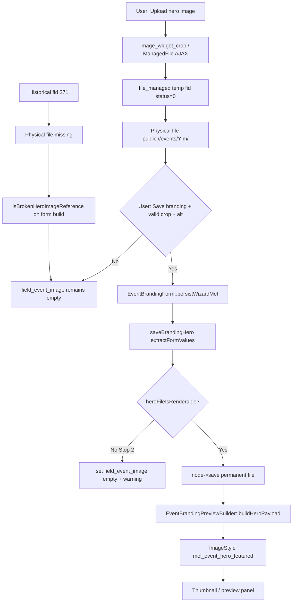

# Event Studio Branding — File Upload Persistence Audit

**Date:** 2026-05-30  
**Branch target:** `audit/event-studio-file-upload-persistence`  
**Actual branch at audit time:** `fix/event-studio-workspace-ajax-exceptions` (prior AJAX fix uncommitted)  
**Test node:** 1381 (RSVP Test 2)  
**Mode:** Audit-only — no code/config/cache changes, no fixes.

---

## Executive summary

**Stop condition reached: Stop 2 — File entity created but physical file missing (historical hero fid 271).**

For event **1381**, the hero image lifecycle breaks at **filesystem persistence**: file entity **271** exists with URI `public://events/2026-03/screenshot-2026-03-28-at-11.43.35-am.png`, but the physical file and directory are absent locally. MEL then **clears** `field_event_image` on form build and on save via `heroFileIsRenderable()` / `isBrokenHeroImageReference()`, leaving the node with an **empty hero field**, null preview, and no widget thumbnail after reload.

A **fresh upload** on 2026-05-30 created temporary file **454** with a **valid on-disk copy** — upload layer works. That file was **never attached to the node** because **Save branding** did not complete successfully (required `event_hero` crop validation error in HTTP repro). Preview/thumbnail pipelines work when the node field is populated and the file exists (verified on node **1584**).

**Single failure layer (1381 current state):** **File persistence failure (local filesystem)** for the historical hero reference, compounded by **node field empty** after MEL broken-reference clearing.

---

## Phase 1 — Repository lifecycle map

### Hero cover image (`field_event_image`)

| Step | Component | File / class | Method / config |
|------|-----------|--------------|-----------------|
| 1. Form widget | `image_widget_crop` | `config/sync/core.entity_form_display.node.event.studio_branding.yml` L73–88 | `preview_image_style: thumbnail`, `crop_preview_image_style: crop_thumbnail`, required crop `event_hero` |
| 2. Form build | `EventBrandingForm` | `src/Form/EventBrandingForm.php` L203–272 | `buildWizardStepContent()` — widget from entity form display; clears broken refs L212–215 |
| 3. Upload (AJAX) | Core `ManagedFile` + `image_widget_crop` | `web/core/modules/file` | Temporary file in `public://events/[Y]-[m]/` per `field.field.node.event.field_event_image.yml` L23 |
| 4. Save trigger | `EventBrandingForm` | `EventBrandingForm.php` L102–120 | `persistWizardMel()` → `saveBrandingHero()` |
| 5. Widget extract | `EventStudioSaveService` | `EventStudioSaveService.php` L948–975 | `widget->extractFormValues()` on `field_event_image` |
| 6. Broken-file guard | `EventStudioSaveService` | L926–935, L1186–1199 | `isBrokenHeroImageReference()`, `heroFileIsRenderable()` — `realpath` + `is_readable` |
| 7. Field write | `EventStudioSaveService` | L995–1041 | Clears field if fid missing/unreadable; else `set('field_event_image', …)` + `enrichBrandingHeroFieldItem()` |
| 8. Node save | `EventStudioSaveService` | L1056–1066 | `EventNodeRevisionSave::prepare()` + `$node->save()` |
| 9. Preview | `EventBrandingPreviewBuilder` | `EventBrandingPreviewBuilder.php` L175–209 | `buildHeroPayload()` — style `mel_event_hero_featured` |
| 10. Thumbnail / crop preview | Core image styles | form display + core ImageWidgetCrop | `thumbnail`, `crop_thumbnail` |

### Gallery (`field_mel_event_gallery`) — separate path

| Step | Component | Notes |
|------|-----------|-------|
| Widget | `media_library_widget` | Same form display L89–96 |
| Save | `EventStudioSaveService::saveBrandingGalleryField()` | L1078–1110 |
| Preview | `EventBrandingPreviewBuilder::buildGalleryThumbnails()` | Via `EventMediaPresenter` |

This audit focuses on **hero** persistence (thumbnail, crop preview, preview panel hero).

---

## Phase 2 — Upload audit (event 1381 + fresh evidence)

| Step | Result | Evidence |
|------|--------|----------|
| Upload file | **YES** (2026-05-30 19:18) | `file_managed.fid=454` created |
| File entity created | **YES** | fid **454**, status **0** (temporary) |
| URI assigned | **YES** | `public://events/2026-05/3e039576-f851-4e84-9fbc-b09c7209636a.jpg` |
| Physical file exists | **YES** | `/var/www/html/web/sites/default/files/events/2026-05/3e039576-f851-4e84-9fbc-b09c7209636a.jpg` (112453 bytes) |
| `file_usage` row | **NO** | No rows for fid 454 |
| Node field populated | **NO** | `node__field_event_image` has **no row** for entity_id 1381 |
| Save branding | **NOT completed** | HTTP POST repro: crop wrapper `class="error"`, required crop not satisfied |
| Reload branding page | Field still empty | SQL confirmed |
| Thumbnail appears | **NO** | Empty field → no hero in preview/widget after reload |
| Crop preview appears | **NO** | Same; crop validation error on incomplete save |

**Historical fid 271 (prior hero):**

| Step | Result |
|------|--------|
| File entity | **YES** (status 1) |
| Physical file | **NO** — `realpath=NULL`, directory `events/2026-03/` absent |
| `file_usage` | **Stale** — `file_usage fid=271 type=node id=1381 count=74` despite empty field |
| Node field | **Empty** |

---

## Phase 3 — File entity audit (runtime values)

### Node 1381 — `field_event_image`

```sql
SELECT * FROM node__field_event_image WHERE entity_id = 1381;
-- (no rows)
```

### File 271 (historical orphan)

| Property | Value |
|----------|--------|
| fid | 271 |
| uri | `public://events/2026-03/screenshot-2026-03-28-at-11.43.35-am.png` |
| status | 1 |
| filesize | 4443129 |
| owner (uid) | 1 |
| created / changed | 1774664324 |

```text
realpath: NULL
file_exists: no
is_readable: no
heroFileIsRenderable(271): no
```

```sql
SELECT * FROM file_usage WHERE fid = 271;
-- module=file type=node id=1381 count=74
```

### File 454 (fresh temp upload)

| Property | Value |
|----------|--------|
| fid | 454 |
| uri | `public://events/2026-05/3e039576-f851-4e84-9fbc-b09c7209636a.jpg` |
| status | 0 (temporary) |
| filesize | 112453 |
| created | 1780132727 (~2026-05-30 19:18 UTC) |

```text
realpath: /var/www/html/web/sites/default/files/events/2026-05/3e039576-f851-4e84-9fbc-b09c7209636a.jpg
file_exists: yes
heroFileIsRenderable(454): yes
file_usage: (none)
```

### Local environment file integrity

```text
public://events/* file entities: 106
missing on disk: 60 (56.6%)
```

---

## Phase 4 — Save path audit

### Form → save chain

```text
EventBrandingForm::submitContinue()
  → persistWizardMel() [EventBrandingForm.php:102-120]
    → EventStudioSaveService::saveBrandingHero() [948-1068]
      → extractFormValues(field_event_image)
      → normalizeHeroFromMelFragment() fallback [986-990]
      → heroFileIsRenderable() gate [1003-1008]
      → $node->set('field_event_image', …) [1039-1041]
      → $node->save()
```

### Broken-reference clearing on form load

```212:215:web/modules/custom/myeventlane_event_studio/src/Form/EventBrandingForm.php
    if ($this->saveService->isBrokenHeroImageReference($formNode)) {
      $formNode->set('field_event_image', []);
      $this->messenger()->addWarning($this->t('The previous cover image file is no longer available. Upload a new image, or use "Remove cover image" and save to clear the broken reference.'));
    }
```

### Save clears unreadable files

```1003:1008:web/modules/custom/myeventlane_event_studio/src/Service/EventStudioSaveService.php
      if (!$file instanceof FileInterface || !$this->heroFileIsRenderable($file)) {
        $this->logger->warning('Branding save: clearing missing or unreadable hero file @fid on node @nid.', [
          '@fid' => (string) $fid,
          '@nid' => (string) $node->id(),
        ]);
        $node->set('field_event_image', []);
```

### HTTP save repro (fid 454, audit-only)

POST to `/vendor/events/1381/studio/branding` with `mel[field_event_image][0][fids]=454` and alt text:

- Response: form re-rendered with crop wrapper `class="error"` (`aria-invalid="true"`)
- Readiness UI: “1 error has been found”
- **Node field still empty** after POST
- fid 454 remains temporary (status 0), no `file_usage`

**Conclusion:** Upload succeeds; **persistence to node requires a valid Save branding submit including required crop**. Incomplete save leaves field empty (Stop 3 outcome).

---

## Phase 5 — Preview pipeline (control: node 1584)

When `field_event_image` is populated and file exists on disk, preview works:

```json
{
  "url": "https://myeventlane.ddev.site/sites/default/files/styles/mel_event_hero_featured/public/events/2026-05/1.jpeg?h=a7b357d7&itok=ur3nesbu",
  "alt": "rainbow"
}
```

Image style checks for fid 454 URI:

| Style | buildUrl | Derivative on disk |
|-------|----------|-------------------|
| thumbnail | OK | yes |
| crop_thumbnail | OK | yes |
| mel_event_hero_featured | OK | no (lazy; normal) |

**Preview pipeline is not the failure** when field + file are valid. For 1381, `buildHeroPayload()` returns `NULL` because **field is empty**.

---

## Phase 6 — Watchdog correlation

| WID | Time | Type | Notes |
|-----|------|------|-------|
| 931367 | 19:23 | myeventlane_event_studio Error | `TypeError` in `ManagedFile.php:63` during malformed curl save (`explode(): array given`) — audit repro artifact |
| 931354 | 19:18 | Debug | Workspace branding render event 1381 — same minute as fid 454 upload |
| 930904 | 13:17 | Error | Pre-AJAX-fix empty-message branding errors (separate resolved issue) |

No branding save success messages logged for 1381 in sampled window. No `Branding save: clearing missing or unreadable hero file` warning captured for 1381 in this audit run (field already empty before save attempts).

---

## Upload lifecycle diagram



---

## Failure point (single confirmed layer)

**Filesystem persistence failure (Stop 2) for historical hero file fid 271**, with downstream effects:

1. Physical file absent → `heroFileIsRenderable()` false  
2. Form build clears broken reference → empty widget / no crop preview after reload  
3. Preview builder returns null → preview panel shows no hero  
4. Stale `file_usage` row remains for fid 271 → node 1381  

**Active upload (fid 454)** proves upload + disk write work; **persistence to node** did not occur because save did not complete (required crop validation).

---

## Repository evidence (key locations)

| Concern | Path | Lines |
|---------|------|-------|
| Broken ref on form load | `EventBrandingForm.php` | 212–215 |
| Save clears bad file | `EventStudioSaveService.php` | 926–935, 1003–1008, 1186–1199 |
| Preview null when empty | `EventBrandingPreviewBuilder.php` | 175–177 |
| Widget config | `core.entity_form_display.node.event.studio_branding.yml` | 73–88 |
| Upload directory | `field.field.node.event.field_event_image.yml` | 23 |

---

## Recommended fix target (audit only — no implementation)

| Priority | Target | Method / area | Smallest-diff intent |
|----------|--------|---------------|----------------------|
| **1 (data)** | Local filesystem / file 271 | Restore missing `public://events/2026-03/…` **or** re-upload + complete Save branding with crop | Unblocks 1381 without code |
| **2 (code, if desired later)** | `EventStudioSaveService.php` | `heroFileIsRenderable()` / stale `file_usage` cleanup | Only if product should tolerate missing files differently |
| **3 (UX, if desired later)** | Crop validation on branding save | Required `event_hero` crop before persist | Explains fid 454 temp file not on node |

**Do not change** Media Library, AJAX exceptions, image styles, or preview builder for this failure — evidence shows they work when field + file are valid.

---

## Validation commands (audit run)

| Command | Result |
|---------|--------|
| `git status -sb` | Modified `EventStudioController.php` from prior AJAX fix; audit doc untracked |
| `composer validate` | OK |
| PHP lint event_studio | OK |
| `ddev drush cr` | OK |
| `ddev drush config:status` | No drift |

---

## Residual risks

- **56.6%** of local `public://events/*` file entities missing on disk — any event referencing those fids will show the same empty-hero behavior after MEL clearing.
- Temporary uploads (status 0) without successful save are garbage-collected by cron — fid 454 may disappear.
- Stale `file_usage` for fid 271 may confuse admin/file reports until cleaned.
- Gallery (`field_mel_event_gallery`) not fully exercised in this audit; hero path is the confirmed blocker for 1381 preview/thumbnail.
