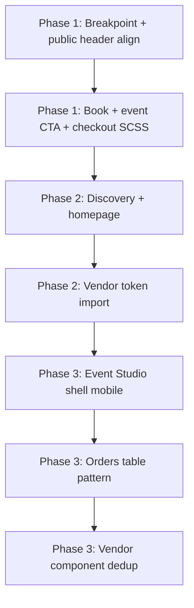

# Mobile Foundation Implementation Roadmap

**Repository:** `/Users/anna/myeventlane`  
**Date:** 2026-06-14  
**Inputs:** All Phase 2A audits + this review suite (`mobile-phase-1-priority-review.md`, `mobile-css-review.md`, `mobile-design-system-readiness.md`, `mobile-conversion-opportunities.md`)  
**Status:** Recommendation only — no implementation on this pass

---

## Branch verification (preflight for implementation)

| Check | Expected | Actual at review time |
|-------|----------|----------------------|
| Branch | `feature/mobile-foundation` | **`feature/brand-rollout-phase-1a-discovery-copy`** |
| Working tree | Clean | **Dirty** — 3 modified Twig files |

**Action before implementation:** `git checkout feature/mobile-foundation` (or branch from it) and ensure clean tree.

---

## Executive summary

MEL's mobile foundation work should **not** start with Event Studio or vendor orders despite their low mobile scores. Repository evidence shows **triple CSS ownership** (public theme, vendor theme, module CSS) and **breakpoint fragmentation** (480 vs 640 sm, 900px vs 768px nav). The safest Phase 1 delivers **public conversion funnel** improvements with **visual/breakpoint-only** diffs, anchored on token unification and five bounded components.

**Highest UX risk:** Vendor Event Studio shell (280px grid) and orders tables — defer.  
**Highest technical risk:** Event Studio CSS ownership + vendor `_event-form.scss` (94× `!important`).  
**Highest mobile conversion opportunity:** Book page + checkout completion path.

---

## Recommended Phase 1

**Goal:** Mobile-first public conversion path at unified `md` (768px) breakpoint without Commerce logic changes.

### Routes (maximum 3)

| # | Route | Path | Rationale |
|---|-------|------|-----------|
| 1 | `myeventlane_commerce.event_book` | `/event/{node}/book` | Unified paid + RSVP cart entry; `mel-booking-summary` mobile panel |
| 2 | `commerce_checkout.form` | `/checkout/{commerce_order}/{step}` | Revenue completion; 20 `@media` in `_checkout.scss`; visual-only scope |
| 3 | `entity.node.canonical` (event full) | Event detail alias | Funnel step before book; `_event-mobile-cta.scss` + sidebar order |

**Explicitly excluded from Phase 1 routes:** Homepage (7/10 — defer to Phase 2 token pass), Event Studio, vendor orders.

### Components (maximum 5)

| # | Component | Owner file(s) | Phase 1 scope |
|---|-----------|---------------|---------------|
| 1 | **Breakpoint tokens** | `myeventlane_theme/src/scss/tokens/_breakpoints.scss` | Document canonical map; align public header cut to `md` (768px) — **no vendor sm change yet** |
| 2 | **Public header nav** | `_site-header.scss`, `header.js` | Resolve 900px vs 768px mismatch (conversion O1) |
| 3 | **Event mobile CTA** | `_event-mobile-cta.scss` | Sticky bar spacing/overlap at md max |
| 4 | **Booking page layout** | `_booking-page.scss`, book Twig | Summary panel visibility on narrow viewports |
| 5 | **Checkout layout** | `_checkout.scss` | Sidebar/summary stack; pane spacing — **no pane plugin/config changes** |

### Phase 1 deliverable shape

- Small, reviewable diffs in **theme SCSS/JS + Twig only**
- No `config/sync` export
- No module PHP or Commerce checkout flow changes
- No Event Studio shell CSS

---

## Recommended Phase 2

**Goal:** Discovery + homepage alignment; begin vendor-readiness without Event Studio grid surgery.

### Routes

| Route | Path | Focus |
|-------|------|-------|
| Homepage | `/home` | Hero chips, carousel, featured events |
| Discovery | `/events`, `/events/category/*`, `/search` | Category strip, filter chips, event cards |
| Cart | `/cart` | Trust copy, event chips (verify Task 11 merged) |

### Components

| Component | Work |
|-----------|------|
| Category chips/pills | Consolidate `.mel-chip` / `.mel-category-chip` / `.mel-pill` active states |
| Event cards | Touch targets, reduced-motion (extend Task 9 patterns) |
| Event full layout | Incremental `_event-full.scss` breakpoint alignment (not full rewrite) |
| Vendor breakpoint import | Vendor theme consumes public `@mel-theme/tokens/breakpoints` for **new** rules only |
| Dead SCSS audit | Verify and remove orphan `vendor-studio-editor` / `studio-inspector` imports if unused |

### Prerequisites from Phase 1

- Phase 1 breakpoint/header alignment merged and QA'd at 390px and 768px
- `npm run mel:lint` + `npm run mel:build` green

---

## Recommended Phase 3

**Goal:** Vendor mobile — module-led Event Studio layout; orders responsive pattern.

### Routes

| Route | Path | Focus |
|-------|------|-------|
| Event Studio | `/vendor/events/{node}/studio/*` | Sidebar → drawer (module `mel-event-studio-shell.css` led) |
| Vendor orders | `/vendor/event/{event}/orders` | Table → card stack via `_mel-tables.scss` pattern |
| Vendor dashboard | `/vendor/dashboard` | KPI grid stack; live ops density |

### Components

| Component | Work |
|-----------|------|
| Event Studio shell | Coordinated module + theme; reduce `_mel-builder.scss` override wars |
| Responsive tables | Canonical stack pattern in `_mel-tables.scss` |
| Vendor button/card dedup | Remove vendor base redeclaration per `canonical-design-system.md` |
| Module CSS slimming | Stop `.mel-btn` redefinition in `mel-event-studio.css` |

### Blockers

- Product sign-off on sm token (480 vs 640 vs 390)
- Manual QA: Event Studio at 390px without horizontal scroll
- Orders pattern must not break CSV export / row actions

---

## Risks

| Risk | Severity | Mitigation |
|------|----------|------------|
| **Breakpoint change regressions** | High | Limit Phase 1 to public theme; visual QA at 390, 768, 900, 1024 |
| **Commerce checkout pane order** | High | Twig render order only; do not alter `commerce_checkout.commerce_checkout_flow.mel_event_checkout.yml` |
| **Event Studio ownership fight** | Very high | Defer to Phase 3; module owns grid |
| **Vendor theme recompiles public SCSS** | Medium | Phase 1 avoids vendor `main.scss`; Phase 2 token import is additive |
| **RSVP tier data gaps (O20)** | High (conversion) | Separate vendor/data ticket — not mobile CSS |
| **Locked hero variants** | Medium | Homepage Phase 2 respects hero lock rule |
| **Parallel branch dirty state** | Process | Clean checkout from `feature/mobile-foundation` |
| **390px token not in repo** | Medium | Use 768 md max as interim; flag 390 for product sign-off |

---

## Dependencies



| Dependency | Blocks |
|------------|--------|
| Breakpoint token decision | All responsive work |
| Phase 1 QA sign-off | Phase 2 discovery |
| `_mel-tables.scss` mobile pattern | Vendor orders |
| Module coordination | Event Studio sidebar drawer |
| Task 9/10/11 merges on target branch | Avoid redoing discovery/event/checkout polish |

---

## Validation requirements

### After each phase

```bash
git status --short
composer validate
ddev drush cr
npm run mel:lint
npm run mel:build
```

### Manual mobile QA matrix (390px primary)

| Phase | URLs |
|-------|------|
| 1 | `/event/1540/book` (RSVP), `/event/1567/book` (paid), checkout with 1 ticket, paid event full page |
| 2 | `/home`, `/events`, `/events/category/{tid}`, `/cart` |
| 3 | `/vendor/events/{nid}/studio`, `/vendor/event/{event}/orders`, `/vendor/dashboard` |

### Regression checks

- Public header drawer open/close at 767px and 901px
- Checkout payment still completes (staging Stripe test mode)
- No horizontal scroll on Phase 1 routes at 390px
- `prefers-reduced-motion` on animated chips/cards (Phase 2)

### Acceptance (Phase 1 complete when)

1. Header CSS and JS use same breakpoint for mobile nav
2. Book page summary visible without horizontal scroll at 390px
3. Checkout form panes readable single-column; payment reachable
4. Event mobile CTA does not obscure footer content
5. Build/lint green; no config export required

---

## Rollback considerations

| Change type | Rollback |
|-------------|----------|
| Theme SCSS/JS/Twig only | Revert commit; `npm run mel:build`; `ddev drush cr` |
| Compiled `dist/*.css` | Regenerate from reverted SCSS via build |
| Accidental config export | **Do not commit** — `ddev drush cim --preview` before any config PR |
| Event Studio module CSS (Phase 3) | Module version revert; cache rebuild; higher blast radius — feature-flag or branch isolation |

**Prefer:** One route group per PR for easy revert (e.g. book-only PR, checkout-only PR).

---

## What should NOT be implemented yet

| Item | Phase | Reason |
|------|-------|--------|
| Event Studio sidebar drawer | 3+ | Module grid ownership; 280px columns |
| Vendor orders card stack | 3+ | No canonical table pattern |
| `_event-form.scss` !important reduction | 3+ | Markup alignment required |
| 390px sm token enforcement | TBD | Repository evidence not found; product sign-off |
| Commerce checkout flow / pane config | Never in mobile CSS phases | Stripe/Commerce risk |
| RSVP tier validation fixes | Separate track | Data/vendor pipeline (O20) |
| Visual redesign / brand changes | Out of scope | `canonical-design-system.md` non-goals |

---

## Priority matrix (implementation order)

| Order | Item | P-tier | Conversion | Tech risk |
|-------|------|--------|------------|-----------|
| 1 | Breakpoint + header align | Foundation | Medium | Low |
| 2 | Book page mobile | P0 | **Highest** | Medium |
| 3 | Checkout layout | P0 | **Highest** | High (scope control) |
| 4 | Event detail CTA | P0 | High | Medium |
| 5 | Discovery/homepage | P1 | High | Low–med |
| 6 | Event Studio | P0 vendor | N/A vendor | **Very high** |
| 7 | Vendor orders | P0 vendor | N/A vendor | **Very high** |

---

## Recommended first implementation branch

```
feature/mobile-phase-1-public-conversion
```

**Branch from:** `feature/mobile-foundation` (commit `247644010` — "Add mobile foundation audit and design system recommendations")

**First PR scope:** Breakpoint/header alignment + `/event/{node}/book` SCSS/Twig only (~smallest conversion win with lowest Commerce risk).

---

## Review artifacts produced

| File | Purpose |
|------|---------|
| `docs/audits/mobile-phase-1-priority-review.md` | Route P0–P3 classification |
| `docs/audits/mobile-css-review.md` | CSS ownership, duplicates, dead code flags |
| `docs/audits/mobile-design-system-readiness.md` | Ready / consolidation / blocked components |
| `docs/audits/mobile-conversion-opportunities.md` | Funnel friction with evidence |
| `docs/audits/mobile-foundation-implementation-roadmap.md` | This document |

---

**Roadmap complete. Ready for Phase 1 implementation planning on a clean `feature/mobile-foundation` branch.**
