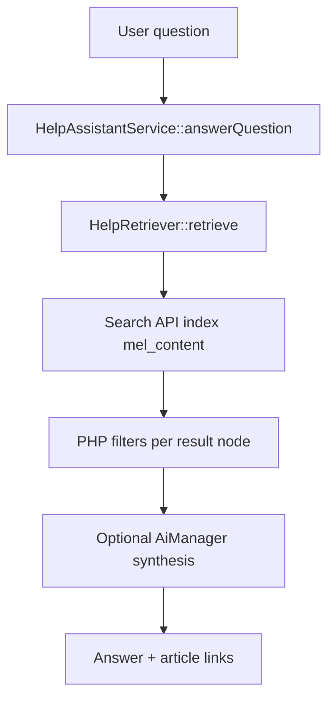

# Help retrieval and access audit

**Audit date:** 2026-05-22

## Help Assistant retrieval pipeline

### Step 1: Search API query (`HelpRetriever::executeQuery`)

**File:** `web/modules/custom/myeventlane_help_assistant/src/Service/HelpRetriever.php`

| Constraint | Value |
|------------|-------|
| Index | `mel_content` |
| Bundle | `type = help_article` only |
| Published | `status = 1` |
| Fulltext fields | `title`, `field_help_summary`, `body`, `field_help_keywords` |
| Audience (index query) | OR group on `field_audience`: anonymous → `public` only; authenticated → `public` OR `vendor` |
| Fetch cap | `max(24, limit * 6)` then trim to 3–5 results |
| Sort | `search_api_relevance` DESC |

**Explicitly excluded at query level:** `staff_playbook`, `support_procedure`, `event`, `page`, `blog_post` (not `help_article` type).

### Step 2: Per-node safety (`isNodeRetrievableForAssistant`)

Applied to each Search API hit after load:

| Check | Rule |
|-------|------|
| Published | `isPublished()` |
| Node access | `$node->access('view', $currentUser)` |
| AI allow-list | `field_help_ai_allowed` must be TRUE |
| Documentation status | If `field_help_status` set: must be `published` or `approved` |
| Audience | `nodeAudienceAllowedForAssistant`: no `staff`; only `public`/`vendor`; must overlap allowed set for current user |

Staff-tagged `help_article` nodes are **never** returned, even for staff users (by design in retriever).

### Step 3: UnifiedHelpRetriever (defence in depth)

**File:** `web/modules/custom/myeventlane_help_shared/src/Service/UnifiedHelpRetriever.php`

- Switches active user via `AccountSwitcher` before calling `HelpRetriever`
- Re-validates each row with same policy; logs `notice` on mismatch (`ai_not_allowed`, `staff_audience`, `status_invalid`, etc.)
- Used when retrieval must be evaluated **as** a specific user (e.g. escalations context) — **Found but usage unclear** for all call sites; grep shows service registered in `myeventlane_help_shared.services.yml`

### Step 4: HelpAssistantService

**File:** `web/modules/custom/myeventlane_help_assistant/src/Service/HelpAssistantService.php`

- If assistant disabled → fallback message + support URL
- If zero results or low retrieval confidence → fallback with article links optional
- If platform AI disabled → articles only, no synthesis
- Otherwise grounded synthesis using retrieved excerpts only (guardrails in service — full prompt rules **Needs verification** in `myeventlane_ai` config)

## Allowed content (Help Assistant)

| Content | Allowed when |
|---------|----------------|
| `help_article` | Published, viewable, `field_help_ai_allowed = 1`, status `published` or `approved`, `field_audience` includes `public` (anon) or `public`/`vendor` (auth), not staff-only |
| Grounded CTAs | From `field_help_cta_label` / `field_help_cta_link` on same nodes |

## Disallowed content (Help Assistant)

| Content | Reason |
|---------|--------|
| `staff_playbook` | Not in index; separate `hook_node_access` |
| `support_procedure` | Not in index; internal bundle |
| `help_article` with `field_audience: staff` | Hard exclude in retriever |
| Draft / review / archived help | `field_help_status` filter |
| `help_article` with AI not allowed | `field_help_ai_allowed` |
| Unpublished or access-denied nodes | status + `node_access` |
| Events, blog posts, pages | Wrong bundle in query |

## Staff content protection

| Mechanism | Location |
|-----------|----------|
| `staff_playbook` node access | `myeventlane_staff_playbooks_node_access` — forbidden without staff permissions |
| Staff audience on `help_article` | `hook_node_access` requires `administer escalations` for view |
| Help Assistant audience filter | Never returns `staff` audience values |
| Playbooks on escalation | Only rendered if `view staff playbooks`; vendor/customer never see panel |
| Staff snippet guide | Route `administer escalations` only |

**staff_playbook is not in `mel_content` index** — confirmed `config/sync/search_api.index.mel_content.yml` bundle list.

## Search API involvement

- **Indexing:** Help articles indexed with `content_access` processor → node grants in index
- **Query:** Help Assistant adds bundle + status + audience conditions; grants applied at query via processor
- **Gap:** `field_help_ai_allowed` and `field_help_status` are **not** indexed filters — all Assistant policy enforcement is post-query in PHP (correct for safety, possible performance cost at scale)

## Node access involvement

- Standard Drupal node grants + `content_access` Search API processor
- Additional `hook_node_access` for `help_article`/`faq` audience rules
- Vendor-only articles: anonymous users forbidden at node level when audience is vendor-only (no public)

## Public / vendor Help Centre listings (Views)

Views use SQL (`node_field_data`), not Search API:

| View | Audience filter | AI/status filter |
|------|-----------------|------------------|
| `mel_help_attendee_help` | `public` | None |
| `mel_help_organiser_help` | `public` | None |
| `mel_help_vendor_help` | `vendor` | None |
| `mel_help_search` | **Enforced** via `HelpArticleBrowsePolicy` + `hook_views_query_alter` (audience `IN` + status `IN`; optional exposed `?audience=` intersected with account allowances) | `published` / `approved` for normal users |
| `mel_help_featured_articles` | None (featured flag only) | None |

**2026-05-22 update:** Help Search (`/help/search`, view `mel_help_search`) no longer relies on node access after rendering result metadata. Audience and `field_help_status` are applied at SQL query time in `myeventlane_help_centre_views_query_alter()`. Help Assistant path unchanged (`HelpRetriever`).

**Mismatch:** A non-AI-allowed article could still appear in browse/search UI if published and viewable, but **not** in Help Assistant. Draft/review articles are now excluded from search for normal users. Editorial workflow should align status + AI flag before publish.

## Retriever vs Views vs node access — mismatch matrix

| Scenario | Browse /help | Help Assistant |
|----------|--------------|----------------|
| Published, AI allowed, approved, public | Yes | Yes |
| Published, AI **not** allowed | Yes | No |
| Status `review` | No (if unpublished) or Yes if published — **Needs verification** per workflow | No |
| Staff audience help_article | No (except staff with permission) | No |
| Vendor-only, anonymous user | No (query policy + node access) | No |
| Vendor-only, logged-in attendee without vendor console | No (search policy: public only) | Yes if AI allowed |
| Vendor-only, vendor console user | Yes (search + node access) | Yes if AI allowed |
| `staff_playbook` | No | No |

## Items needing verification

1. Live count of `help_article` nodes with `field_help_ai_allowed = 0` still published.
2. Whether any `help_article` uses `staff` audience for internal docs shown only to escalations admins — Assistant excludes them; confirm staff browse path is intentional.
3. `support_procedure` nodes: reachable via any public URL or only admin?
4. Whether `/help/ask` and POST `/help/assistant` share identical retrieval path (both should use `HelpAssistantService` — **Needs verification** in `HelpCentreAiController`).
5. Reindex schedule after bulk content imports (`myeventlane_docs_importer`).
6. Anonymous users have `access myeventlane help assistant` — confirm product intent for public AI usage.

## Code references

- `HelpRetriever.php` — lines 62–180 (query + filters)
- `UnifiedHelpRetriever.php` — `validateNode`, `nodeAudienceAllowed`
- `myeventlane_help_centre.module` — `myeventlane_help_centre_node_access` (~line 437)
- `myeventlane_staff_playbooks.module` — `hook_node_access`
- `search_api.index.mel_content.yml` — bundle whitelist
