# Event Studio — Draft Recovery & Cache Coherency Design

**Branch:** `design/event-studio-draft-recovery-and-cache-coherency`  
**Status:** Design only — no implementation  
**Date:** 2026-05-29  
**Scope:** Autosave TempStore draft discovery/recovery UX and render-cache coherency around draft state

---

## Executive summary

The autosave persistence path is working. The remaining gaps are:

1. **Concern A — Restore UI freshness:** After a successful autosave in the same browser session, the shell shows “Saved” but does not promote the topbar to “Restore draft available” until a full page reload.
2. **Concern B — Cache coherency:** TempStore mutations in `EventStudioAutosaveService` do not participate in Drupal cache metadata. Today’s workspace pages are effectively uncacheable in DDEV because embedded forms bubble `max-age: 0`, but production enables `dynamic_page_cache` and `page_cache` and nothing formally prevents a future cacheable workspace subtree from serving stale draft-discovery UI.
3. **Concern C — Draft terminology:** At least four distinct “draft” concepts share naming in UI, settings keys, and code, with inconsistent restore semantics across section form types.

**Recommended approach:** **Option C (client-side draft-discovery sync after first load) plus a minimal Option A (custom cache tags invalidated on `storeDraft()` / `clearDraft()`)** on the workspace shell. Defer Option B unless workspace cacheability is intentionally improved later.

---

## Phase 1 — Dependency map

### 1.1 Canonical persistence service

All autosave draft CRUD flows through one service:

| Symbol | File | Role |
| --- | --- | --- |
| `storeDraft()` | `web/modules/custom/myeventlane_event_studio/src/Service/EventStudioAutosaveService.php` | Writes PrivateTempStore key `node.{nid}.{section}` in store `myeventlane_event_studio_autosave` |
| `getDraft()` | same | Reads draft; clears and returns `NULL` if entity `changed` / `revision_id` is newer than draft `base_*` |
| `hasDraft()` | same | `getDraft() !== NULL` |
| `clearDraft()` | same | Deletes tempstore key |
| `isStaleSubmission()` | same | Compares submitted `mel_studio_changed` / `mel_studio_revision` against live entity |

**TempStore key shape:** `node.{nid}.{sanitized_section}` (section id from form/controller, e.g. `information`, `branding`, `merchandise`).

**No cache invalidation** occurs anywhere in this service (confirmed: no `CacheTagsInvalidator`, no `#cache` references).

---

### 1.2 `draftAvailable` — server → client bootstrap only

| Location | Usage |
| --- | --- |
| `EventStudioController::workspace()` | Sets `drupalSettings.myeventlaneEventStudio.draftAvailable` = `hasDraft($node, $section)` |
| `mel-event-studio-shell.js` (attach) | If `draftAvailable`, adds CSS class `has-draft` to `#mel-studio-form-state` |

**Does not update after autosave.** Autosave success path sets status text to “Saved just now” only; it ignores `restore_available: true` from the JSON response.

---

### 1.3 `restore_draft` — server-rendered discovery + opt-in merge

| Location | Usage |
| --- | --- |
| `EventStudioController::buildTopbar()` | `'restore_draft' => hasDraft(...)`, `'restore_url' => section route + `?restore_draft=1` |
| `mel-event-studio-topbar.html.twig` | If `topbar.restore_draft`, renders link “Restore draft available” and `has-draft` class on autosave status span |
| `EventStudioBaseForm::buildForm()` | Calls `getDraft()`; merges draft MEL into baseline **only when** `?restore_draft=1` |
| `EventBrandingForm::buildWizardStepContent()` | On `restore_draft`, applies `applyDraftHeroOverlay()` to cloned node for hero widget |
| `EventStudioPublishController::readinessResponse()` | On publish block (`autosave_draft`), returns `restoreUrl` with `?restore_draft=1` |
| `mel-event-studio-shell.js` | `renderPublishFeedback()` shows dynamic restore link from publish JSON only (not from autosave) |

**Important:** Operational section forms **do not** use `restore_draft` query gating:

| Form | Draft read behaviour |
| --- | --- |
| `EventStudioProductisationForm` | Silently merges `getDraft($event, 'merchandise')` on every build |
| `EventStudioOperationalCapabilityForm` | Silently merges `getDraft($event, 'fulfilment')` on every build |
| `EventCheckoutQuestionsForm` | No `getDraft()` on build; `clearDraft()` on successful save only |

---

### 1.4 Call graph (dependency map)

```mermaid
flowchart TB
  subgraph persistence["PrivateTempStore (myeventlane_event_studio_autosave)"]
    TS[(node.nid.section)]
  end

  subgraph service["EventStudioAutosaveService"]
    storeDraft
    getDraft
    hasDraft
    clearDraft
    isStaleSubmission
  end

  subgraph write_paths["Write paths"]
    AutosaveCtrl["EventStudioAutosaveController::autosave()"]
    BaseFormSave["EventStudioBaseForm submit"]
    ProdFormSave["EventStudioProductisationForm submit"]
    CapFormSave["EventStudioOperationalCapabilityForm submit"]
    MerchFormSave["EventStudioOperationalMerchandiseForm submit"]
    QuestionsSave["EventCheckoutQuestionsForm submit"]
  end

  subgraph read_discovery["Draft discovery (UI)"]
    WorkspaceCtrl["EventStudioController::workspace()"]
    TopbarTwig["mel-event-studio-topbar.html.twig"]
    ShellJS["mel-event-studio-shell.js draftAvailable"]
  end

  subgraph read_merge["Draft merge (form values)"]
    BaseForm["EventStudioBaseForm + workspace wizard sections"]
    BrandingForm["EventBrandingForm hero overlay"]
    ProdForm["EventStudioProductisationForm silent merge"]
    CapForm["EventStudioOperationalCapabilityForm silent merge"]
  end

  subgraph gates["Stale / publish gates"]
    PublishCtrl["EventStudioPublishController"]
    StaleForms["Multiple forms isStaleSubmission() checks"]
  end

  AutosaveCtrl --> storeDraft
  AutosaveCtrl --> clearDraft
  AutosaveCtrl --> isStaleSubmission
  BaseFormSave --> clearDraft
  ProdFormSave --> clearDraft
  CapFormSave --> clearDraft
  MerchFormSave --> clearDraft
  QuestionsSave --> clearDraft

  storeDraft --> TS
  getDraft --> TS
  clearDraft --> TS
  hasDraft --> getDraft

  WorkspaceCtrl --> hasDraft
  WorkspaceCtrl --> TopbarTwig
  WorkspaceCtrl --> ShellJS

  BaseForm --> getDraft
  BrandingForm --> getDraft
  ProdForm --> getDraft
  CapForm --> getDraft

  PublishCtrl --> hasDraft
  PublishCtrl --> isStaleSubmission
  StaleForms --> isStaleSubmission
```



---

### 1.5 Tests touching draft APIs

| File | Usage |
| --- | --- |
| `tests/src/Kernel/EventStudioOperationalCapabilityKernelTest.php` | Calls `storeDraft()` directly for fulfilment section |

No PHPUnit coverage found for `draftAvailable`, `restore_draft` UX, or cache metadata around drafts.

---

### 1.6 Unrelated homonyms (Concern C)

These names overlap “draft” but are **not** TempStore autosave drafts:

| Symbol / term | Location | Meaning |
| --- | --- | --- |
| `createDraftEventForUser()` | `VendorEventStudioCreateService` | Creates unpublished **event node** |
| `findLatestUnpublishedEventNidForUser()` | same | Resume pointer to unpublished node |
| Topbar `'status' => 'Draft'` | `EventStudioController::buildTopbar()` | Node published flag, not autosave |
| `getDraftCardKind()` etc. | `mel-event-studio.js` | Ticket tier card UI in legacy wizard |
| `$draft` parameter | `EventStudioSaveService::save()` | Wizard “save without publish” intent |
| `moderation_state: draft` | Content moderation | Editorial workflow state (documented elsewhere) |
| `MelReadinessHelper` `$hasDraft` | `myeventlane_core` | Unrelated readiness aggregation |

---

## Phase 2 — Cache metadata audit (repository evidence only)

### 2.1 Enabled cache modules

From `config/sync/core.extension.yml`:

- `dynamic_page_cache` — **enabled**
- `page_cache` — **enabled**

No Event Studio–specific cache bin or `cache.max_age` overrides were found in `config/sync`.

---

### 2.2 Workspace shell cache metadata

`EventStudioController::workspace()` root render array:

```php
'#cache' => [
  'tags' => $node->getCacheTags(),
  'contexts' => ['route', 'user', 'user.permissions'],
],
```

Observations:

- **Tags:** Node entity tags only (`node:{nid}`, etc.). Autosave tempstore is **not** represented.
- **Contexts:** Route + user + permissions. No variation on tempstore draft presence/version.
- **Max-age:** Not set on shell (inherits from children).

Attached `drupalSettings.myeventlaneEventStudio.draftAvailable` is computed at render time from `hasDraft()` and is part of the same cacheable response envelope.

---

### 2.3 Child render arrays and forms

| Component | Cache metadata (from repo) |
| --- | --- |
| Section forms (`EventStudioBaseForm` descendants) | No explicit `#cache`; Drupal Form API defaults bubble **`max-age: 0`** |
| `EventStudioSectionRenderer` | No `#cache` keys |
| `EventStudioPreviewController` | `tags: node`, `contexts: user, user.permissions` (legacy wizard preview, not workspace) |
| Governance bundles | Various `user` / `route` / node tags via `EventStudioGovernanceBuilder` |
| Access checks | `EventStudioAccess` adds `route`, `user`, `user.roles`, `user.permissions` contexts |

**TempStore:** Private per-user storage. Survives `drush cr`. Not integrated with cache tags, contexts, or invalidation.

---

### 2.4 Observed runtime behaviour (DDEV browser audit)

Prior browser verification reported workspace responses:

```http
X-Drupal-Dynamic-Cache: UNCACHEABLE (poor cacheability)
```

This aligns with form-driven `max-age: 0` bubbling. **I cannot confirm production response headers from the repository alone.**

---

### 2.5 What production *could* cache (logical analysis from repo facts)

| Scenario | Cache risk |
| --- | --- |
| Full workspace GET with embedded form (current default) | **Low today** — form bubble makes page uncacheable for Dynamic Page Cache |
| Authenticated vendor routes | **No Page Cache** for anonymous; DPC still applies per user + route + contexts |
| User autosaves on section A, navigates away, returns to section A | **Medium if** section A response were ever cacheable — cached HTML/settings would reflect pre-autosave `draftAvailable` / `restore_draft` |
| User autosaves without navigating (same page) | **Not a cache issue** — Concern A is client state sync |
| Node entity save (wizard submit) | Node cache tags invalidate — **does not** reflect tempstore-only autosave |
| Publish JSON endpoint | Uncached JSON; `hasDraft()` evaluated live — publish gate sees drafts even when HTML is stale |

**Gap statement:** Draft lifecycle mutations are invisible to Drupal’s cache system. Coherency currently relies on de facto uncacheability, not explicit modelling.

---

## Phase 3 — Design options

### Option A — Cache tag invalidation on `storeDraft()` / `clearDraft()`

**Mechanism**

1. Define tag pattern, e.g. `event_studio_autosave:{nid}:{section}` (and optionally a node-level aggregate tag).
2. Add tag(s) to workspace `#cache` in `EventStudioController`.
3. Inject `CacheTagsInvalidatorInterface` into `EventStudioAutosaveService` (or a thin wrapper) and invalidate on write/delete.

**Addresses:** Concern B (cross-navigation / future cacheable subtrees).  
**Does not alone fix:** Concern A (same-session UI after autosave without reload).

| Criterion | Assessment |
| --- | --- |
| Complexity | Low–medium |
| Drupal 11 compliance | High — standard cache tag pattern |
| Cache safety | High — explicit invalidation |
| Performance | Autosave every ~12s invalidates section cache for that user/route; acceptable if workspace remains mostly uncacheable; wasteful if cacheability improves without Option B |
| Maintenance | Low — localized to autosave service + controller |
| Production risk | Low implementation risk; mitigates stale HTML if caching becomes possible |

---

### Option B — Custom cache context `user.event_studio_drafts`

**Mechanism**

1. Register cache context plugin (e.g. `user.event_studio_autosave:{nid}` or global user revision).
2. Maintain monotonic draft revision counter (user.data or tempstore meta) bumped on every `storeDraft()` / `clearDraft()`.
3. Add context to workspace `#cache`.

**Addresses:** Concern B with finer granularity than blunt invalidation.  
**Does not alone fix:** Concern A.

| Criterion | Assessment |
| --- | --- |
| Complexity | Medium–high |
| Drupal 11 compliance | High if implemented as standard context plugin |
| Cache safety | High when counter bump is transactional with tempstore write |
| Performance | Better hit rates than Option A under heavy autosave |
| Maintenance | Higher — new plugin, counter discipline, multi-section aggregation rules |
| Production risk | Medium — bugs in counter/context yield subtle stale or over-varying cache |

---

### Option C — Client-side draft discovery after first page load

**Mechanism**

1. Treat `draftAvailable` / topbar `restore_draft` as **initial snapshot only**.
2. On autosave success, read existing JSON field `restore_available: true` and:
   - add `has-draft` class to `#mel-studio-form-state`;
   - inject or reveal “Restore draft available” link using `restore_url` pattern already emitted in topbar settings (or add `restoreUrl` to autosave JSON mirroring publish controller).
3. On successful section save (form submit) or explicit draft clear, remove restore affordance client-side.
4. Publish-block path already uses `restoreUrl` in JSON — keep as secondary discovery path.

**Addresses:** Concern A directly (proven UX gap).  
**Partially addresses:** Concern B for same-session editing; **not** sufficient alone for cached full-page GET after navigation.

| Criterion | Assessment |
| --- | --- |
| Complexity | Low |
| Drupal 11 compliance | High — presentation layer only |
| Cache safety | Neutral — does not fix stale server render |
| Performance | Positive — no server cache churn |
| Maintenance | Low — confined to `mel-event-studio-shell.js` |
| Production risk | Low — uses existing autosave contract field |

---

### Option comparison matrix

| | A — Tags | B — Context | C — Client sync |
| --- | --- | --- | --- |
| Fixes same-page “Saved but no restore link” | No | No | **Yes** |
| Fixes cached GET after navigation | **Yes** | **Yes** | No |
| New server infrastructure | Invalidator + tags | Context plugin + counter | Optional JSON field |
| Autosave frequency impact | Invalidates cache | Varies cache key | None |
| Aligns with “fix proven problems first” | Preventive | Preventive | **Proven gap** |

---

## Phase 4 — Recommendation

### Primary recommendation: **Option C + minimal Option A**

Implement as **one coordinated slice**, not three unrelated fixes.

#### 1. Option C — Client draft-discovery sync (do first)

**Why:** Browser audit confirmed autosave persistence (`200`, single request) while restore affordance failed to appear in-session. Autosave JSON already returns `restore_available: true` (`EventStudioAutosaveController.php` L143). Shell JS ignores it today.

**Scope:**

- Update `mel-event-studio-shell.js` autosave success handler to promote restore UI.
- Reuse topbar link URL shape: section route + `?restore_draft=1` (already built server-side in `buildTopbar()` — expose via `drupalSettings` if not already available to JS).
- On successful form submit navigation, rely on full reload (acceptable).

**Explicitly out of scope (per stabilisation agreement):**

- AbortController, autosave queues, throttling — no production evidence of request storms.

#### 2. Minimal Option A — Cache tags (do in same slice)

**Why:** Repository proves tempstore writes do not affect cache metadata while `dynamic_page_cache` is enabled. DDEV uncacheability is an **observed mitigator**, not an architectural guarantee. Tag invalidation is the smallest D11-native way to model draft state in cache.

**Scope:**

- Tag pattern: `event_studio_autosave:{nid}:{section}` on workspace `#cache`.
- Invalidate in `storeDraft()` and `clearDraft()`.
- Document tag in `docs/event-studio-architecture.md` Autosave section when implementing.

**Defer Option B** until there is a deliberate initiative to make workspace shells cacheable with `max-age > 0` (e.g. cached sidebar/readiness strip with lazy-loaded forms).

---

### Concern C — Terminology (parallel doc task, not blocking implementation)

Adopt glossary-first naming in code/docs (implementation can be incremental):

| Term | Definition |
| --- | --- |
| **Unpublished event** | Node with `status = 0` / topbar “Draft” badge |
| **Autosave snapshot** | TempStore payload in `myeventlane_event_studio_autosave` |
| **Restore available** | `hasDraft()` true for current section — user may opt in via `?restore_draft=1` |
| **Restore action** | User follows link; form merges snapshot into editable values |

**Normalize restore semantics** across section forms in a follow-up (operational forms currently silent-merge vs wizard opt-in). That is maintainability work, not required for the first UX/cache slice.

---

### Risk summary

| Risk | Mitigation |
| --- | --- |
| Client restore link wrong section | Derive URL from server-provided settings keyed to `currentSection` |
| Tag invalidation on every autosave | Acceptable while forms keep page uncacheable; revisit if cacheability changes |
| Silent-merge operational forms confuse “restore” UX | Document in glossary; align in separate form-behaviour ticket |
| Production cache headers unknown | Option A provides defense in depth independent of DDEV observations |

---

### Suggested implementation order (after design approval)

1. Option C — shell JS restore promotion + settings exposure if needed  
2. Option A — cache tags on workspace + autosave service invalidation  
3. Kernel test: store draft → workspace render array includes tag; clear draft → tag invalidated  
4. Browser verification script: assert restore link appears after autosave without reload  
5. Terminology pass in architecture doc (Concern C)

---

### Validation commands (for implementation phase)

```bash
ddev drush cr
ddev exec vendor/bin/phpunit -c web/modules/custom/myeventlane_event_studio/phpunit.xml
npm run mel:lint
npm run mel:build
# Manual: autosave → restore link appears; navigate away/back → restore link still correct
```

---

## References

- `web/modules/custom/myeventlane_event_studio/src/Service/EventStudioAutosaveService.php`
- `web/modules/custom/myeventlane_event_studio/src/Controller/EventStudioController.php`
- `web/modules/custom/myeventlane_event_studio/src/Controller/EventStudioAutosaveController.php`
- `web/modules/custom/myeventlane_event_studio/js/mel-event-studio-shell.js`
- `web/modules/custom/myeventlane_event_studio/templates/mel-event-studio-topbar.html.twig`
- `docs/event-studio-architecture.md` — Autosave boundaries
- Prior browser audit: `scripts/audit/event-studio-browser-verification.mjs` (uncommitted tooling)
