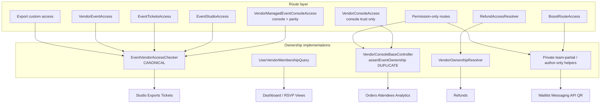

# Phase 2B — Ownership Architecture Consolidation

**Date:** 2026-07-21  
**Status:** Workstream 2A implemented (attendee ownership consolidation)  
**Branch evidence:** `feature/mel-canonical-ownership-api`  
**Prerequisite:** Phase 2A.2 security hotfix (RSVP isolation, export hardening, check-in bind); Workstream 1 canonical API  
**Companion plan (shorter):** `docs/implementation/phase2b-ownership-consolidation-plan.md`  
**ADR:** `docs/adr/ADR-0008-canonical-event-ownership.md`

---

## Stage 0 — Repository safety

| Check | Result |
|---|---|
| Repository root | `/Users/anna/myeventlane-wt-apple-wallet-poster` |
| Implementation branch | `feature/mel-canonical-ownership-api` (cut from `origin/main`) |
| Prior note | Stale `fix/mel-vendor-access-and-create-flow` had diverged from `origin/main` after PR #698 merge; Workstream 1 restarted on current main |
| Runtime modified in Workstream 1? | **Yes** — thin wrapper + tests only (behaviour-neutral) |

---

## Objective

Consolidate organiser ownership into one canonical model so every organiser-facing surface answers the same question:

> Can this organiser manage this event?

**Non-goals for Phase 2B.1 (this stage):**

- No PHP / YAML / services / routing / Views / permission changes
- No config export
- No behaviour change
- No Commerce role strip (Phase 2A remaining / 2C)

---

## Stage 1 — Ownership inventory

### Legend — ownership models

| Model ID | Meaning |
|---|---|
| **Parity** | Author **or** vendor entity owner **or** `field_vendor_users` on event’s `field_event_vendor` |
| **Managed-set** | Bulk event IDs via author ∪ vendor-linked events |
| **Team-partial** | Author **or** `field_vendor_users` only — **misses vendor entity owner** |
| **Author-only** | Node `uid` match only |
| **Store** | Commerce store ↔ vendor ↔ event (`VendorOwnershipResolver`) |
| **Console-trust** | Role/permission/onboarding for `/vendor/*` — **not** event-scoped |
| **Permission-only** | Route `_permission` with no event ownership at route layer |
| **Admin-bypass** | Named staff permissions on callers (`administer nodes`, attendee/commerce admin, etc.) |

---

### 1.1 Canonical / preferred services

#### EventVendorAccessChecker

| | |
|---|---|
| **File** | `web/modules/custom/myeventlane_vendor/src/Service/EventVendorAccessChecker.php` |
| **Interface** | `EventVendorAccessCheckerInterface` |
| **Method** | `accountHasWorkspaceParityForEvent(NodeInterface, AccountInterface): bool` |
| **Ownership model** | **Parity** (no admin, no store) |
| **Callers** | `VendorManagedEventConsoleAccess`, `MelAttendeeOperationsAccess`, `EventStudioAccess`, `EventTicketsAccess` / `EventAccess`, `VendorEventAccess`, `AttendeeCsvExportAccess`, export controllers, analytics `accessEvent`, check-in `assertEventAccess`, vendor comms (partial), many Event Studio forms |
| **Strengths** | Small, interface-injected, documented as workspace parity, unit-tested |
| **Weaknesses** | Ignores legacy `field_vendor`; duplicated inline in console base; not yet used by all surfaces |
| **Future state** | **Canonical per-event decision API** |

#### UserVendorMembershipQuery

| | |
|---|---|
| **File** | `web/modules/custom/myeventlane_vendor/src/Service/UserVendorMembershipQuery.php` |
| **Methods** | `getVendorIdsForUser()`, `getManagedEventNodeIds($uid, $publishedOnly)` |
| **Ownership model** | **Managed-set** (author ∪ `field_event_vendor` IN vendor IDs; optional legacy `field_vendor`) |
| **Callers** | `RsvpOrganiserViewScope`, dashboard / metrics / ticket sales / RSVP stats aggregators |
| **Strengths** | Correct list/KPI scoping pattern; fail-soft empty set |
| **Weaknesses** | Legacy `field_vendor` can widen vs parity; node query uses `accessCheck(FALSE)` intentionally |
| **Future state** | **Canonical bulk/list API**; must stay semantically aligned with parity |

#### MelAttendeeOperationsAccess

| | |
|---|---|
| **File** | `web/modules/custom/myeventlane_checkout_flow/src/Service/MelAttendeeOperationsAccess.php` |
| **Methods** | `canViewAttendees`, `canExportAttendees`, `canCheckInAttendees`, `canCancelAttendance`, `canViewAttendeeRow`, `hasAnyOperationalAccess` |
| **Ownership model** | **Admin-bypass** + **Parity** |
| **Callers** | `MelAttendeeCheckinManager`, door / ops controller paths |
| **Strengths** | Action-named, fail-closed, already uses checker |
| **Weaknesses** | Not yet wired into older attendee/waitlist controllers; all actions share one resolve |
| **Future state** | **Canonical attendee ops policy** wrapping parity |

#### VendorManagedEventConsoleAccess

| | |
|---|---|
| **File** | `web/modules/custom/myeventlane_vendor/src/Access/VendorManagedEventConsoleAccess.php` |
| **Method** | `access(RouteMatch, Account)` |
| **Ownership model** | **Console-trust** composed with **Parity** + `administer nodes` |
| **Callers** | Selected vendor routing (`vendor_managed_event_console`) e.g. archive |
| **Strengths** | Correct target composition for `{event}` console routes |
| **Weaknesses** | Under-used; most console event tabs still console-only + controller assert |
| **Future state** | Preferred `_custom_access` for managed-event console routes |

#### VendorConsoleAccess

| | |
|---|---|
| **File** | `web/modules/custom/myeventlane_vendor/src/Access/VendorConsoleAccess.php` |
| **Method** | `access(RouteMatch, Account)` |
| **Ownership model** | **Console-trust** / onboarding / path namespace — **not** event ownership |
| **Callers** | Most `/vendor/*` routes; composed by managed-event and boost workspace access |
| **Strengths** | Menu vs request path parity; onboarding deadlock avoidance |
| **Weaknesses** | Easy to mistake for event ownership |
| **Future state** | Keep as console entry gate only |

---

### 1.2 Store / refund path

#### VendorOwnershipResolver

| | |
|---|---|
| **File** | `web/modules/custom/myeventlane_checkout_flow/src/Service/VendorOwnershipResolver.php` |
| **Methods** | `vendorOwnsEvent(Store, Event)`, `getStoreForUser(Account)` |
| **Ownership model** | **Store** |
| **Callers** | `RefundAccessResolver`, vendor check-in (store path), vendor comms (OR with parity), messaging fallbacks |
| **Strengths** | Correct Commerce question: “does this store sell this event?” |
| **Weaknesses** | Not workspace parity; team without resolvable store can fail |
| **Future state** | **Implementation detail / additional constraint** — never sole event-management gate |

#### RefundAccessResolver

| | |
|---|---|
| **File** | `web/modules/custom/myeventlane_refunds/src/Service/RefundAccessResolver.php` |
| **Methods** | `vendorCanManageEvent`, `vendorCanRefundOrderForEvent`, `accessManageEvent`, `accessRefundOrder` |
| **Ownership model** | Author **OR** **Store** (+ commerce admin); order-state + event-item binding for refunds |
| **Callers** | Refund forms, `VendorOrdersController`, refund route access checks, `RefundProcessor` |
| **Strengths** | Order binding and refundable-state guards |
| **Weaknesses** | ≠ parity; team without store may be denied; author allowed without store |
| **Future state** | **Parity AND store/order constraints** |

---

### 1.3 Domain access checkers

| Component | File | Method | Model | Callers | Strengths | Weaknesses | Future |
|---|---|---|---|---|---|---|---|
| **EventStudioAccess** | `myeventlane_event_studio/.../EventStudioAccess.php` | `access` | Admin + vendor context + **Parity** | Studio routes | Avoids node-grant-only trap | Extra vendor-resolve can deny when no vendor entity | Keep; ensure not stricter than parity without product reason |
| **EventTicketsAccess** | `myeventlane_tickets/.../EventTicketsAccess.php` | `access` | Ticket perms + **Parity** | Tickets workspace routes | Stronger product gate | Dual permission paths | Keep; ownership via checker |
| **VendorEventAccess** | `myeventlane_rsvp/.../VendorEventAccess.php` | `access` | RSVP perm + **Parity** | RSVP vendor routes | Uses checker | Parallel QR private helper drifts | Keep; delete private duplicates |
| **TicketOperationsAccess** | `myeventlane_tickets/.../TicketOperationsAccess.php` | `accessResend` | Ticket/console + **Parity** | Resend routes | Event-scoped | Narrow surface today | Keep pattern |
| **AttendeeCsvExportAccess** | `myeventlane_views/.../AttendeeCsvExportAccess.php` | `access` | Capability + **Parity** on download | Legacy CSV route | No existence leak | Query-param event id | Keep until retired |
| **BoostRouteAccess** | `myeventlane_boost/.../BoostRouteAccess.php` | `access`, `accessVendorWorkspace`, `accountManagesEvent` | Public: **Author-only**; vendor: **Team-partial** | Boost routes | Separates public purchase vs console | Vendor path **misses vendor entity owner** | Vendor path → checker |

---

### 1.4 Controllers and private helpers

| Component | File | Method | Model | Notes | Future |
|---|---|---|---|---|---|
| **VendorConsoleBaseController** | `myeventlane_vendor/.../VendorConsoleBaseController.php` | `assertEventOwnership` | **Parity** (inline duplicate) + console trust | Used by most console event controllers | Thin wrapper over checker |
| **ManageEventControllerBase** | `myeventlane_vendor/.../ManageEventControllerBase.php` | `access` | Admin / author+edit-own / vendor owner+team (inline) | Author path requires edit-own; team does not | Delegate to checker + explicit perms |
| **VendorEventTicketsBaseController** | `myeventlane_tickets/.../VendorEventTicketsBaseController.php` | inherited assert | Parity duplicate | Tickets override can allow `EventAccess` first | Keep base; ownership via checker |
| **CheckInController** | `myeventlane_checkin/.../CheckInController.php` | `assertEventAccess` | Admin **or** **Parity** | Routes still **permission-only** | Move to `_custom_access` |
| **VendorAttendeeController** | `myeventlane_event_attendees/.../VendorAttendeeController.php` | `access` / `accessAttendee` | **Team-partial** | Misses vendor entity owner | → MelAttendeeOperationsAccess / parity |
| **WaitlistManagementController** | same module | `access` | **Team-partial** | Same gap | → parity |
| **VendorNotifyForm** | `myeventlane_messaging/.../VendorNotifyForm.php` | `assertEventOwnership` | **Team-partial** | Private | → checker |
| **MessageAttendeesController** | `myeventlane_pro/.../MessageAttendeesController.php` | `assertAccess` | Private owner/team | Route console-only | → checker |
| **QrCheckinController** | `myeventlane_rsvp/.../QrCheckinController.php` | `canManageEvent` | **Team-partial** | Validate route permission-only | → checker; route `_custom_access` |
| **VendorApiBaseController** | `myeventlane_api/.../VendorApiBaseController.php` | `vendorOwnsEvent` | Vendor link **or** author==vendor owner — **no team** | Route permission-only | Align API user with parity |
| **ChartDataController** | `myeventlane_reporting/.../ChartDataController.php` | `access` | **Author-only** at route; methods call full assert | Drift: team/vendor-owner denied at access, assert would allow | Align access with parity |
| **EventWizardBaseForm / EventContentForm** | event wizard forms | author asserts | **Author-only** | Narrower than Studio parity | Align or document intentional |

---

### 1.5 Entity access handlers and Views

| Component | File | Model | Future |
|---|---|---|---|
| **EventAttendeeAccessControlHandler** | `myeventlane_event_attendees/.../EventAttendeeAccessControlHandler.php` | Author + own-attendee perms; admin attendee | Align with MelAttendeeOperationsAccess / parity |
| Ticket ACHs (`TicketGroup`, `AccessCode`, settings, purchase surface) | `myeventlane_tickets/...` | Via `EventAccess` → parity | Keep |
| **RedemptionLogAccessControlHandler** | tickets | Custom helpers + check-in perm | Align helpers with checker |
| **VendorAccessControlHandler** | vendor entity | Vendor **entity** owner only for update/delete | Keep intentional (≠ event parity) |
| Views `vendor_store_access` | `myeventlane_views` | Store owner / admin | Coarse page gate only |
| Views `myeventlane_rsvp_vendor_access` | RSVP | Permission-only page | Row isolation via `RsvpOrganiserViewScope` |

#### RsvpOrganiserViewScope

| | |
|---|---|
| **File** | `web/modules/custom/myeventlane_rsvp/src/Service/RsvpOrganiserViewScope.php` |
| **Methods** | `accountBypassesOrganiserScope`, `getManagedEventIds`, `applyToViewsQuery` |
| **Model** | **Managed-set** + staff bypass; fail-closed `1=0` |
| **Future** | Keep list gate; prove ≡ parity |

---

### 1.6 Domain summary

| Domain | Primary model today | Classification |
|---|---|---|
| Event Studio | Parity (+ vendor context) | Service-based + route-based |
| Orders (console) | Console-trust + controller parity assert | Controller-local (route incomplete) |
| Attendees | Mixed: assert / team-partial / Mel ops | Duplicated |
| Exports | Mostly parity (Phase 2A.2) | Service/route-based (good) |
| Refunds | Author OR store | Store-only hybrid (divergent) |
| Messaging | Team-partial / parity OR store | Duplicated / inconsistent |
| Check-in | Permission-only route + parity in controller (legacy); store / team-partial elsewhere | Controller-local gap |
| Analytics | Parity on event dashboard; console assert | Mostly aligned |
| Reporting charts | Author-only access callback | Author-only drift |
| Vendor API | Vendor link / owner UID; no team | Controller-local; inconsistent |
| Waitlist | Team-partial | Inconsistent |
| Questions | Studio parity / manage-event clone | Mostly service-based |
| Boost | Author-only public; team-partial vendor | Inconsistent |
| Dashboard | Managed-set queries | Service-based (list) |

---

### 1.7 Semantic mismatch: parity vs managed-set

| Signal | Workspace parity | Managed event IDs |
|---|---|---|
| Event author | Yes | Yes |
| Vendor entity owner | Yes | Yes (via vendor ID set) |
| `field_vendor_users` | Yes | Yes |
| Legacy `field_vendor` | **No** | **Yes** (if field exists) |
| Store | No | No |

**Implication:** Modern `field_event_vendor` events should match. Divergence: legacy field widening on lists, or callers using store / team-partial instead of either API.

---

## Stage 2 — Dependency graph

### Target shape

```text
Route
  ↓
Custom Access (_custom_access)
  ↓
EventVendorAccessChecker  (parity)
  ↓  [optional AND]
VendorOwnershipResolver / order-state / product perms
  ↓
Business logic
```

### Current shape (simplified)



### Duplicated ownership implementations

1. `EventVendorAccessChecker` ↔ `VendorConsoleBaseController::assertEventOwnership` (intentional clone)
2. `ManageEventControllerBase::access` (inline clone)
3. Team-partial private loops (miss vendor entity owner):
   - `VendorAttendeeController::access`
   - `WaitlistManagementController::access`
   - `BoostRouteAccess::accountManagesEvent`
   - `VendorNotifyForm::assertEventOwnership`
   - `QrCheckinController::canManageEvent`
   - (and related messaging helpers)
4. `RefundAccessResolver` + `VendorOwnershipResolver` (store model parallel to parity)
5. `VendorCommsController` parity **OR** store (union)
6. `VendorApiBaseController::vendorOwnsEvent` (vendor link / owner; no team)
7. `ChartDataController::access` (author-only vs assert parity)
8. Event Studio form author-only checks vs `EventStudioAccess` parity
9. Tickets: route `EventTicketsAccess` + controller assert (defense-in-depth double)

### Controllers that perform ownership directly

(Representative — not exhaustive of every subclass)

- `VendorConsoleBaseController` and subclasses (workspace, orders, order view, overview, settings, RSVP, analytics, attendees, archive, tickets, addon orders, boost exports, reporting controllers)
- `CheckInController` (`assertEventAccess`)
- `VendorEventOperationsController`
- `EventTicketsController` / ticket check-in surfaces
- `VendorAttendeeController`, `WaitlistManagementController`
- `VendorOrderController`, `AttendeeExportController`, `AttendeeCsvController`
- `AnalyticsDashboardController::accessEvent`
- `ChartDataController`, `EventInsightsController`, `ExportCentreController`
- `MessageAttendeesController`, `VendorNotifyForm`
- `BoostController` / `WizardController`
- `VendorApiBaseController` (+ event/attendee/export API)
- `QrCheckinController`
- Event Studio publish/autosave/governance controllers
- `ManageEventControllerBase`

### Route gaps (permission/console-only → ownership only in controller)

| Gap | Route pattern | Route gate | Ownership later |
|---|---|---|---|
| Legacy check-in | `myeventlane_checkin.*` | `_permission` | Controller parity |
| RSVP QR validate | `myeventlane_rsvp.checkin_validate` | `_permission` | Private team-partial |
| Most console event tabs | orders, workspace, RSVP, settings, analytics, attendees list, door | `VendorConsoleAccess` only | `assertEventOwnership` |
| Boost wizard | wizard steps | console only | assert |
| Message attendees | pro message route | console only | private assert |
| Vendor API | `myeventlane_api.vendor.*` | `access vendor api` | `vendorOwnsEvent` |

**Already route-hardened with parity:** Event Studio, tickets workspace, RSVP vendor event routes, CSV/export access (Phase 2A.2), analytics per-event `accessEvent`, archive via `VendorManagedEventConsoleAccess`.

---

## Stage 3 — Behaviour matrix

**Legend:** `Y` = allowed under typical organiser setup · `N` = denied · `P` = partial / path-dependent · `—` = not applicable  
**Actors:** Author = event node owner · Vendor owner = vendor entity owner (may ≠ author) · Vendor team = `field_vendor_users` · Store owner = Commerce store owner without parity · Authenticated = unrelated logged-in user

| Surface | Author | Vendor owner | Vendor team | Admin | Store owner | Anonymous | Authenticated | Current result | Future result |
|---|---|---|---|---|---|---|---|---|---|
| **Event Studio** | Y | Y | Y | Y | N | N | N | Parity + vendor context | Parity (+ console trust where needed) |
| **Orders** | Y | Y | Y | Y | N | N | N | Console + controller parity | Route managed-event access + parity; order IDOR bind |
| **Attendees** | Y | P | Y | Y | N | N | N | Mixed: assert vs team-partial (owner gap on export) | MelAttendeeOperationsAccess → parity |
| **Exports** | Y | Y | Y | Y | N | N | N | Mostly parity (2A.2) | Keep parity; Mel export policy |
| **Refunds** | Y | P | P | Y | P | N | N | Author OR store | Parity **AND** store/order rules |
| **Messaging** | Y | P | Y | Y | P | N | N | Team-partial / parity OR store | Parity; store only as extra |
| **Check-in** | Y | Y | Y | Y | P | N | N | Route permission + controller parity (legacy); other paths diverge | Route `_custom_access` → Mel ops / parity |
| **Analytics** | Y | Y | Y | Y | N | N | N | Parity / console assert | Parity |
| **API** | Y | Y | N | Y | N | N | N | Vendor link / owner UID | Parity for API account |
| **Waitlist** | Y | N | Y | Y | N | N | N | Team-partial (owner miss) | Parity |
| **Questions** | Y | Y | Y | Y | N | N | N | Studio parity / manage clone | Parity via Studio / checker |
| **Boost** | Y | N* | Y* | Y | N | N | N | Public author-only; vendor team-partial (*vendor owner miss on workspace) | Public TBD; vendor → parity |
| **Dashboard** | Y | Y | Y | Y | N | N | N | Managed-set scoping | Managed-set ≡ parity |

\*Boost public purchase path remains author-oriented by product design today; vendor workspace path should not omit vendor entity owner.

---

## Stage 4 — Canonical ownership model

### Preferred stack

```text
Route
  ↓
Custom Access
  ↓
EventVendorAccessChecker::accountHasWorkspaceParityForEvent()
  ↓
Business logic
```

### Role of each layer

| Layer | Responsibility |
|---|---|
| **Route `_permission` / Pro gates** | Product capability (e.g. manage refunds, Pro analytics) — never event membership alone |
| **VendorConsoleAccess** | Organiser console trust + onboarding — never event membership |
| **VendorManagedEventConsoleAccess / EventStudioAccess / MelAttendeeOperationsAccess** | Compose console/product gates with **parity** |
| **EventVendorAccessChecker** | **Canonical** answer to “can this account manage this event?” |
| **UserVendorMembershipQuery** | Canonical bulk membership for Views/KPIs; must ≡ parity |
| **VendorOwnershipResolver** | Commerce store linkage — **additional** constraint for refunds/finance |
| **Controller assert** | Fail-loud defense-in-depth **calling** checker — no private membership loops |

### Where VendorOwnershipResolver remains appropriate

- Refund eligibility after parity (AND)
- Finance / store-scoped aggregations
- Explicit “which store sells this event?” questions

### Where it must not be primary

- Attendee PII
- Check-in
- Messaging
- Event Studio / console event tabs
- Waitlist / questions / boost vendor workspace
- Vendor API event scope

### Staff bypass policy

- Explicit named permissions only (`administer nodes`, `administer event attendees`, `administer commerce_order`, domain admin perms)
- Never silent widen inside the parity checker itself

---

## Stage 5 — Migration plan (workstreams)

### Workstream 1 — Lock the canonical API (no behaviour change)

**Outcome:** Single public ownership contract + equivalence tests; deprecate new private helpers by convention.

| Item | Detail |
|---|---|
| Scope | Document + tests around `EventVendorAccessChecker` and `UserVendorMembershipQuery`; thin `assertEventOwnership` → checker (behaviour-preserving) |
| Estimated files | 8–15 (`EventVendorAccessChecker*`, `UserVendorMembershipQuery*`, `VendorConsoleBaseController`, unit/kernel tests, this ADR/docs) |
| Expected tests | Parity matrix: author, vendor owner, team, stranger, staff; managed-set ≡ parity (published/unpublished); legacy `field_vendor` policy test |
| Risk | Low if assert becomes pure delegate |
| Rollback | Revert thin-wrapper PR; no route changes |

**Maps to plan IDs:** 2B.1

### Workstream 2 — Align divergent callers (preserve intended allow/deny)

**Outcome:** Replace team-partial / author-only / store-primary event-management gates with parity (plus AND store for refunds).

| Item | Detail |
|---|---|
| Scope | Attendees, waitlist, messaging, boost vendor workspace, QR check-in helper, ChartData access, EventAttendee ACH, RefundAccessResolver AND parity, Vendor API team parity |
| Estimated files | 20–35 across attendees, messaging, boost, rsvp, reporting, refunds, api, event_attendees ACH |
| Expected tests | Kernel A/B organiser isolation per surface; refund: team with store, team without store, author-only, stranger; vendor entity owner on waitlist/export/boost |
| Risk | Medium — fixing vendor-owner gaps **widens** access for vendor entity owners on team-partial surfaces (correctness fix, not silent broaden for strangers). Refund AND may **narrow** team-without-store if previously store-OR author paths differed — matrix must lock expected product behaviour first |
| Rollback | Revert per-module PR; keep Workstream 1 tests as baseline |

**Maps to plan IDs:** 2B.2 (+ parts of messaging/API/boost)

### Workstream 3 — Route-layer ownership + order IDOR

**Outcome:** Move ownership from controller-only to `_custom_access`; close order detail IDOR; optional CSRF follow-up for legacy check-in.

| Item | Detail |
|---|---|
| Scope | Expand `VendorManagedEventConsoleAccess` (or Mel ops access) on console `{event}` routes; check-in routes; RSVP validate; order detail bind to event/vendor stores; CSRF see `docs/security/follow-up-checkin-csrf.md` |
| Estimated files | 15–25 (routing YAML, access services, order view controller, check-in, tests) |
| Expected tests | Static routing safety (check-in requires `_custom_access`); kernel IDOR on foreign order IDs; regression Phase 2A.2 suite |
| Risk | Medium — menu link visibility may change when route access gains parity; cache contexts must include user + event |
| Rollback | Revert routing + access service wiring; controllers still assert as backstop until removed in a later cleanup |

**Maps to plan IDs:** 2B.3, 2B.4  
**Deferred product backlog:** 2B.5 (permission/config cleanup after PO sign-off)

### Cross-cutting risks

| Risk | Mitigation |
|---|---|
| Edge membership behaviour change | Parity matrix tests before/after; separate PRs per workstream |
| Refund false allow if store dropped | Keep store as **AND** with parity |
| Performance of repeated parity | Per-request memoisation; managed-set for lists |
| Scope creep into Commerce role strip | Keep role YAML out of Phase 2B PRs |
| Legacy check-in CSRF | Tracked separately; land with or immediately after 2B.3 |
| Soft redirects mistaken for access | Never treat messenger redirect as ACL |

### Expected modules touched (implementation later)

`myeventlane_vendor`, `myeventlane_event_attendees`, `myeventlane_refunds`, `myeventlane_checkin`, `myeventlane_messaging`, `myeventlane_tickets`, `myeventlane_rsvp`, `myeventlane_boost`, `myeventlane_api`, `myeventlane_reporting`, `myeventlane_pro`, `myeventlane_vendor_comms`, `myeventlane_checkout_flow`, `myeventlane_checkout_paragraph`, `myeventlane_views` (regression only)

### Rollback strategy (global)

1. Prefer small reversible PRs per workstream  
2. Keep controller asserts until route access proven  
3. No config/permission strip in ownership PRs  
4. Feature flag only if a widen/narrow cannot be proven with fixtures  

---

## Stage 6 — ADR

See: [`docs/adr/ADR-0008-canonical-event-ownership.md`](../adr/ADR-0008-canonical-event-ownership.md)

---

## Stage 7 — Validation

### Workstream 1 validation (executed)

| Check | Result |
|---|---|
| `php -l` on changed PHP | Pass |
| Focused phpunit ownership tests | Pass (21 tests) |
| PHPCS on changed module files | Pass (0 errors) |
| `ddev drush cr` | Pass |
| Service `myeventlane_vendor.event_access_checker` | Resolves; implements interface |
| Constructor optional 4th param | Compatible with existing 3-arg subclass calls |
| YAML / routing / services / Views / permissions | Unchanged |
| Config export | Not required |
| `scripts/check-webroot-safety.sh` | Pass |
| Runtime behaviour | **Unchanged** for event-bundle organiser matrix |

```bash
ddev exec vendor/bin/phpunit -c web/core \
  web/modules/custom/myeventlane_vendor/tests/src/Unit/EventVendorAccessCheckerTest.php \
  web/modules/custom/myeventlane_vendor/tests/src/Unit/VendorConsoleBaseControllerOwnershipEquivalenceTest.php
```

---

## Exit criteria

- [x] Workstream 1: thin `assertEventOwnership` → `EventVendorAccessChecker`; equivalence tests  
- [x] Workstream 2A: attendee / waitlist / messaging / QR / ACH ownership → Mel → checker (or checker where Mel is cycle-blocked)  
- [x] Parity ≡ managed-set proven for modern `field_event_vendor` events; legacy `field_vendor` widen documented (no reconciliation invented)  
- [ ] Call-site inventory closed for non-attendee surfaces (Workstream 2B)  
- [ ] Check-in routes ownership at route layer; Phase 2A.2 bind retained  
- [ ] Refund parity AND store aligned (Workstream 2B)  
- [ ] Order detail IDOR tests green  
- [ ] CSRF follow-up fixed or still explicitly deferred  

---

## Workstream 2A — Attendee ownership consolidation (2026-07-21)

### Scope

Attendee-facing organiser workflows only. Excluded: refunds, Boost, charts, analytics, APIs, Event Studio, Commerce permissions, route conversions, check-in route refactoring.

### Components migrated

| Class | Current ownership model | Canonical replacement | Behaviour change |
|---|---|---|---|
| `VendorAttendeeController::access` / `accessAttendee` | Team-partial (author + `field_vendor_users`) | Product gates + `EventVendorAccessChecker` (Mel delegate; Mel lives in `checkout_flow` which depends on this module) | **Vendor entity owner** gains access when `view own event attendees` holds |
| `WaitlistManagementController::access` | Team-partial | Staff bypass preserved + `EventVendorAccessChecker` | **Vendor entity owner** gains access |
| `VendorNotifyForm::assertEventOwnership` | Team-partial | Staff bypass + `MelAttendeeOperationsAccess::accountHasOrganiserOwnership` → checker | **Vendor entity owner** gains access |
| `MessageAttendeesController::assertAccess` | Private owner/team (already included vendor entity owner) | Pro gate + Mel ownership hop | **None** for organisers (cleanup only) |
| `QrCheckinController::canManageEvent` | Team-partial | RSVP perms + Mel ownership hop | **Vendor entity owner** gains access when `manage own event rsvps` holds |
| `EventAttendeeAccessControlHandler` | Author-only + own-attendee perms | Same product perms + checker parity | **Vendor entity owner / team** gain entity view/update/delete when product perms hold |
| `AttendeeExportController` / `AttendeeCsvExportAccess` | Already parity (Phase 2A.2) | Unchanged (already `EventVendorAccessChecker`) | None |

### Ownership paths removed

- Private author / `field_vendor_users` loops in attendee list, waitlist, notify form, QR validate
- Private `resolveEventVendor` / `isVendorMember` helpers on `MessageAttendeesController`

### Intentional behavioural improvements

- Vendor entity owners (not listed on `field_vendor_users`) can use attendee list, waitlist, notify, QR validate, and attendee entity ACH where they previously could not
- Unrelated organisers remain denied; customer-facing behaviour unchanged; routes/menus/Commerce permissions unchanged

### Module dependency note

`myeventlane_checkout_flow` depends on `myeventlane_event_attendees`, so attendee controllers cannot hard-inject `MelAttendeeOperationsAccess` without a cycle. Those surfaces call `EventVendorAccessChecker` directly — the same service Mel delegates to. Messaging / Pro / RSVP inject Mel.

### Mel API addition

- `MelAttendeeOperationsAccessInterface::accountHasOrganiserOwnership()` — ownership-only hop (no staff/product gates) so callers preserve their existing admin and permission composition

### Equivalence verification

- `ManagedSetWorkspaceParityEquivalenceTest`: for modern `field_event_vendor` events, managed-set membership ⇔ workspace parity across author / vendor owner / team / stranger / anon
- Legacy `field_vendor` managed-set widen vs parity is an **explicit documented divergence**; no reconciliation invented in 2A

### Cache verification (before → after)

| Surface | Cache contexts | Cache tags / deps | max-age | Menu / local tasks |
|---|---|---|---|---|
| `VendorAttendeeController::access` | Unchanged (`user` on allow; perms on admin) | Unchanged (`addCacheableDependency($node)`) | Unchanged | Unchanged |
| `WaitlistManagementController::access` | Unchanged (`cachePerPermissions`) | Unchanged (node dep) | Unchanged | Unchanged |
| `EventAttendeeAccessControlHandler` | Unchanged (`user` / perms) | Unchanged (entity dep) | Unchanged | N/A |
| Notify / Message / QR asserts | N/A (exceptions) | N/A | N/A | Unchanged |
| Routes / YAML | Unchanged | Unchanged | Unchanged | Unchanged |

### Tests added

- `VendorAttendeeAccessOwnershipTest`
- `WaitlistManagementAccessOwnershipTest`
- `EventAttendeeAccessControlHandlerOwnershipTest`
- `VendorNotifyFormOwnershipTest`
- `MessageAttendeesOwnershipTest`
- `QrCheckinOwnershipTest`
- `ManagedSetWorkspaceParityEquivalenceTest`
- Extended: `MelAttendeeOperationsAccessTest`, `AttendeeExportAccessTest`

### Remaining Workstream 2B

- Boost vendor workspace path, ChartData access, RefundAccessResolver AND parity, Vendor API team parity
- `ManageEventControllerBase::access()` composition without dropping `edit own event content`
- Optional: move Mel into `event_attendees` to eliminate cycle soft-path

### Remaining Workstream 3

- Route `_custom_access` for check-in + console event tabs
- Order detail IDOR bind
- CSRF follow-up for legacy check-in (or keep deferred)

---

## Workstream 1 — Implementation log (2026-07-21)

### Wrappers migrated

| Class | Current ownership call | Canonical replacement | Behaviour change? |
|---|---|---|---|
| `VendorConsoleBaseController::assertEventOwnership()` | Inline author + vendor owner + `field_vendor_users` | `EventVendorAccessChecker::accountHasWorkspaceParityForEvent()` after console trust + `administer nodes` | **No** for event bundles (matrix locked in unit tests) |
| `EventVendorAccessChecker` | Already canonical | Docs/interface clarified as canonical API | No |
| `ManageEventControllerBase::access()` | Inline parity + **author requires `edit own event content`** | Deferred — not wrapped | N/A (stop: wrapping would widen authors lacking edit-own) |
| Team-partial helpers (attendees, waitlist, messaging, boost, QR, API) | Private loops | Deferred to Workstream 2 | N/A |

### Duplicate ownership removed

- Inline membership loop inside `VendorConsoleBaseController::assertEventOwnership()` replaced by canonical checker call.
- Method signature, `AccessDeniedHttpException`, console-trust prelude, and `administer nodes` bypass retained.
- Helper method **not deleted** (defense-in-depth wrapper).

### Behaviour equivalence (event bundles)

| Actor | Legacy inline | Canonical checker | Wrapper (`assertEventOwnership`) |
|---|---|---|---|
| Event author | Allow | Allow | Allow |
| Vendor entity owner | Allow | Allow | Allow |
| Vendor team member | Allow | Allow | Allow |
| Unrelated organiser | Deny | Deny | Deny |
| Authenticated non-organiser | Deny | Deny | Deny |
| Anonymous | Deny (also fails console trust) | Deny | Deny (console trust) |
| Administrator (`administer nodes`) | Allow (caller bypass) | Deny (by design) | Allow (caller bypass retained) |

**Edge note (not a production caller path):** checker returns FALSE for non-`event` bundles even when UID matches author; pre-wrapper assert allowed any-bundle authors. Console callers pass event nodes only — no route/menu change.

### Cache verification

| Surface | Changed? |
|---|---|
| Route `_custom_access` / requirements | No |
| Menu / local tasks / local actions / breadcrumbs | No |
| `AccessResult` cache contexts/tags/max-age | No — `assertEventOwnership` remains void/exception (never returned cache metadata) |
| `ManageEventControllerBase::access()` cache metadata | Untouched |

### Tests added / extended

- `EventVendorAccessCheckerTest` — anonymous, authenticated non-organiser, admin-without-membership, non-event bundle
- `VendorConsoleBaseControllerOwnershipEquivalenceTest` — legacy ≡ checker ≡ wrapper for author / vendor owner / team / stranger / non-organiser; admin bypass; anonymous deny

### Remaining after Workstream 1 (superseded by 2A log above)

See **Workstream 2A** and **Remaining Workstream 2B / 3** sections.

---

## Related documents

- `docs/implementation/phase2b-ownership-consolidation-plan.md`
- `docs/audits/vendor-permission-inventory.md`
- `docs/audits/vendor-route-access-audit.md`
- `docs/audits/vendor-pii-exposure-audit.md`
- `docs/vendor-console-v2-access-matrix.md`
- `docs/implementation/vendor-permission-hardening-phase2-plan.md`
- `docs/security/follow-up-checkin-csrf.md`
