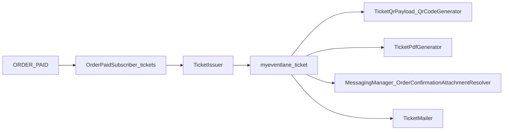

# Operational issuance pipeline

This document describes the **canonical operational issuance lifecycle** for paid Commerce ticket orders, how it differs from **attendee/roster** handling, and what was removed during issuance pipeline convergence (Phase 2B, Commit 4).

## Canonical lifecycle

The platform treats **`myeventlane_ticket` entities** as the single source of operational entitlement truth (codes, QR payloads, PDFs, wallet links, scanner state). Commerce **order items** remain **purchase context** (SKU, quantity, price, checkout answers), not operational truth.

Intended flow:

1. **`OrderEvents::ORDER_PAID`** — Commerce marks the order paid.
2. **`OrderPaidSubscriber`** (`myeventlane_tickets`) — Calls **`TicketIssuer::issueForOrder()`**.
3. **`TicketIssuer`** — Creates one **`myeventlane_ticket`** row per unit quantity for eligible order items (variation-backed, event-resolvable).
4. **QR payloads** — Built from ticket entities via **`TicketQrPayload`** and **`QrCodeGenerator`** (also surfaced through **`UniversalTicketViewModelBuilder`**).
5. **PDFs** — Generated through **`TicketPdfGenerator`** (`myeventlane_tickets.ticket_pdf_generator`), using the canonical view model for issued tickets. Legacy paths (order item, attendee, RSVP) remain for compatibility and are **not** part of the paid-order issuance slice; they are isolated in compatibility adapters (see [legacy-pdf-compatibility.md](./legacy-pdf-compatibility.md)).
6. **Wallet** — **`myeventlane_wallet`** routes remain **`/wallet/apple/{order_item_id}`** and **`/wallet/google/{order_item_id}`** for compatibility. Internally, wallet generation **resolves issued `myeventlane_ticket` rows** for that order item, enforces the same access semantics as ticket PDFs, and builds Apple scaffold bytes from **`UniversalTicketViewModelBuilder`** (which uses **`TicketQrPayload`**). When no issued ticket exists, **legacy placeholder** behaviour is preserved (no issuance from wallet). See [wallet-operational-convergence.md](./wallet-operational-convergence.md).
7. **Notifications** — Order confirmation PDFs at send time are merged by **`MessagingManager`** → **`OrderConfirmationAttachmentResolver`** → **`TicketPdfGenerator::getPdfContentForTicket()`** per ticket row for the order. Ticket-ready email uses **`TicketMailer`**, which attaches PDFs from **`TicketPdfGenerator`** for assigned tickets.

Venue gate execution for scans continues to flow through **`mel_scanner.operation_manager`** (`ScannerOperationManager`), composed with **`EntitlementCapabilityRegistry`** and **`VenueOperationPolicyManager`** for policy and staff-side integrity metadata (see [offline-venue-operations-convergence.md](./offline-venue-operations-convergence.md)); issuance steps above are unchanged. **Event Studio** may author per-event operational capability metadata (`field_mel_op_capabilities`) for vendor configuration and guest-facing previews only; it does not participate in issuance or QR generation (see [vendor-operational-capability-studio.md](./vendor-operational-capability-studio.md)). **`DeviceOperationIdentityManager`** (`myeventlane_tickets.device_operation_identity_manager`) normalizes optional **`mel_operational_device`** / **`operational_device`** metadata, orchestrated with zone/timing/session policy through **`VenueOperationPolicyManager::evaluateOperationalIdentity()`** and continuity/reconciliation scaffolding through **`VenueOperationPolicyManager::evaluateOperationalContinuity()`** / **`OperationalContinuityPolicyManager`** without changing QR contracts or public scanner tokens (see [device-gate-identity-convergence.md](./device-gate-identity-convergence.md), [offline-reconciliation-operational-continuity.md](./offline-reconciliation-operational-continuity.md)). **`OccupancyPolicyManager`** (`myeventlane_tickets.occupancy_policy_manager`) normalizes optional **`mel_operational_occupancy`** / **`operational_occupancy`** metadata and is composed after timing/session/zone gates for directional scan policy only (see [anti-passback-live-occupancy-convergence.md](./anti-passback-live-occupancy-convergence.md)). Zone and access topology policy remains in **`ZoneAccessPolicyManager`** (`myeventlane_tickets.zone_access_policy_manager`) and is composed through **`VenueOperationPolicyManager::evaluateZoneAccessForScan()`** (see [zone-access-topology-convergence.md](./zone-access-topology-convergence.md)).

## Event subscribers and entry points

| Entry | Module | Role |
| --- | --- | --- |
| `OrderEvents::ORDER_PAID` | `myeventlane_tickets` | **`OrderPaidSubscriber`** → **`TicketIssuer`** (canonical issuance). |
| `commerce_order.place.post_transition` | `myeventlane_commerce` | **`OrderCompletedSubscriber`** → **`event_attendee`** creation, `extra_data` sync, roster repair. **Not** ticket entity issuance. |
| Entity insert / domain events | `myeventlane_domain_events` | Downstream signals (e.g. payment succeeded, ticket issued); unchanged in this slice. |
| Messaging send pipeline | `myeventlane_messaging` | **`OrderConfirmationAttachmentResolver`** merges ticket PDFs for `order_confirmation`. |

A vestigial **`OrderPaidSubscriber`** under **`myeventlane_commerce`** (logging stub, never registered in `myeventlane_commerce.services.yml`) was **removed** to avoid confusion with the real tickets subscriber.

## Attendee (`event_attendee`) vs ticket (`myeventlane_ticket`)

**`event_attendee`** is a separate **roster / attendance** domain model (holder identity, accessibility, purchaser linkage, `extra_data` from holder paragraphs). It is created from checkout data on order placement and must **not** be conflated with operational ticket issuance.

**`myeventlane_ticket`** is the **operational entitlement** row used for QR, PDF, wallet links, and check-in. Both may exist for the same order; they serve different purposes.

## Removed duplicate / dead operational paths

- **`OrderCompletedSubscriber`** previously called private helpers that referenced **non-existent service IDs** (`myeventlane_tickets.pdf`, `myeventlane_wallet.pk_pass`, `myeventlane_wallet.google_wallet`). Those code paths **never** ran successfully (`hasService` always false). They were **removed**. Attendee creation is **unchanged**.

- The real PDF service IDs are **`myeventlane_tickets.ticket_pdf_generator`** and the alias **`myeventlane_tickets.pdf_generator`**. Wallet builder IDs include **`myeventlane_wallet.pkpass_builder`** and **`myeventlane_wallet.google_wallet_builder`**.

## Order confirmation PDF attachments

**Canonical path:** **`MessagingManager`** → **`OrderConfirmationAttachmentResolver`** → **`TicketPdfGenerator`** → issued **`myeventlane_ticket`** entities.

**`OrderConfirmationPdfAttachments`** (tickets module) was an alternate merge helper that was **never referenced** outside its service definition. The **class and service registration were removed** after confirming no contrib, decoration, or cross-module references to `myeventlane_tickets.order_confirmation_pdf_attachments`.

## Idempotency (ORDER_PAID replay)

**`TicketIssuer::issueForOrder()`** performs an **order-scoped, deterministic** guard: if **any** `myeventlane_ticket` row already exists for the order ID, issuance **aborts** with an **info** log. It does **not** partially issue, reconcile, or mutate existing ticket rows.

**`TicketIssuer::countExpectedIssuanceUnits()`** and **`TicketIssuer::isOrderItemEligibleForTicketIssuance()`** expose the same eligibility rules for **read-only** diagnostics (no issuance side effects).

## Operational observability (Phase 2D)

Read-only integrity diagnostics for paid orders are centralized in **`OperationalIntegrityInspector`** (`myeventlane_tickets.operational_integrity_inspector`). It inspects issuance alignment, artifact readiness, recovery markers, compatibility surfaces, guest/purchaser continuity, venue gate descriptors, **timed entry diagnostics** (`artifacts.timed_entry_policy`), **session entitlement diagnostics** (`artifacts.session_entitlement_policy`), and **zone access topology diagnostics** (`artifacts.zone_access_topology`) **without** generating PDFs, wallet artifacts, or QR output for persistence. See [operational-observability.md](./operational-observability.md), [timed-entry-capacity-convergence.md](./timed-entry-capacity-convergence.md), [session-multiuse-entitlement-convergence.md](./session-multiuse-entitlement-convergence.md), and [zone-access-topology-convergence.md](./zone-access-topology-convergence.md).

**Staff workspace shell:** Phase 3A adds `OperationalWorkspaceBuilder` + `/admin/mel/operations` to surface **normalized** inspector-derived summaries for venue operations staff (optional `?event={nid}` scope). Details: [venue-operations-workspace-convergence.md](./venue-operations-workspace-convergence.md).

## Timed entry and capacity windows (operational clock policy)

Operational clock semantics (entry windows, grace, early/late states, session/capacity metadata) are centralized in **`TimedEntryPolicyManager`** (`myeventlane_tickets.timed_entry_policy_manager`). **`VenueOperationPolicyManager`** composes timed policy into descriptors and scan gates; **`ScannerOperationManager`** enforces the gate before mutations. QR payload contracts remain unchanged; structured QR `exp` continues to cap interpretation through the policy layer. Details: [timed-entry-capacity-convergence.md](./timed-entry-capacity-convergence.md).

## Entitlement capability convergence (Phase 2E)

Operational semantics for the seven ticket-backed entitlement types (admission, merch, parking, drink, food, VIP, add-on) are normalized in **`EntitlementCapabilityRegistry`** (`myeventlane_tickets.entitlement_capability_registry`). **`TicketCapabilityManager`** delegates type normalization, redeemability, and fulfilment-workflow flags into that registry; **`ScannerOperationManager`** routes redemption-log actions from registry `scanner_mode`; **`UniversalTicketViewModelBuilder`** surfaces **`capabilities`** and **`fulfilment.mode`** for PDFs, wallet scaffolds, and diagnostics. See [entitlement-capability-convergence.md](./entitlement-capability-convergence.md).

## Service locator cleanup (RSVP)

**`RsvpMailer`** no longer uses `\Drupal::service('myeventlane_tickets.pdf_generator')` for RSVP PDF attachments; it receives **`@?myeventlane_tickets.ticket_pdf_generator`** via constructor injection.

## Tests

Kernel coverage: **`IssuancePipelineConvergenceTest`** (`myeventlane_tickets`), **`OperationalIntegrityInspectorTest`** (read-only diagnostics), **`TimedEntryPolicyManagerTest`** (timing policy), **`SessionEntitlementPolicyManagerTest`** (session orchestration), **`ZoneAccessPolicyManagerTest`** (zone topology policy), **`DeviceOperationIdentityManagerTest`** (operational identity normalization), and the existing **`VenueOperationPolicyManagerTest`**, **`TicketCheckinServiceTest`**, and **`UniversalTicketViewModelBuilderTest`** slices that cover scanner and view-model wiring.

- Issuance creates one ticket entity per unit quantity.
- **Regression:** calling **`issueForOrder()`** twice on the same order does **not** create additional ticket rows.
- **`getPdfContentForTicket()`** succeeds for issued tickets after holder fields are set (PDF continuity from ticket entities).
- **`OrderConfirmationAttachmentResolver::mergeOrderConfirmationAttachments()`** appends one PDF per issued ticket for `order_confirmation` while preserving queued non-PDF attachments (same behavior as production **`MessagingManager`** wiring).

## Manual verification checklist

Performed in a full environment (e.g. DDEV) with real mail and checkout:

1. Paid orders still create **`myeventlane_ticket`** rows after payment.
2. Order confirmation emails still include ticket PDFs (resolver path).
3. Assigned-ticket / ticket-ready emails still attach PDFs (**`TicketMailer`**).
4. Ticket download URLs unchanged.
5. Existing QR codes for already-issued tickets unchanged (no signing or payload changes in this slice).
6. Guest checkout still issues tickets when the order is paid.
7. No duplicate ticket rows for repeated paid transitions on the same order (idempotent guard).
8. No duplicate PDF merge from removed dead paths; confirm order confirmation attachment count matches ticket count where expected.
9. No vendor/customer data leakage in logs or attachments (existing access rules unchanged).

## Related documentation

- [customer-operational-commerce-experience.md](./customer-operational-commerce-experience.md) — customer-safe operational expectation copy (no issuance or QR exposure).
- [operational-commerce-capability-linking.md](./operational-commerce-capability-linking.md) — Event Studio authoring links capabilities to Commerce products (no issuance/inventory execution).
- [operational-surface-convergence.md](./operational-surface-convergence.md) — My Tickets and PDF rendering convergence onto **`UniversalTicketViewModelBuilder`**.
- [operational-observability.md](./operational-observability.md) — read-only operational diagnostics authority and anti-patterns.
- [wallet-operational-convergence.md](./wallet-operational-convergence.md) — Wallet routes, inward ticket resolution, and QR authority alignment.
- [legacy-pdf-compatibility.md](./legacy-pdf-compatibility.md) — **Governance:** operational authority vs legacy PDF adapters, inward-only delegation, frozen contracts, forbidden patterns (Commit 5+).
